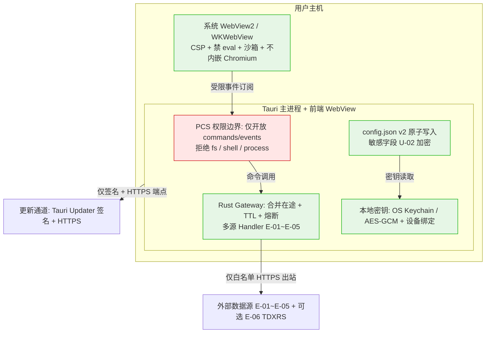

# AICoding 架构设计 · 安全设计

> 本文档为《AICoding 架构设计》核心产物之一，对应**《安全架构设计模板》**，并按本项目本地桌面应用形态做裁剪适配。
>
> 状态：**Approved（G5）**；责任人：严守正（security-architect）；最后更新：2026-08-13。
>
> **事实基线（严格继承，不得推翻）**：
> - 目标架构 = Tauri 2 + Rust（X1 已裁决）；原生 HTML/CSS/JavaScript 前端；Rust 进程内 gateway（已裁决）。
> - 仅开放事件能力（Tauri commands/events），不开放任意 fs / shell / 进程（已裁决）。
> - config.json v2 原子写入 + 旧字段兼容；敏感字段（持仓成本 / 备注）加密属待裁决 U-02。
> - 数据可靠性口径：空值 null / available:false 诚实表达，不伪装净流入 / 确定结论；外部源不可用时 handler 保留来源 / 降级 / 不可用元数据。
> - 对外数据源（已登记 E-01~E-05，可选外部进程 E-06 TDXRS）：腾讯 / 东方财富 / 同花顺 / HKEX / 金十 / 财联社 / 新浪 / 交易所。
> - 更新：完整版 Tauri Updater 强制签名验证 + 端点强制 HTTPS，验证不可禁用（U-03 待裁决商务 / 成本）；MVP 走 ZIP + 文档化 xattr 步骤。
> - 待裁决 U-01~U-04 移交下游，本文仅标注移交，不自行拍板。
> - 上游权威边界文档：《高层架构设计.md》《系统设计.md》《UserStory.md》《research_report.md》《material_digest.md》。

---

## 0. 裁剪与适配说明（本地桌面语义）

> 本系统为**本地桌面应用（Tauri 2 + Rust）**，非 SaaS / 非私有化、单机单用户、无远端 RDBMS / Redis / 消息队列 / K8s，无云端账户体系。据此对模板的云安全章节做如下裁剪与改写，章节序号顺延整理：

| 模板原章节 | 处理 | 本地桌面改写 / 适配说明 |
| --- | --- | --- |
| §1.1 安全总体架构图（DDoS/WAF/CLB/堡垒机/KMS/SOC 云组件） | 重写 | 以「Tauri PCS 权限边界 + 本地加密 + 出口白名单 + 更新完整性」替代云安全组件清单；云组件统一标记为 N/A |
| §1.2 威胁模型（STRIDE） | 保留并适配 | 按本地桌面重新识别 STRIDE 六类威胁，每条映射到下文缓解措施 |
| §2 身份与访问管理（IAM） | 改写 | 无账号体系（N/A）；保留「认证方式清单」用于明确 N/A 边界；授权改为 **PCS 权限模型**（核心） |
| §3 数据安全 | 保留并适配 | 数据分级按本地语义（公开 / 内部 / 敏感）；传输 = 出网 HTTPS + 进程内 IPC；存储 = config.json v2 原子写入 + U-02 加密 |
| §4 应用安全（OWASP） | 保留并适配 | 以 WebView 风险面（CSP / 禁 eval / 沙箱 / 不内嵌 Chromium）与命令清单白名单重构 OWASP 防护 |
| §5 网络与基础设施安全 | 改写 | 无 VPC / 南北向 / 东西向；改为「对外出口白名单（仅 HTTPS/REST 到 E-01~E-05 + 可选 E-06），禁止任意外联；无入站服务」 |
| §6 密钥与凭证管理 | 保留并适配 | 本地密钥分级：OS Keychain vs AES-GCM + 设备绑定（U-02），不引入 KMS 云托管 |
| §7 运行时安全：监控、审计、应急 | 保留并适配 | 本地日志（traceId / 源状态 / 降级熔断记录）+ 保留期 + 个人信息 / 脱敏说明；本地应急响应预案 |

**不可裁剪章节均保留**：§1 安全总体架构 / §2 身份与访问管理 / §3 数据安全 / §4 应用安全 / §5 网络与基础设施安全 / §6 密钥与凭证管理 / §7 运行时安全。

---

## 1. 安全总体架构

### 1.1 安全总体架构图（本地桌面语义）

> 总览：以下图叠加展示——Tauri PCS 权限边界、Rust 进程内 gateway、本地加密存储、系统 WebView 风险面、对外出口白名单、更新完整性通道。云安全组件（DDoS/WAF/堡垒机/KMS/SOC）在本应用中全部为 **N/A**。

**安全组件参考清单（本地桌面适配版）**：

| 组件 | 作用 | 是否启用 | 说明 |
| --- | --- | --- | --- |
| Tauri PCS 权限边界 | 渲染进程仅能调用已声明 command / 订阅已声明 event；拒绝任意 fs / shell / process | 是 | 权限最小化核心 |
| 系统 WebView 沙箱 | 渲染进程由操作系统 WebView 提供，不打包 Chromium | 是 | 风险面随 OS 维护 |
| 本地数据加密（U-02） | config 敏感字段加密 | 待裁决 | OS Keychain vs AES-GCM + 设备绑定 |
| 出口白名单 | handler 仅能访问 E-01~E-05 域名；禁止任意外联 | 是 | 见 §5 |
| 更新完整性 | Tauri Updater 强制签名 + HTTPS（完整版）；MVP ZIP + xattr | 是（分阶段） | 见 §4.4 / §7 |
| 云安全组件（DDoS/WAF/CLB/堡垒机/KMS/SOC） | — | N/A | 本地桌面无非云组件 |

### 1.2 威胁模型（STRIDE）

> 采用 **STRIDE** 方法识别本地桌面场景下的威胁，每条威胁映射到 §2~§7 的缓解措施，形成「威胁—缓解措施映射表」。

| 威胁类别（STRIDE） | 本地桌面典型示例 | 对应缓解措施（章节） |
| --- | --- | --- |
| 仿冒（Spoofing） | 外部数据源被中间人 / 伪造端点冒充，返回被篡改行情 | 出网强制 HTTPS + 证书校验；出口白名单锁定域名；可选证书钉扎（§3.2/§5） |
| 篡改（Tampering） | config.json 被篡改；更新包被替换投毒 | 原子写入防损坏；Updater 强制签名验证不可禁用（§3.3/§4.4/§7） |
| 否认（Repudiation） | 本地单用户，无多主体审计需求；但故障需可诊断 | 本地结构化日志 + traceId + 源状态 / 熔断记录（§7） |
| 信息泄露（Information Disclosure） | 敏感配置字段明文存储被导出；日志打印持仓明文 | U-02 加密 + 文件权限受限；日志禁止打印敏感字段并脱敏（§3.3/§6/§7） |
| 拒绝服务（DoS） | 上游限流 / 风控致整体不可用；本地资源耗尽 | gateway 熔断 + 多源降级 + 并发上限；诚实表达兜底（§3.2/§4.3） |
| 权限提升（Elevation of Privilege） | WebView 通过 IPC 获得任意 fs / shell / process 能力 | PCS 仅开放事件能力，拒绝 fs / shell / process（§2.2） |

**威胁—缓解措施映射表**（每条威胁均有落点）：

| 威胁 | 缓解措施编号 | 落点章节 |
| --- | --- | --- |
| Spoofing | M1 | §3.2 / §5 出口白名单 + HTTPS |
| Tampering | M2 | §3.3 原子写入 / §4.4 Updater 签名 / §7 完整性校验 |
| Repudiation | M3 | §7 审计日志 |
| Information Disclosure | M4 | §3.3 U-02 加密 / §6 密钥 / §7 日志脱敏 |
| DoS | M5 | §3.2 并发限流 / §4.3 熔断降级 |
| Elevation of Privilege | M6 | §2.2 PCS 权限模型 |

---

## 2. 身份与访问管理（IAM）

### 2.1 身份认证（Authentication）

> 本应用**无账号体系**（本地单用户、无云端账户、O4 不做），以下常见认证方式在本系统中均 **N/A**，列出用于明确边界，不实际启用：

| 认证方式 | 是否适用 | 说明 |
| --- | --- | --- |
| 账号密码 | N/A | 无登录账号 |
| MFA / 2FA | N/A | 无登录态 |
| SSO / OAuth / OIDC / SAML | N/A | 无远程身份提供方 |
| 生物识别 | N/A | 由操作系统在需要时提供（如 Keychain 解锁），应用层不依赖 |

- **本地会话**：应用进程即用户会话，关闭即结束；无 Token、无会话有效期、无登出概念。

### 2.2 授权与权限控制（Authorization）—— Tauri PCS 权限模型

> 本应用**权限最小化的核心机制**为 Tauri **PCS（Permission / Capability / Scope）权限模型**：渲染进程（WebView）仅能通过已声明的 `capabilities` 调用被暴露的 command、订阅被声明的 event；**不开放任意文件系统 / shell / 进程能力**。

**最小权限清单（已声明 capability）**：

| 类别 | 名称 | 用途 | 权限范围 |
| --- | --- | --- | --- |
| command | `fetch_index_snapshot` / `fetch_quote` / `fetch_kline` / `fetch_fund_flow` / `fetch_news` / `fetch_announcements` / `fetch_radar` / `fetch_northbound` | 行情 / 资讯只读聚合 | 仅经 Rust gateway，不直接触网 |
| command | `load_config` / `save_config` / `cache_get` / `cache_set` | 配置与本地缓存读写 | 仅应用数据目录 |
| command | `schedule_refresh` / `pause_hidden` | 刷新调度 | 进程内 |
| event | `refresh-tick` / `source-status` / `breaker-tripped` / `config-changed` / `alert-fired` / `float-window-feed` | 状态 / 提醒推送 | 仅订阅，不回传能力 |

**禁止能力（PCS 拒绝）**：

| 能力 | 状态 | 说明 |
| --- | --- | --- |
| 任意文件系统访问（fs） | 拒绝 | 前端不可读写应用数据目录以外路径 |
| shell / 进程（process） | 拒绝 | 不开放命令执行；TDXRS 仅由 Rust 端在显式配置下 spawn（E-06） |
| 任意网络（http 自定义） | 拒绝 | 外联仅经 gateway handler，受出口白名单约束（§5） |

- **越权防护**：前端无任何路径获得 fs / process 能力；所有敏感操作经 gateway 收敛，命令清单即能力边界（与《系统设计》§3.6 对齐）。
- **多租户隔离**：不适用（单机单用户）。

### 2.3 云账号与云资源访问

> N/A。本应用无云端账户、无子账号、无 AKSK 云凭证体系（见 §6 说明）。云账号策略、权限分离、高敏权限分离等云安全章节均不适用。

---

## 3. 数据安全

### 3.1 数据分级（本地语义）

| 等级 | 类别 | 示例 | 处理策略 |
| --- | --- | --- | --- |
| L1 公开 | 公开行情数据 | 指数 / 个股实时价 / 公开快讯 | 经 HTTPS 获取，本地缓存可重拉；无特殊管控 |
| L2 内部 | 用户配置 | 自选分组 / 主题 / 提醒阈值 / 路由偏好 | 落 config.json v2，原子写入；明文 |
| L3 敏感 | 个人投资数据 | 持仓成本、持仓备注、提醒阈值 | U-02 加密落盘（待裁决）+ 文件权限受限；日志脱敏 |
| L4 高敏 | 凭据 / 密钥 | 无远程凭据；本地加密密钥 | 不落明文；由 OS Keychain 或设备绑定密钥保护（§6） |

### 3.2 数据传输安全

#### 3.2.1 出网传输（公网访问）

- 全链路 **HTTPS / TLS 1.2+**，禁用明文 HTTP；gateway 直连外部源，TLS 终结在外部源侧。
- handler 对外部响应强制校验 HTTP 状态 + 有效行数（D4 §2.3），空结果触发降级。
- 可选强化：对高信任源支持证书钉扎（certificate pinning），作为后续加固项。

#### 3.2.2 进程内传输（IPC）

- 前端 ↔ Rust 经 Tauri IPC（commands / events），JSON over IPC，**不跨网络**。
- 统一响应信封含 `traceId` / `source` / `available` / `data` / `degraded` / `meta`（与《系统设计》§3.5.1 对齐）。

#### 3.2.3 接口签名 / 传参禁忌

- 无对外签名需求（公开 API 调用，不携带用户密钥）。
- 传参禁忌：禁止将敏感字段（持仓成本 / 备注）通过 URL / 日志 / 错误堆栈外泄；外链（公告 PDF）仅经受限外部链接打开，不在应用内渲染未授权内容。

### 3.3 数据存储安全

#### 3.3.1 加密存储（仅敏感数据需要）—— U-02 待裁决

> U-02 由主理人裁定移交安全设计定稿，本文不自行拍板；但给出**密钥分级推荐**供下游裁决参考。

**敏感字段**：`config.json v2` 内的 `holdings`（成本 / 备注）、`alerts`（阈值）。

**方案推荐（不拍板，标注待裁决）**：

| 方案 | 机制 | 优点 | 缺点 / 约束 | 推荐倾向 |
| --- | --- | --- | --- | --- |
| 方案 A：OS Keychain | Windows Credential Manager / macOS Keychain 存密钥，config 敏感字段用该密钥 AES-GCM 加密 | 密钥由 OS 保护，设备绑定，最低自研成本 | 依赖 OS 组件；跨平台实现差异；首次解锁需用户会话 | 推荐（优先） |
| 方案 B：AES-GCM + 设备绑定 | 从设备硬件标识 / TPM / 安全 enclave 派生密钥，AES-GCM 加密敏感字段 | 不依赖 OS 凭据库，可控性强 | 密钥派生与设备绑定实现复杂；需防密钥提取 | 备选 |

- **密钥分级**：L3 敏感字段用 OS Keychain / 设备绑定密钥保护；L4 高敏（若有）同此机制，绝不落明文。
- **红线**：密钥禁止硬编码入代码 / 配置文件明文；禁止明文写入 config.json。

#### 3.3.2 配置原子写入与防损坏

- config.json v2 采用「临时文件写 + fsync + 原子 rename 覆盖」；失败保留旧文件（与《系统设计》§4.3 / §4.5 对齐）。
- 旧字段兼容迁移一次性就地应用，迁移失败保留 v1 文件并提示。

#### 3.3.3 数据使用安全（展示 / 导出 / 销毁）

- **展示脱敏**：本机单用户，敏感字段（持仓成本 / 备注）默认完整展示给本机用户；日志侧禁止打印明文（见 §7）。
- **数据导出管控**：导入 / 导出（F13）延后至完整版，避免过早扩大文件权限面（O3）；完整版需权限最小化 + 格式校验。
- **数据销毁**：分组 / 持仓删除为软删（数组移除 + 重新保存）；本地磁盘缓存按 TTL 失效可重拉；快讯正文不长期缓存（U-04）。

#### 3.3.4 隐私合规（本地语义）

- 本应用仅处理本机用户自发录入的投资数据，**无个人信息采集 / 无云端上报 / 无跨设备同步**（O4 不做）。
- 数据最小化：仅存储用户显式录入的分组 / 持仓 / 设置；不采集设备指纹以外的遥测（默认关闭）。
- 可被遗忘权：删除 config.json 即清除全部本地数据（用户自主管控）。

---

## 4. 应用安全

> 以 OWASP Top 10 风险为视角，结合本地桌面 WebView 风险面梳理防护清单（参考 Electron / Tauri 安全实践，但落地为 Tauri 形态）。

### 4.1 输入安全（WebView 风险面）

| 风险 | 防护措施（本地桌面） |
| --- | --- |
| XSS | 输出编码 + **内容安全策略（CSP）** 严格限定脚本来源；禁用内联脚本；Cookie 不适用（无 Web 会话） |
| 命令注入 | 不开放 shell / process（PCS 拒绝）；TDXRS 启动参数为白名单配置项，非任意拼接 |
| 反序列化 | 仅处理 serde 强类型 JSON；禁用任意动态反序列化；外部源数据经 handler 校验后入业务模型（ACL 防腐层） |
| SSRF | 出口白名单锁定 E-01~E-05 域名；handler 禁止访问内网 / 回环地址（§5） |
| 文件上传 | 导入 / 导出（F13）延后；完整版仅限用户显式指定文件路径，格式校验 + 不执行 |
| XXE | 不使用 XML 外部实体解析；行情数据以 JSON 为主 |
| 开放重定向 | 外链（公告 PDF 等）仅经受限外部链接打开，跳转 URL 白名单 |
| 越权（EoP） | PCS 仅开放事件能力，前端无 fs / shell / process（§2.2） |
| SQL 注入 | 无 RDBMS；本地存储为 JSON 单文件，无 SQL 执行路径 |
| CSRF | 无 Cookie / 无跨站会话；IPC 命令由应用自身发起，无第三方发起面 |

### 4.2 输出安全

#### 4.2.1 统一异常处理

- 错误码体系（与《系统设计》§3.5.1 对齐）：字母类别 + 6 位数字（`A010001` 等）；**禁止暴露堆栈 / SQL / 内部路径**给用户。
- 错误响应结构含 `code` / `msg` / `msgI18n` / `data` / `traceId` / `timestamp`。

#### 4.2.2 调试信息

- 调试 / stacktrace 严禁出现在生产环境用户可见响应中；仅写入本地日志（§7）。

### 4.3 业务逻辑安全

#### 4.3.1 越权防护

- 前端无权限获得文件系统 / 进程；所有敏感操作经 gateway 收敛（已覆盖 §2.2）。

#### 4.3.2 防刷防爬 / 限流

- 普通请求并发上限 3；东方财富单并发 + 启动间隔 1–1.3s + 抖动；迷你图懒加载并发 ≤ 2（与《系统设计》§3.5.3 对齐）。
- 目标为保护上游、避免被风控，非防护攻击面。

#### 4.3.3 诚实表达（数据可靠性）

- 空值以 `null` / `available:false` 表达，不伪装为零值 / 红绿 / 净流入 / 确定结论。
- 北向同花顺主源 + HKEX 仅成交额备用（不描述净流入）；新浪仅可确认主力净额；官方源空值不参与评分；机会雷达少于 3 核心组件不生成综合分（D4 §2.4/§2.5）。

#### 4.3.4 幂等性

- 写入类 `save_config` 全量覆盖天然幂等；查询类 `fetch_*` 天然幂等；订阅类任务 key 去重（与《系统设计》§3.5.2 对齐）。

### 4.4 第三方与供应链安全

- **对外出口白名单**：handler 仅能访问 E-01~E-05 登记域名，禁止任意外联（详见 §5）。
- **更新完整性（Updater）**：完整版 Tauri Updater 构建期私钥签名 + 运行期公钥验证 + 端点强制 HTTPS，**验证不可禁用**（U-03 待裁决商务 / 成本）；MVP 走 ZIP + 文档化 `xattr` 步骤，发布核对 SHA-256。
- **不携带冗余运行时**：分发 ZIP 不含 Chromium / Node / Python / TDX（N2 门禁），WebView 由操作系统提供。
- **可选外部进程 TDXRS（E-06）**：仅当用户显式配置 `TDXRS_BIN` / `TDXRS_PYTHON` 时由 Rust 端 spawn；包不含其 runtime。
- **开源协议合规**：Tauri 2（Apache-2.0 / MIT）无授权费；第三方依赖经 CICD 门禁扫描（后续补全）。

---

## 5. 网络与基础设施安全（对外出口白名单）

> 本应用为本地桌面，**无 VPC / 南北向 / 东西向网络分区**，无入站服务。本章仅承载对开发产生约束的网络结论：仅对外访问 E-01~E-05，全部出网 HTTPS，无入站监听。

### 5.1 网络边界

| 网络环境 | 用途 | 访问策略 |
| --- | --- | --- |
| 本机 | 应用运行与本地存储 | 仅本地进程与文件（应用数据目录） |
| 出网 | 访问外部数据源 | 仅允许 E-01~E-05 域名白名单 HTTPS 出站 |
| 入站 | — | 无（不监听任何端口 / 不提供本地服务） |

### 5.2 出口白名单（条目级）

| 外部系统 | 域名（条目级） | 协议 | 备注 |
| --- | --- | --- | --- |
| E-01 腾讯 | `qt.gtimg.cn` / `web.ifzq.gtimg.cn` | HTTPS | 实时行情 / 指数主源 |
| E-02 东方财富 | `push2.eastmoney.com` / `datacenter.eastmoney.com` | HTTPS | 资金流 / 龙虎榜 / 限售解禁 / 快讯 |
| E-03 同花顺 / HKEX | 同花顺行情域名 / `www.hkex.com.hk` | HTTPS | 北向主源与备用 |
| E-04 金十 / 财联社 | 各自公开快讯域名 | HTTPS | 财经快讯多源降级 |
| E-05 新浪 / 交易所 | `money.finance.sina.com.cn` / 交易所官网 | HTTPS | 资金流备用 / 公告 / 北向官方 |

- **约束**：新增数据源须先登记进入白名单；handler 不得访问白名单外域名；禁止回环 / 内网地址（防 SSRF）。
- **可选 E-06 TDXRS**：为本地外部进程（非网络外联），仅显式配置启动。
- **与打包边界对齐**：分发包不含冗余运行时，外部源访问能力无法超出已编译 handler（与部署设计包体门禁一致）。

### 5.3 内部互联（进程内）

- 进程间通信 = Tauri IPC（commands / events），JSON over IPC；无 mTLS（进程内）。
- 跨窗口经事件总线解耦（主窗口 / 浮窗 / 托盘）。

---

## 6. 密钥与凭证管理

> 本应用**无远端凭据体系**（无 AKSK / 云 Token / 用户密码）；仅涉及本地加密密钥（U-02）。据此改写模板的 KMS / AKSK 章节。

### 6.1 密钥分级与存储（本地语义）

| 密钥类型 | 存储 / 管理方式 |
| --- | --- |
| 本地加密密钥（保护 config 敏感字段） | 方案 A：OS Keychain（Windows Credential Manager / macOS Keychain）；方案 B：AES-GCM + 设备绑定密钥（TPM / 安全 enclave 派生） |
| 更新签名公钥 | 编译进二进制 / 由 Tauri Updater 托管；私钥由签名流程保管（U-03） |
| API Key / Token | 无（本应用不持有任何远程 API 凭据） |
| 用户密码 | 无（无账号体系） |

### 6.2 密钥泄露防护

- **红线**：禁止密钥明文入库 / 入代码 / 入配置文件明文；跨环境不共用（本应用单环境）。
- 密钥由 OS 或设备绑定保护，应用运行时经 PCS 约束的接口取用，绝不在前端 / 日志暴露。
- 轮换：设备绑定密钥随设备；若采用 Keychain，密钥生命周期由 OS 管理。

### 6.3 密钥使用红线（与 §3.3 一致）

- 严禁密钥出现在源码、Git 仓库、前端代码、日志、错误堆栈、URL、配置明文。
- 上线 / 构建必须通过代码扫描（后续 CICD 门禁）识别硬编码密钥。

---

## 7. 运行时安全：监控、审计、应急

### 7.1 安全事件监控（本地）

- **来源健康监控**：`source-status` / `breaker-tripped` 事件记录各 E-xx 健康 / 熔断状态，前端状态面板展示实际来源与覆盖率。
- **降级 / 熔断记录**：每次主备切换、熔断触发、半开探测结果均记入本地日志（带 traceId）。
- **本地资源监控**：CPU / 内存 / 磁盘（应用内 USE 指标），超阈值收紧缓存 TTL（与《系统设计》§5.5 联动）。

### 7.2 审计日志（本地）

> 结构化日志规范（与《系统设计》§8.2 对齐），必含 `traceId` + `tenantId`（单租户固定 `local`）。

| 日志类型 | 级别 | 保留期 | 去向 |
| --- | --- | --- | --- |
| 应用日志（业务） | INFO+ | 会话级 + 本地滚动（建议 ≤ 7 天，待部署侧回填具体值） | 应用日志目录（JSON） |
| 来源 / 熔断日志 | INFO+ | 会话级 | 日志目录 |
| 异常日志 | ERROR+ | 会话级 + 本地滚动 | 日志目录 + 发版 smoke |
| 审计日志 | INFO+ | 同上（保留期与部署侧对齐） | 应用目录 |

- **是否含个人信息 / 脱敏**：日志**禁止打印持仓成本 / 备注明文**（与 §3.3 / U-02 联动）；外部源原始数据仅记录来源标识与状态码，不记录响应体全文。
- **不可篡改保障**：本地单用户，日志随应用目录；不作合规级防篡改（移交安全设计定稿，即本文）。

### 7.3 应急响应

- **应急预案**：配置损坏（原子写入失败保留旧文件并提示）、WebView 缺失（Windows 显示原生提示与官方下载链接）、全部外部源熔断且无缓存（诚实表达 + 缓存兜底）、更新包校验失败（拒绝更新并提示）。
- **更新完整性保障（MVP / 完整版）**：
  - 完整版：Tauri Updater 强制签名验证 + HTTPS 端点，验证不可禁用；仅非 2xx 才试下一端点。
  - MVP：ZIP 分发 + 文档化 `xattr -rd com.apple.quarantine` 步骤 + 发布核对 SHA-256；完整性靠用户侧校验 + 包体门禁。
- **备份与恢复**：config.json 原子写入防损坏；RPO = 0（本地原子写入），RTO ≤ 1 分钟（重启自动恢复配置 + 缓存重拉）；无自动备份（F13 延后）。
- **演练**：随发版 smoke 验证（如 `npm run smoke`）。

### 7.4 合规要点（U-01 / U-04 待裁决移交）

- **U-01 数据源 redistribution**：各公开第三方源（腾讯 / 东方财富 / 同花顺 / HKEX / 金十 / 财联社 / 新浪 / 交易所）实时可用性、字段稳定性与是否允许 redistribution 未明确，本文仅标注待裁决；当前以「数据仅供参考，不构成投资建议」免责（D1 §6.5）+ 仅展示来源链接 + 不长期缓存超时限正文兜底。
- **U-04 快讯版权与缓存时限**：金十 / 财联社等快讯正文版权边界未明确，本文仅标注待裁决；约束为仅展示来源链接与摘要、不长期缓存正文、以来源官方页面为准。
- 两项均不自行拍板，移交安全 / 部署 / 法务在 G5 阶段处理。

---

## 8. [交接·安全→部署]

> 本节为安全侧对部署设计的前置约定与待部署侧回填条目。安全设计（本文）已冻结的边界，需部署设计在《部署设计.md》的 **[交接·部署→安全]** 节中逐项回填确认（该节由 platform-architect 在部署设计中新增；截至本文落盘，部署文档尚在并行产出，下列「假设」项以本文推测为准，待对方回填后对齐）。

### 8.1 六项本地化交叉一致性核对

**(1) 签名密钥分级与保管**

- **安全侧立场**：完整版 Tauri Updater 必须强制签名验证且验证不可禁用；更新签名私钥须由签名流程安全保管，绝不进入代码仓库 / 配置明文；macOS 公证（U-03）涉及 Apple Developer ID 密钥。
- **需部署侧确认点**：签名私钥 / 公证密钥的保管位置（硬件令牌 / 密钥库）、轮换与最小暴露策略；构建服务器如何安全注入公钥；该条目在部署设计中是否落入密钥保管 SOP。

**(2) 本地密钥 / 加密（U-02）**

- **安全侧立场**：config 敏感字段推荐 OS Keychain（优先）或 AES-GCM + 设备绑定；密钥绝不落明文，与签名流程无耦合。
- **需部署侧确认点**：U-02 裁决后，加密实现如何打包进分发物；是否需要在部署 SOP 中说明首次运行密钥初始化；与 macOS 公证 / Windows 签名流程是否存在交互（如 Keychain 访问权限声明）。

**(3) 对外出口白名单**

- **安全侧立场**：仅允许 HTTPS/REST 到已登记 E-01~E-05 域名，禁止任意外联；包内不含冗余运行时（N2 门禁）。
- **需部署侧确认点**：构建产物是否确保无额外运行时 / 无隐藏外联能力；分发包体扫描确认不含 Chromium/Node/Python/TDX；部署侧是否在打包清单中体现该约束。

**(4) 权限模型（Tauri PCS）**

- **安全侧立场**：仅开放事件能力（commands/events 清单，§2.2），不开放任意 fs/shell/process；capabilities 配置即能力边界。
- **需部署侧确认点**：部署侧构建是否确保 `tauri.conf.json` 的 capabilities 不被扩展；不在打包流程中引入额外 Tauri 插件能力（如任意 fs / shell 插件）。

**(5) 日志保留期**

- **安全侧立场**：本地日志含 traceId / 源状态 / 降级熔断记录；禁止打印敏感字段明文；保留期建议会话级 + 本地滚动（≤ 7 天为推荐值，待确认）。
- **需部署侧确认点**：部署侧是否定义具体保留天数上限 / 滚动清理策略；是否需随分发包提供日志目录说明；与「是否含个人信息 / 脱敏」要求的最终对齐值。

**(6) 更新通道安全**

- **安全侧立场**：Tauri Updater 强制签名 + HTTPS，验证不可禁用；MVP 走 ZIP + xattr + SHA-256 核对；更新端点仅接受非 2xx 才试下一个。
- **需部署侧确认点**：更新服务器 / 端点的 HTTPS 证书与托管方式（U-03 商务 / 成本）；降级路径（签名失败 / 端点不可达时的用户提示与回退）；MVP 与完整版的切换 SOP 是否写入部署设计。

### 8.2 引用与假设标注

- 本文显式引用部署设计文档的 **[交接·部署→安全]** 节（约定由 platform-architect 回填其侧的前置约定与待安全侧确认点）。
- **假设**：截至落盘，部署设计尚在并行产出，本文对部署侧回填位置（§8.1 各「需部署侧确认点」）的归属判断基于《高层架构设计》§5.2 / §6.6 与《系统设计》§5 / §7 的既定边界，若与实际部署设计有出入，以部署设计定稿为准并回注本文。

---

## 附录 A：待裁决项处理（U-01~U-04）

> 主理人明确裁定：U-01~U-04 移交下游，安全设计中仅标注移交，不自行拍板。本附录仅做边界登记。

| 编号 | 待裁决项 | 本文涉及章节 | 处理方式 |
| --- | --- | --- | --- |
| U-01 | 各第三方数据源实时可用性、字段 / 时序稳定性与是否允许 redistribution | §3.2 / §5.2 / §7.4 | 标注待裁决；以诚实表达 + 免责 + 来源链接兜底 |
| U-02 | 本地 config.json 敏感字段是否加密及密钥管理（OS Keychain vs AES-GCM+设备绑定） | §3.3 / §6 | 给出推荐但未拍板，标注待安全设计定稿 |
| U-03 | macOS 公证与自动更新通道商务 / 成本 | §4.4 / §7.3 / §8.1(1)(6) | 完整版范围标注待裁决；MVP 走 ZIP + xattr |
| U-04 | 上游快讯版权与合规边界 | §3.3 / §7.4 | 仅展示来源链接与摘要，不长期缓存正文，标注待裁决 |

## 附录 B：中间确认自检（协议 §2.4）

> 本节为元信息附录，记录本阶段关键决策点的中间确认自检结果。结论：全程未命中协议 §2.1 / §2.2，**未发起 `[中间确认]`**。

### B.1 §2.2 PCS 权限模型自检

- **§2.1 判定**：未命中。「仅开放事件能力、不开放 fs/shell/process」已由主理人 X1 裁决为不可动摇前提，且《高层架构设计》§5.2 / 《系统设计》§3.1.5 / §7.2.5 已冻结，无 ≥2 种未冻结合理方案。
- **§2.3 反向验证 3 问**：
  - Q1：PCS 约束已冻结，若推翻需重构 capabilities 与 IPC 层，返工范围约本文 §2.2 + 系统设计的 5%，因已冻结实际不会被推翻。→ 可控。
  - Q2：权限模型对用户无直接功能感知（UI 一致）。→ 感知不到。
  - Q3：与「仅开放事件能力」诉求一致（material_digest D1 §6 直接引用）。→ 一致。

### B.2 §3.3 / §6 敏感字段加密（U-02）自检

- **§2.1 判定**：未命中。U-02 已由主理人明确裁定「移交下游（安全设计），仅标注待裁决，不自行拍板」（《高层架构设计》§6.6）。存在「OS Keychain vs AES-GCM+设备绑定」两种方案，但边界已冻结为「待裁决」，不属未冻结决策点；本文在附录 B.2 给出推荐倾向（OS Keychain 优先）但标注待裁决，未越权拍板。
- **§2.3 反向验证 3 问**：
  - Q1：若下游裁决加密，仅影响 config 存储层，返工范围约本文 §3.3 + §6 + 系统设计 3%。→ 可控。
  - Q2：加密属对外承诺 / 合规属性，但已由 U-02 移交下游，本阶段不越权。→ 本阶段感知不到（待下游）。
  - Q3：用户诉求未显式指定加密方式。→ 一致（标注移交）。

### B.3 §4.4 / §7.3 更新完整性（U-03）自检

- **§2.1 判定**：未命中。U-03（macOS 公证 / Updater 商务成本）已移交下游；「强制签名 + HTTPS、验证不可禁用」为已裁决安全底线，无未冻结分歧。
- **§2.3 反向验证 3 问**：
  - Q1：更新机制若变更仅影响部署 / 签名流程，返工范围约本文 §4.4 + §7.3，约 5%。→ 可控。
  - Q2：更新通道对用户为后台行为，MVP 走 ZIP 不影响功能感知。→ 感知不到（完整版待裁决）。
  - Q3：与「Updater 强制签名 + HTTPS」诉求一致（UserStory §6.4.3 直接引用）。→ 一致。

### B.4 总体结论

全部关键决策点均已冻结或移交下游（U-01~U-04），无 ≥2 种未冻结合理方案，未触发协议 §2.1 / §2.2，故全程未发起 `[中间确认]`。
