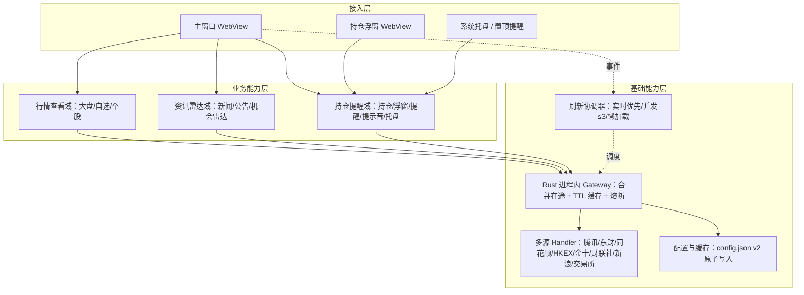
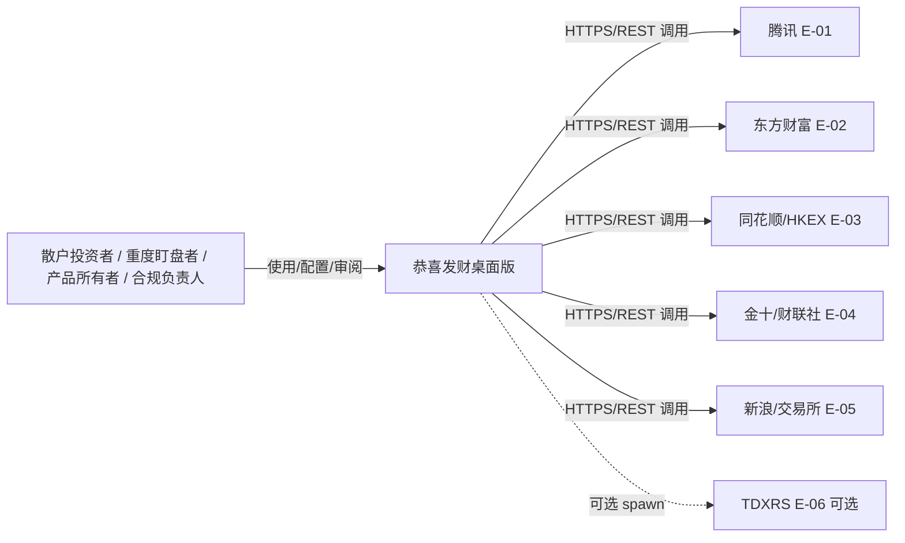
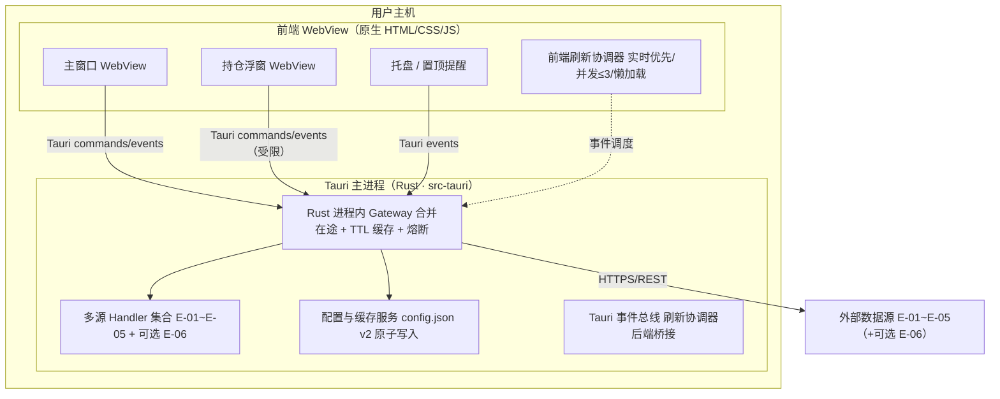
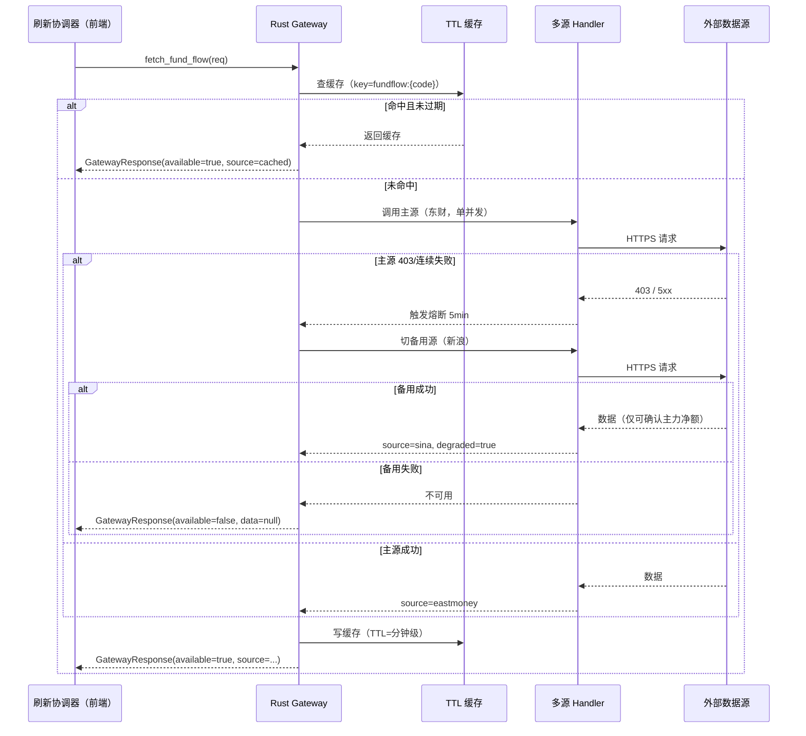
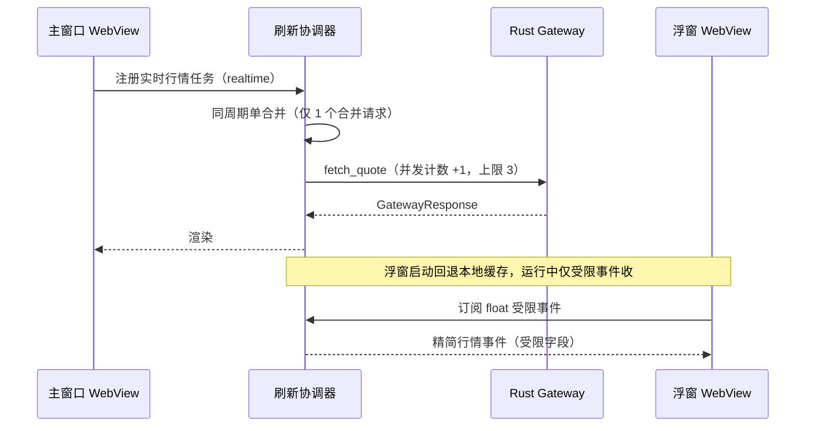
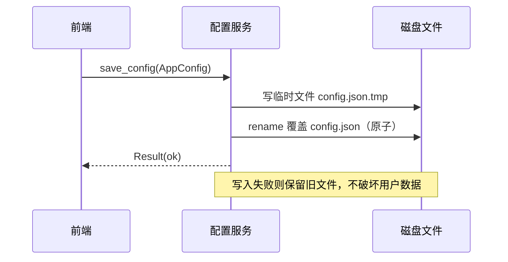
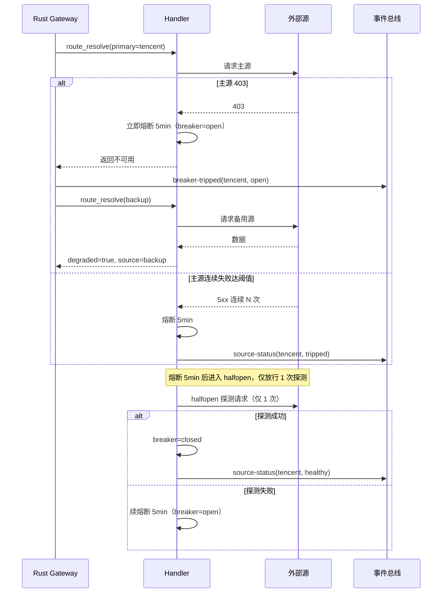
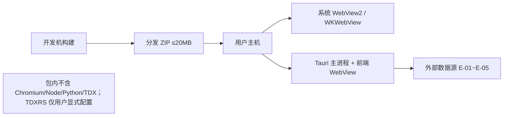

# AICoding 架构设计 · 系统设计

> 本文档为《AICoding 架构设计》核心产物之一，对应**系统架构设计模版（技术与实现层）**。
> 上游输入：《高层架构设计》产出的业务架构、系统定位、能力盘点、功能边界（F1–F15、N1/N2、O1–O5、U-01~U-04）；
> 下游输出：用于驱动《部署设计》《安全设计》《UserStory》的实施。
>
> **裁剪与适配说明（写入 §0，供校验与评审追溯）**：本系统为**本地桌面应用（Tauri 2 + Rust）**，非 SaaS / 非私有化、单机单用户、无租户、无远端 RDBMS / Redis / 消息队列 / K8s。据此对模板做如下裁剪，并顺延编号：
> - 未启用：§3.1.3 中"云组件 / 中间件清单"（服务器集群类）—— 以"§3.1.3 外部依赖清单（E-xx）+ 本地运行时依赖"替代；§4.3 中"RPO/RTO 备份恢复"以本地原子写入 + 缓存恢复改写；§5 部署架构以"桌面分发与运行时约束"改写；§6 网络架构以"对外数据源出口白名单"改写。
> - 不可裁剪章节（§1/§2/§3.1/§3.2/§4.1~§4.3/§5/§7/§8）均已保留，仅按本地桌面形态落地。
> - 跨章节引用中"数据库表名"在本系统等价于 `config.json v2` 的顶层键 / 数据段，统一在 §1.3 与 §4 中说明。

---

## 0. 元信息：修订记录

> 状态：**Approved（G4）**；责任人：高见远（system-architect）；最后更新：2026-08-13。

| 文档版本 | 发布日期 | 修订人 | 修订说明 |
| --- | --- | --- | --- |
| v1.0 | 2026-08-13 | 高见远（system-architect） | 文档初始版本，基于已通过 G3 的《高层架构设计》冻结边界产出技术与实现层设计 |

**填写要求**：每次评审通过新增一行；修订说明必须能定位到具体章节，禁止"细节优化 / 调整内容"等不可验证表述。

---

## 1. 引言

### 1.1 文档目标

- **一句话定位**：本文档定义「恭喜发财桌面版」在 Tauri 2 + Rust 目标架构下的全部技术与实现层产物（系统上下文、容器、关键组件、数据模型、接口契约、关键流程、非功能落地）。
- **读者对象**：架构师 / Rust 研发 / 前端研发 / 分发与合规负责人 / 评审委员会。
- **设计范围**：业务架构 + 应用架构（系统上下文 / 容器 / 模块）+ 本地数据模型 + 接口契约 + 关键流程 + 分发与运行时约束 + 安全基线 + 可观测。

### 1.2 关联文档清单

| 输入类型 | 内容要点 | 在本文档中的用途 | 形式（外部文档 / 本文档自带） |
| --- | --- | --- | --- |
| 高层架构 | Tauri 2+Rust 已裁决边界、F1–F15/N1/N2、O1–O5、U-01~U-04、数据可靠性口径 | 第 2/3/4/5/7 章的权威边界 | 外部文档：高层架构设计.md |
| 行业调研 | Tauri/Electron/Wails 对比、弹性模式、WebView2 依赖、Updater 安全 | 第 3.1.5 技术选型、第 7 章安全基线 | 外部文档：research_report.md |
| 资料摘要 | README/AGENTS/design-brief/overview 的现状事实与冲突（X1–X3 已按 Tauri 裁决） | 第 3.2 模块设计、第 4 章数据模型、第 6 章出口白名单 | 外部文档：material_digest.md |
| 系统定位 | 本地桌面、单机单用户、不内嵌 Chromium/Node、Windows WebView2 / macOS 未公证 | 第 3.1 / 第 5 / 第 7 章约束 | 本文档自带（§3.1.2 / §5） |
| 设计体系 | 白纸/黑墨/荧光黄；DESIGN_VARIANCE 5 / MOTION_INTENSITY 3 / VISUAL_DENSITY 8；light/dark；响应式 540/592/760/1280 | 第 3.5 / 第 5.4 非功能落地 | 本文档自带（§3.5.4 / §5.4） |

### 1.3 名词与术语表

> 本系统无远端 RDBMS，"数据库表名"列以 `config.json v2` 的**顶层键 / 数据段**等价承载，便于研发落地时对照。

| 业务术语 | 业务定义（≤ 30 字） | 应用层核心对象（§3.3 O-xx） | 数据段（等价"表名"，§4.2） |
| --- | --- | --- | --- |
| 大盘指数 | 上证/深证/创业板等指数实时与分时 | `IndexSnapshot` | `cache.index.*` |
| 自选分组 | 用户自定义股票分组与成员 | `WatchGroup` | `groups` |
| 持仓成本备注 | 本地持仓成本与用户备注 | `Holding` | `holdings` |
| 分时 / 日K | 个股时间序价格与成交 | `Kline` | `cache.kline.*` |
| 资金流 | 主力/净流入等资金面数据 | `FundFlow` | `cache.fundflow.*` |
| 新闻 / 公告 | 财经快讯与交易所公告 | `NewsItem` | `cache.news.*` |
| 机会雷达 | 前 8 名深度分析的综合评分 | `RadarResult` | `cache.radar.*` |
| 持仓浮窗 | 常驻精简行情浮窗 | `FloatWindow` | `settings.float` |
| 多源降级 | 主备源切换与熔断元信息 | `SourceMeta` | `meta.sources` |
| 配置存储 | config.json v2 原子写入 | `AppConfig` | `config.json` 根 |

---

## 2. 业务架构

### 2.1 业务架构概览

#### 2.1.1 业务全景图

> 系统级业务全景图，以业务域分块展示：接入层（用户触点）→ 业务能力层（行情/自选/持仓/提醒/雷达）→ 基础能力层（Rust gateway / 多源 handler / 配置缓存 / 刷新协调器）。

**业务域清单**：

| 业务域 | 核心场景 | 涉及角色 | 与其他业务域的关系 |
| --- | --- | --- | --- |
| 行情查看域 | 大盘/自选/个股分时日K/资金流 | 散户投资者 / 重度盯盘者 | 上游依赖基础能力层 gateway |
| 资讯雷达域 | 新闻公告 / 机会雷达深度分析 | 散户投资者 | 依赖 gateway 多源聚合 |
| 持仓提醒域 | 持仓成本备注 / 浮窗 / 置顶提醒 / 提示音 / 托盘 | 重度盯盘者 | 依赖配置与协调器 |
| 数据链路域 | 多源 handler / gateway 熔断 / 降级元数据 | 合规负责人 | 支撑全部上层业务域 |
| 配置域 | config.json v2 原子写入 / 旧字段兼容 | 产品所有者 | 被所有业务域读写 |



### 2.2 领域关系映射

#### 2.2.1 限界上下文清单

> 本节按 DDD 给出限界上下文。**注意**：本系统为本地桌面应用，领域划分用于解耦模块边界与防腐层设计，不对应微服务。

| 限界上下文 | 对应业务域 | 域类型 | 覆盖的核心业务实体 | 上下文边界（属于本域 vs 不属于） |
| --- | --- | --- | --- | --- |
| 行情聚合上下文 | 行情查看域 + 资讯雷达域 | 核心域 | `IndexSnapshot` / `Kline` / `FundFlow` / `NewsItem` / `RadarResult` | 属于：行情与资讯解析、多源聚合；不属于：外部源原始协议 |
| 配置与缓存上下文 | 配置域 + 数据链路域 | 支撑域 | `AppConfig` / `WatchGroup` / `Holding` / `SourceMeta` | 属于：本地配置与缓存；不属于：远端账户体系 |
| 提醒与展示上下文 | 持仓提醒域 | 支撑域 | `FloatWindow` / `AlertRule` / `TrayState` | 属于：浮窗/提醒/托盘；不属于：行情计算 |
| 外部数据源防腐上下文 | 数据链路域（对外） | 通用域 | `SourceAdapter`（ACL） | 属于：适配器与协议转换；不属于：业务语义模型 |

**域类型说明**：核心域（Core）= 行情聚合，差异化竞争力所在，投入最多；支撑域（Supporting）= 配置/缓存、提醒展示，必要但非差异化，自研；通用域（Generic）= 外部数据源防腐层，优先以 ACL 适配上游私有协议。

#### 2.2.2 上下文映射（Context Mapping）

| 关系编号 | 上游上下文 | 下游上下文 | 关系模式 | 同步方式 | 选择理由 |
| --- | --- | --- | --- | --- | --- |
| C-01 | 外部数据源防腐上下文 | 行情聚合上下文 | ACL（Anticorruption Layer） | 同步 API + 适配器 | 外部源协议私有且多变，禁止污染本域业务模型，handler 保留来源/降级/不可用元数据 |
| C-02 | 腾讯行情源（上游平台） | 外部数据源防腐上下文 | Conformist | 直接遵循对方模型 | 对强势上游无议价能力，适配器顺从其字段 |
| C-03 | 配置与缓存上下文 | 行情聚合上下文 | Customer/Supplier | 本地读写 | 配置驱动聚合参数（分组/阈值/路由覆盖） |
| C-04 | 提醒与展示上下文 | 配置与缓存上下文 | Shared Kernel | 共享 `AppConfig` DTO | 浮窗与提醒共用配置结构，必须一致 |

**关系模式说明**：ACL 用于隔离外部数据源；Conformist 用于顺从腾讯等强势上游；Customer/Supplier 用于配置→聚合；Shared Kernel 用于浮窗/提醒共享配置结构。

#### 2.2.3 跨域协作原则

| 原则编号 | 原则 |
| --- | --- |
| P-01 | 核心域（行情聚合）禁止反向依赖支撑域的内部模型；仅通过 `AppConfig` 共享结构读取参数 |
| P-02 | 核心域之间（行情查看 / 资讯雷达）禁止直接耦合，必须经 Rust gateway 与事件解耦 |
| P-03 | 对接外部不可控系统（E-xx）必须建 ACL 防腐层（C-01），禁止把外部模型贯穿到本域 |

### 2.3 详细业务架构

#### 2.3.1 用例图

**用例图清单**：

| 编号 | 用例图标题 | 涉及业务域 | 源文件位置 |
| --- | --- | --- | --- |
| UC-01 | 主窗口行情查看 | 行情查看域 | 内嵌 Mermaid（§3.2.M1） |
| UC-02 | 持仓与提醒管理 | 持仓提醒域 | 内嵌 Mermaid（§3.2.M3） |
| UC-03 | 多源降级与熔断感知 | 数据链路域 | 内嵌 Mermaid（§3.2.M4） |

#### 2.3.2 业务流程图

**关键流程清单**（核心业务覆盖度 ≥ 80%）：

| 流程编号 | 流程名 | 起点 | 终点 | 涉及业务域 | 源文件位置 |
| --- | --- | --- | --- | --- | --- |
| BF-01 | 实时刷新调度 | 协调器节拍触发 | 前端渲染完成 | 行情查看域 / 数据链路域 | §3.2.M1.4 |
| BF-02 | 多源降级切换 | 主源不可用 | 备用源返回或诚实表达 | 数据链路域 | §3.2.M4.4 |
| BF-03 | 熔断半开探测 | 熔断计时到期 | 恢复或续熔断 | 数据链路域 | §3.2.M4.4 |
| BF-04 | 浮窗受限事件收 | 浮窗启动 | 受限精简行情渲染 | 持仓提醒域 | §3.2.M3.4 |

### 2.4 业务范围与边界

#### 2.4.1 功能模块清单

| 编号 | 一级功能名 | 子功能描述 | 对应业务域 | 实现状态 |
| --- | --- | --- | --- | --- |
| F1 | 大盘指数监控 | 指数列表 + 真实 242 点分时迷你图 | 行情查看域 | 完整实现 |
| F2 | 自选股分组 | 分组增删改、排序 | 行情查看域 | 完整实现 |
| F3 | 持仓成本与备注 | 本地持仓 + 备注 | 持仓提醒域 | 完整实现 |
| F4 | 分时 / 日K | 多源聚合展示 | 行情查看域 | 完整实现 |
| F5 | 资金流 | 东财主源 + 新浪备用 | 行情查看域 | 完整实现 |
| F6 | 新闻 / 公告 | 多源降级 + 来源标识 | 资讯雷达域 | 完整实现 |
| F7 | 风险与机会雷达 | 前 8 名深度分析；少于 3 个核心组件可用时不生成综合分 | 资讯雷达域 | 完整实现 |
| F8 | 独立持仓浮窗 | 受限事件收精简行情 | 持仓提醒域 | 完整实现 |
| F9 | 透明置顶提醒 | 常驻置顶 | 持仓提醒域 | 完整实现 |
| F10 | 提示音 | 提醒音效 | 持仓提醒域 | 完整实现 |
| F11 | Windows 托盘 | 托盘常驻 | 持仓提醒域 | 完整实现 |
| F12 | 多数据源降级 | gateway 熔断 + 降级元数据 | 数据链路域 | 完整实现 |
| N1 | 配置原子写入 | config.json v2 原子写入 + 旧字段兼容 | 配置域 | 完整实现 |
| N2 | 包体 ≤20MB | 不含 Chromium/Node/Python/TDX | 配置域 / 分发 | 完整实现 |
| F13 | 导入 / 导出 | 文件读写（权限敏感） | 配置域 | 延后（MVP 后，F13） |
| F14 | 自动更新通道 | Tauri Updater 签名 + HTTPS | 分发 | 延后（完整版，F14） |
| F15 | macOS 公证发行 | 公证 + 签名 | 分发 | 延后（完整版，F15） |

**In-Scope（本期范围内）**：

| 编号 | 本期必做的事项 |
| --- | --- |
| F1–F12 | 大盘/自选/持仓/分时日K/资金流/新闻公告/机会雷达/浮窗/提醒/提示音/托盘/多源降级 |
| N1 | config.json v2 原子写入 + 旧字段兼容 |
| N2 | 分发 ZIP ≤20MB，不含 Chromium/Node/Python/TDX |

**Out-of-Scope（本期不做）**：

| 编号 | 不做的事项 | 不做的原因 | 未来归属 |
| --- | --- | --- | --- |
| O1 | 自动更新通道 | 涉及签名密钥管理与更新服务器商务/成本（U-03） | F14 完整版 |
| O2 | macOS 公证发行 | 需 Apple Developer ID 年费与公证流程（U-03） | F15 完整版 |
| O3 | 导入 / 导出 | 涉及文件权限与外部格式，过早扩大权限面（U-02 关联） | F13 MVP 后 |
| O4 | 服务端聚合 / 云端账户 / 跨设备同步 | 超出本地桌面应用边界 | 不做 |
| O5 | 交易下单 | 合规风险高，非本工具职责 | 不做 |

### 2.5 质量与柔性可用

#### 2.5.1 服务质量目标

**质量目标 Top 3-5**：

| 优先级 | 质量目标 | 业务驱动 | 受影响的关键章节 |
| --- | --- | --- | --- |
| Q1 | 数据可靠性（诚实表达 100%，熔断恢复 ≤5min） | 断流/降级不误导投资决策（P1） | §3.2.M4 / §4.2 / §5.3 |
| Q2 | 实时性（普通并发 ≤3，刷新 P99 受协调器节拍约束） | 实时行情新鲜度体验 | §3.2.M1 / §3.2.M2 |
| Q3 | 轻量分发（ZIP ≤20MB，无冗余运行时） | 分发门禁与降低运维成本（P2） | §5.4 / §5.5 |
| Q4 | 主题一致性（浅/深/跟随 100% 统一） | 高密度信息扫描降低认知成本（P2） | §3.5.4 / §5.4 |
| Q5 | 权限最小化（仅开放事件能力） | 安全边界与合规底线 | §3.1.5 / §7.2 |

**可验证质量场景**：

| 场景编号 | 关联目标 | 触发源 | 触发条件 | 期望响应 | 度量指标 |
| --- | --- | --- | --- | --- | --- |
| QS-01 | Q1 | 上游 403/连续失败 | 连续失败达阈值 | 5 分钟熔断 + 半开单次探测 | 熔断恢复时效 ≤ 5min；诚实表达覆盖率 100% |
| QS-02 | Q2 | 用户查看分时 | 同周期合并后 ≤3 并发 | 正常返回且同周期只发 1 个请求 | 普通请求并发峰值 ≤ 3 |
| QS-03 | Q3 | 构建产物 | ZIP 产出 | 体积 ≤ 20MB 且不含 Chromium/Node | ZIP ≤ 20MB |

#### 2.5.2 业务柔性可用策略

**业务功能优先级分层**：

| 层级 | 含义 | 故障态下的处置方向 | 用户感知 |
| --- | --- | --- | --- |
| L0 核心业务 | 行情聚合与展示主链路 | 不降级；优先消耗所有资源保障 | 无 / 极轻微 |
| L1 重要业务 | 浮窗 / 提醒 / 托盘 | 限流 + 异步化 | 变慢 / 排队提示 |
| L2 辅助业务 | 机会雷达深度分析 | 关闭综合分，仅返回可用组件 | 部分功能不可用 + 友好提示 |
| L3 附加业务 | 提示音 / 迷你图懒加载 | 直接关闭 + 异步补偿 | 通常无感 |

**业务降级清单**：

| 编号 | 关联功能（F-xx） | 触发条件 | 降级动作 | 用户感知 | 决策类型 |
| --- | --- | --- | --- | --- | --- |
| BD-01 | F12 | 主源 403/连续失败 | 切备用源 + 标注来源 | 界面显示实际使用来源，无中断 | 自动 |
| BD-02 | F7 | 少于 3 个核心组件可用 | 不生成综合分，返回覆盖率与缺失来源 | 提示"数据不足，未生成综合分" | 自动 |
| BD-03 | F5 | 主源东财熔断 | 切新浪备用，仅展示可确认主力净额 | 资金流标注备用源 | 自动 |
| BD-04 | F6 | 快讯源全不可用 | 返回空 + available:false，不缓存正文 | 提示"快讯暂不可用" | 自动 |

---

## 3. 应用架构

### 3.1 应用架构概览

#### 3.1.1 系统上下文

**系统上下文要素清单**：

| 节点类型 | 节点名 | 与本系统的关系 | 关系语义 |
| --- | --- | --- | --- |
| 角色 | 散户投资者 | 使用 | 主窗口 / 设置页操作 |
| 角色 | 重度盯盘者 | 使用 | 浮窗 / 置顶提醒 / 托盘 |
| 角色 | 产品所有者 | 配置 | 分组 / 持仓 / 阈值设定 |
| 角色 | 合规负责人 | 审阅 | 数据源降级覆盖率与包体门禁 |
| 外部系统 | 腾讯行情源（E-01） | 本系统 → 调用 | 实时行情 / 指数 / 日K 分时（主源） |
| 外部系统 | 东方财富（E-02） | 本系统 → 调用 | 资金流 / 龙虎榜 / 限售解禁 / 快讯 |
| 外部系统 | 同花顺 / HKEX（E-03） | 本系统 → 调用 | 北向数据（主源同花顺分钟序列，HKEX 日统计备用） |
| 外部系统 | 金十 / 财联社（E-04） | 本系统 → 调用 | 财经快讯（三者互相降级） |
| 外部系统 | 新浪 / 沪深交易所 / 深交所（E-05） | 本系统 → 调用 | 资金流备用 / 公告 / 北向官方 |
| 外部进程 | TDXRS（E-06，可选） | 本系统 → spawn | 仅用户显式配置时启动，包不含 runtime |



#### 3.1.2 系统模块图（容器图 C4-lite）

> C4-lite 容器图：标注 **Tauri 主进程 ↔ Rust gateway ↔ 前端 WebView ↔ 外部数据源** 四层容器与协议方向。



**分层组件清单**：

| 层次 | 内容 | 数据来源 |
| --- | --- | --- |
| 接入层 | 主窗口 WebView / 持仓浮窗 WebView / 托盘置顶提醒 | §2.3 用例图角色 |
| 应用层 | Rust gateway / 多源 Handler / 配置缓存服务 | §2.1 业务域 |
| 中间件层 | 进程内 TTL 缓存 / 本地磁盘缓存（无远端中间件） | §4.4 |
| 集成对接层 | 外部依赖 E-01~E-06 的 handler 适配入口（ACL） | §3.1.3 外部依赖清单 |

#### 3.1.3 集成架构

##### 外部依赖清单

| ID | 外部系统 | 归属供应商 | 类别 | 使用方式 | 集成方式 | 协议 / 版本 | 功能定位（≤ 30 字） | 联系人 |
| --- | --- | --- | --- | --- | --- | --- | --- | --- |
| E-01 | 腾讯行情源 | 腾讯 | 第三方业务平台 | 消费 | HTTPS/REST | 公开 HTTP API | 实时行情/指数/日K分时主源 | 主理人 |
| E-02 | 东方财富 | 东方财富 | 第三方业务平台 | 消费 | HTTPS/REST | 公开 HTTP API | 资金流/龙虎榜/限售解禁/快讯 | 主理人 |
| E-03 | 同花顺 / HKEX | 同花顺/HKEX | 第三方业务平台 | 消费 | HTTPS/REST | 公开 HTTP API | 北向数据主源与备用 | 主理人 |
| E-04 | 金十 / 财联社 | 金十/财联社 | 第三方业务平台 | 消费 | HTTPS/REST | 公开 HTTP API | 财经快讯多源降级 | 主理人 |
| E-05 | 新浪 / 沪深交易所 / 深交所 | 新浪/交易所 | 第三方业务平台 | 消费 | HTTPS/REST | 公开 HTTP API | 资金流备用/公告/北向官方 | 主理人 |
| E-06 | TDXRS（可选） | 用户显式配置 | 外部进程 | 消费 | 进程 spawn | 外部二进制 | 日K/分时加速，包不含 runtime | 主理人 |

**填写要求**：类别取值封闭枚举（第三方业务平台）；使用方式取值消费 / 生产 / 双向（本系统全部为消费）。

##### 本地运行时依赖（替代"云组件清单"）

| ID | 组件类别 | 选型 | 部署形态 | 规格量级 | 容量预估 | 提供方 | 用途 |
| --- | --- | --- | --- | --- | --- | --- | --- |
| L-01 | 系统 WebView | WebView2（Windows）/ WKWebView（macOS） | 操作系统组件 | 随系统 | 不计入包体 | 操作系统厂商 | UI 渲染（不打包进应用） |
| L-02 | 进程内缓存 | 进程内存 + 本地磁盘缓存 | 应用内 | 受 ≤20MB 约束 | 分钟级 TTL | 自研 | 行情/新闻可重拉缓存 |
| L-03 | 配置存储 | config.json v2 原子写入 | 应用数据目录 | 单文件 | KB 级 | 自研 | 用户配置与持仓 |

##### 组件依赖关系

| 业务模块（§3.2） | 依赖的外部系统（E-xx） | 依赖的本地组件（L-xx） | 故障传导风险 |
| --- | --- | --- | --- |
| M1 行情网关 | E-01 / E-02 / E-03 / E-05 | L-02 缓存 | E-01 不可用 → 切备用或诚实表达，主链路不崩 |
| M2 刷新协调器 | — | L-02 缓存 | 缓存不可用 → 直连 gateway，增上游压力 |
| M3 配置存储 | — | L-03 配置 | 配置写入损坏 → 原子写入回退旧文件 |
| M4 降级元数据流转 | E-01~E-05 | L-02 缓存 | 多源同时不可用 → 诚实表达，不伪装 |

#### 3.1.4 工程结构

```
fund-tracker-desktop/
├── src-tauri/                 # Rust 桌面壳工程（主进程）
│   ├── src/
│   │   ├── commands.rs        # Tauri commands 暴露给前端的命令
│   │   ├── gateway.rs         # 进程内 gateway：合并在途 + TTL 缓存 + 熔断
│   │   ├── handlers/          # 多源 handler（E-01~E-05 + 可选 E-06）
│   │   │   ├── tencent.rs
│   │   │   ├── eastmoney.rs
│   │   │   ├── northbound.rs
│   │   │   ├── news.rs
│   │   │   └── mod.rs
│   │   ├── config.rs          # config.json v2 读写 + 旧字段兼容迁移
│   │   ├── cache.rs           # 进程内 TTL 缓存
│   │   └── events.rs          # Tauri events 广播（刷新/来源状态/熔断/提醒）
│   ├── Cargo.toml
│   └── tauri.conf.json        # capabilities：仅开放事件能力
├── app/                       # 主窗口原生前端
│   ├── src/
│   │   ├── coordinator.js     # 刷新协调器：实时优先/并发≤3/懒加载
│   │   ├── api/               # 对 Tauri commands 的封装（对齐 §3.2 接口清单）
│   │   ├── stores/            # 全局状态（无大型状态库）
│   │   ├── pages/             # 大盘/自选/个股/持仓/设置
│   │   ├── components/        # 跨页面通用组件
│   │   └── theme/             # 白纸黑墨荧光黄双模式 token
│   └── index.html
├── renderer/                  # 持仓浮窗 / 提醒前端
└── scripts/                   # 前端准备、版本、分发 ZIP 脚本
```

> **公共模块约束**：前端 `api/` 仅通过 Tauri commands/events 访问桌面能力；Rust `commands.rs` 是唯一对外开放边界，禁止前端获得任意 fs/shell/进程权限（PCS 能力约束）。

#### 3.1.5 技术选型（版本约束）

| 技术分类 | 选型 | 版本 | 备注 / 选型理由 |
| --- | --- | --- | --- |
| 应用外壳框架 | Tauri 2 | 2.0 | 系统 WebView + 不携带 Chromium/Node，直接满足 ZIP ≤20MB 分发门禁；相对 Electron（否决，包体冲突）场景契合度最高 |
| 主进程语言 | Rust（stable） | 1.85 | 内存安全，与既有 src-tauri 工程一致；相对 Go（Wails）语言栈不符，不采用 |
| 异步运行时 | Tokio | 1.40 | 支撑 gateway 合并在途与并发控制；轻量、生态成熟 |
| HTTP 客户端 | reqwest | 0.12 | 多源 handler 统一 HTTP 调用；支持超时与退避 |
| 系统 WebView | WebView2（Windows）/ WKWebView（macOS） | 系统组件 | 不计入包体；Windows 缺失时显示原生提示与官方下载链接 |
| 前端栈 | 原生 HTML/CSS/JavaScript | 无框架 | 已裁决保留原生前端，无 Node/任意 fs 权限；相对 React/Vite 不引入大型依赖 |
| 可靠性模式 | 自研 Retry + Circuit Breaker + Cache-Aside | — | 进程内轻量实现，匹配 gateway 位置；不引入 Java/Net 生态库 |
| 配置存储 | 原子写文件（临时写 + rename） | — | config.json v2 原子写入 + 旧字段兼容；敏感字段加密待 U-02 裁决 |

**填写要求**：必须有版本号；选型理由用一句话说明为什么选 A 不选 B。

### 3.2 模块详细设计

#### 3.2.1 模块公共约束（Common）

**通信方式约束**：

| 约束项 | 取值 |
| --- | --- |
| 接口路径风格 | Tauri command 名（kebab-case 命令式） |
| 协议 | Tauri IPC（commands 请求 / events 推送） |
| 数据格式 | JSON（前端）↔ Rust serde 结构体 |
| 字符编码 | UTF-8 |

**通用基础结构**：

| 基类 / 结构 | 用途 | 包路径 |
| --- | --- | --- |
| `GatewayResponse〈T〉` | gateway 统一响应信封（含 source/available/data/degraded/meta） | `src-tauri/src/gateway.rs` |
| `SourceMeta` | 来源/降级/不可用元数据 | `src-tauri/src/handlers/mod.rs` |
| `AppConfig` | config.json v2 根结构 | `src-tauri/src/config.rs` |

#### 3.2.2 模块清单与编号规则

**模块清单**：

| 编号 | 模块名 | 业务域（§2.1） | 模块负责人 | 关联子领域 |
| --- | --- | --- | --- | --- |
| M1 | 行情网关模块（Rust gateway） | 数据链路域 / 行情查看域 | 高见远 | 多源聚合 / 熔断 / 缓存 |
| M2 | 刷新协调器模块 | 数据链路域 | 高见远 | 实时优先 / 并发≤3 / 懒加载 |
| M3 | 配置与缓存模块 | 配置域 | 高见远 | 原子写入 / 旧字段兼容 |
| M4 | 降级元数据流转模块 | 数据链路域 | 高见远 | 主备切换 / 诚实表达 |

**编号规则**：模块编号 `M{N}` 全局唯一，与 §2.1 业务域名一致；每个模块独立成节（§3.2.M{N}），节内五段式编号 §3.2.M{N}.1~§3.2.M{N}.5。

#### 3.2.3 单模块设计模板（五段式）

> 本节为格式规范说明（项目级公共约束），各模块在 §3.2.M{N} 下仅体现不重复声明。五段顺序：模块概述 / 接口清单 / 结构定义（DTO）/ 模块逻辑时序图 / 关键流程逻辑。

#### 3.2.M1 行情网关模块（Rust gateway）

##### §3.2.M1.1 模块概述

`行情网关模块` 覆盖实时行情聚合、多源 handler 调度、TTL 缓存、在途请求合并与熔断的业务流程，业务逻辑在刷新协调器、前端 WebView、外部数据源之间流动，同时涉及 Rust gateway、多源 Handler、配置与缓存等内外部系统。

##### §3.2.M1.2 接口清单

| 子领域 | command / 方法 | 路径或命令名 | 用途（≤ 20 字） | 请求 DTO | 响应 VO | 幂等 |
| --- | --- | --- | --- | --- | --- | --- |
| 行情 | command | `fetch_index_snapshot` | 大盘指数快照 | `IndexReq` | `GatewayResponse〈IndexSnapshot〉` | 天然（只读） |
| 行情 | command | `fetch_quote` | 个股实时报价 | `QuoteReq` | `GatewayResponse〈Quote〉` | 天然 |
| 行情 | command | `fetch_kline` | 分时 / 日K | `KlineReq` | `GatewayResponse〈Kline〉` | 天然 |
| 资金 | command | `fetch_fund_flow` | 资金流（东财主+新浪备） | `FundFlowReq` | `GatewayResponse〈FundFlow〉` | 天然 |
| 资讯 | command | `fetch_news` | 新闻 / 快讯 | `NewsReq` | `GatewayResponse〈NewsItem[]〉` | 天然 |
| 资讯 | command | `fetch_announcements` | 公告 | `NewsReq` | `GatewayResponse〈NewsItem[]〉` | 天然 |
| 雷达 | command | `fetch_radar` | 机会雷达前 8 名 | `RadarReq` | `GatewayResponse〈RadarResult〉` | 天然 |
| 北向 | command | `fetch_northbound` | 北向数据 | `NorthReq` | `GatewayResponse〈Northbound〉` | 天然 |

##### §3.2.M1.3 关键结构定义（DTO）

**统一响应信封（关键字段）**：

| DTO / VO 名 | 字段名 | 类型 | 必填 | 业务含义 | 约束 / 默认值 |
| --- | --- | --- | --- | --- | --- |
| `GatewayResponse〈T〉` | `ok` | bool | 是 | 调用是否成功 | — |
| `GatewayResponse〈T〉` | `source` | String | 是 | 实际使用来源标识（如 eastmoney） | 多源降级时返回实际源 |
| `GatewayResponse〈T〉` | `available` | bool | 是 | 数据是否可用 | 不可用必须为 false（诚实表达） |
| `GatewayResponse〈T〉` | `data` | T / null | 否 | 业务数据 | 不可用时必须为 null，禁止零值伪装 |
| `GatewayResponse〈T〉` | `degraded` | bool | 是 | 是否经降级取得 | 默认 false |
| `GatewayResponse〈T〉` | `meta` | Object | 是 | 元数据：fetchedAt / ttl / breaker 状态 | 含熔断状态字段 |

**关键字段定义表**：

| DTO / VO 名 | 字段名 | 类型 | 必填 | 业务含义 | 约束 / 默认值 |
| --- | --- | --- | --- | --- | --- |
| `FundFlow` | `main_net` | Number / null | 否 | 主力净额 | 新浪备用仅填充可确认主力净额，其余为 null |
| `Northbound` | `net_buy` | Number / null | 否 | 北向净买额 | HKEX 备用仅成交额，net_buy 必须为 null，不得描述为净流入 |
| `RadarResult` | `composite_score` | Number / null | 否 | 综合分 | 少于 3 个核心组件可用时为 null，不生成综合分 |
| `RadarResult` | `coverage` | Object | 是 | 可用组件覆盖率与缺失来源 | 与综合分同返回 |

##### §3.2.M1.4 模块逻辑时序图

**时序图清单**：

| 编号 | 标题（行情网关 - 场景名） | 场景类别 | 是否包含异常分支 |
| --- | --- | --- | --- |
| SQ-01 | 行情网关 - 聚合单源 | 核心实体查询 | 是 |
| SQ-02 | 行情网关 - 多源降级 | 主备切换 / 回退 | 是 |



##### §3.2.M1.5 关键流程逻辑

```
触发：fetch_* command 进入 gateway

Step 1: 在途合并（同步）
  ├── 计算 dedup key = command + 参数哈希
  ├── 若已有在途相同请求：订阅其 Future，不重复发上游
  └── 否则进入步骤 2

Step 2: TTL 缓存检查（同步）
  ├── 命中且未过期：直接返回（source=cached）
  └── 未命中：进入步骤 3

Step 3: handler 调度（同步）
  ├── 主源 handler 调用（受单并发/间隔约束，见 §3.2.M4）
  ├── 校验 HTTP 状态 + 有效行数（D4 §2.3）
  ├── 失败 → 触发降级（BD-01）
  └── 全部不可用 → 返回 available:false, data:null（诚实表达）

Step 4: 写回缓存（异步）
  └── 仅成功且 available=true 时写 TTL 缓存
```

#### 3.2.M2 刷新协调器模块

##### §3.2.M2.1 模块概述

`刷新协调器模块` 覆盖主窗口与浮窗的统一刷新调度，业务逻辑在前端 WebView、Rust gateway、Tauri 事件总线之间流动；仅经事件能力调度 gateway，不开放任意 fs/shell。

##### §3.2.M2.2 接口清单

| 子领域 | 方法 | 命令名 / 事件 | 用途（≤ 20 字） | 请求 DTO | 响应 VO | 幂等 |
| --- | --- | --- | --- | --- | --- | --- |
| 调度 | 事件订阅 | `refresh-tick` | 节拍触发刷新 | — | Event | 天然 |
| 调度 | 命令 | `schedule_refresh` | 注册刷新任务 | `ScheduleReq` | Result | 是（任务去重） |
| 调度 | 命令 | `pause_hidden` | 页面隐藏暂停后台 | `PauseReq` | Result | 天然 |

##### §3.2.M2.3 关键结构定义（DTO）

| DTO / VO 名 | 字段名 | 类型 | 必填 | 业务含义 | 约束 / 默认值 |
| --- | --- | --- | --- | --- | --- |
| `ScheduleReq` | `scope` | String | 是 | 刷新作用域（main/float） | main / float |
| `ScheduleReq` | `priority` | String | 是 | 实时优先标记 | realtime / normal |
| `ScheduleReq` | `concurrency` | Number | 否 | 普通并发上限 | 默认 3 |

##### §3.2.M2.4 模块逻辑时序图



##### §3.2.M2.5 关键流程逻辑

```
触发：refresh-tick 节拍

Step 1: 实时优先（同步）
  ├── realtime 任务优先于 normal 任务出队
  └── 同周期仅保留 1 个合并行情请求

Step 2: 并发控制（同步）
  ├── 普通请求并发计数，超过 3 则排队
  ├── 东方财富通道单并发 + 启动间隔 1–1.3s
  └── 迷你图按可见区域懒加载，限 2 并发

Step 3: 隐藏暂停（事件）
  ├── 页面隐藏：暂停该页面后台刷新
  └── 浮窗：启动回退本地缓存，运行中仅收受限事件
```

#### 3.2.M3 配置与缓存模块

##### §3.2.M3.1 模块概述

`配置与缓存模块` 覆盖 config.json v2 原子写入、旧字段兼容迁移与本地缓存读写，业务逻辑在前端/命令、Rust config 服务、磁盘文件之间流动。

##### §3.2.M3.2 接口清单

| 子领域 | 方法 | 命令名 | 用途（≤ 20 字） | 请求 DTO | 响应 VO | 幂等 |
| --- | --- | --- | --- | --- | --- | --- |
| 配置 | command | `load_config` | 读取配置（含迁移） | — | `AppConfig` | 天然 |
| 配置 | command | `save_config` | 原子写入配置 | `AppConfig` | Result | 是（全量覆盖） |
| 缓存 | command | `cache_get` | 读本地缓存 | `CacheKey` | `CacheVal` | 天然 |
| 缓存 | command | `cache_set` | 写本地缓存 | `CachePut` | Result | 天然 |

##### §3.2.M3.3 关键结构定义（DTO）

| DTO / VO 名 | 字段名 | 类型 | 必填 | 业务含义 | 约束 / 默认值 |
| --- | --- | --- | --- | --- | --- |
| `AppConfig` | `schema_version` | Number | 是 | 配置结构版本 | 当前 2 |
| `AppConfig` | `groups` | Array | 是 | 自选分组 | 由 v1 watchlist 迁移 |
| `AppConfig` | `holdings` | Array | 是 | 持仓成本与备注 | 由 v1 positions 迁移 |
| `AppConfig` | `settings` | Object | 是 | 主题/提醒/路由偏好 | 由 v1 prefs 迁移 |

##### §3.2.M3.4 模块逻辑时序图



##### §3.2.M3.5 关键流程逻辑

```
触发：save_config

Step 1: 序列化 AppConfig 为 JSON
Step 2: 写临时文件 config.json.tmp（同目录）
Step 3: 原子 rename 覆盖 config.json
Step 4: 失败回退旧文件，返回错误供前端提示
```

#### 3.2.M4 降级元数据流转模块

##### §3.2.M4.1 模块概述

`降级元数据流转模块` 覆盖主备源路由、熔断判定与来源/降级/不可用元数据在 handler 与 gateway 之间的流转；业务逻辑在多源 Handler、Rust gateway、前端状态面板之间流动。

##### §3.2.M4.2 接口清单

| 子领域 | 方法 | 命令名 / 事件 | 用途（≤ 20 字） | 请求 DTO | 响应 VO | 幂等 |
| --- | --- | --- | --- | --- | --- | --- |
| 降级 | 事件 | `source-status` | 广播来源健康度 | — | `SourceMeta` | 天然 |
| 降级 | 事件 | `breaker-tripped` | 广播熔断事件 | — | `BreakerMeta` | 天然 |
| 降级 | command | `route_resolve` | 解析主备源 | `RouteReq` | `RoutePlan` | 天然 |

##### §3.2.M4.3 关键结构定义（DTO）

| DTO / VO 名 | 字段名 | 类型 | 必填 | 业务含义 | 约束 / 默认值 |
| --- | --- | --- | --- | --- | --- |
| `SourceMeta` | `source` | String | 是 | 来源标识 | tencent/eastmoney/... |
| `SourceMeta` | `state` | String | 是 | 健康状态 | healthy/degraded/tripped/unavailable |
| `SourceMeta` | `breaker` | String | 是 | 熔断状态 | closed/halfopen/open |
| `RoutePlan` | `primary` | String | 是 | 主源 | 路由表主源 |
| `RoutePlan` | `backup` | Array | 是 | 备用源列表 | 按优先级排序 |

##### §3.2.M4.4 模块逻辑时序图



##### §3.2.M4.5 关键流程逻辑

```
触发：handler 收到上游响应

Step 1: 熔断判定（同步）
  ├── 403：立即熔断 5min（breaker=open）
  ├── 连续网络/429/5xx 失败达阈值：熔断 5min
  └── 否则 breaker=closed

Step 2: 半开探测（定时）
  ├── 5min 计时到期 → breaker=halfopen
  ├── 仅放行 1 次探测请求
  ├── 成功 → closed；失败 → 续 open 5min

Step 3: 降级元数据流转（事件）
  ├── 每次状态变化广播 source-status / breaker-tripped
  └── 前端状态面板显示实际来源与覆盖率（F12）
```

### 3.3 核心业务对象清单

#### 3.3.1 对象定义

| 编号 | 对象名（代码类名） | 对象类型 | 包路径 | 模块归属 | 被哪些模块复用 | 实例化策略 | 序列化约定 | 持久化策略 |
| --- | --- | --- | --- | --- | --- | --- | --- | --- |
| O-01 | `AppConfig` | 聚合根 | `src-tauri/src/config.rs` | M3 | M1/M2/M3/M4 | 启动时加载 + 内存单例 | JSON（serde） | 落 config.json v2（原子写入） |
| O-02 | `GatewayResponse〈T〉` | 共享 DTO | `src-tauri/src/gateway.rs` | M1 | M1/M4 | new（不可变响应） | JSON | 不落盘，瞬时返回 |
| O-03 | `SourceMeta` | 值对象 | `src-tauri/src/handlers/mod.rs` | M4 | M1/M4 | new | JSON | 不落盘，瞬时广播 |
| O-04 | `BreakerState` | 共享枚举 | `src-tauri/src/handlers/mod.rs` | M4 | M4 | — | String | 内存状态机 |
| O-05 | `SourceAdapter` | 防腐层 ACL | `src-tauri/src/handlers/mod.rs` | M4 | M1 | new + 适配 | — | 不落表，瞬时转换 |

**对象类型说明**：聚合根（AppConfig）/ 共享 DTO（GatewayResponse）/ 值对象（SourceMeta）/ 共享枚举（BreakerState）/ 防腐层 ACL（SourceAdapter，与 §2.2.2 C-01 对齐）。

#### 3.3.2 命名漂移登记表

| 业务实体（§2） | 代码类名（§3.3.1） | 数据段（§4.2） | 漂移原因 |
| --- | --- | --- | --- |
| 自选分组 | `WatchGroup` | `groups` | v1 用扁平 `watchlist`，v2 收敛为分组结构 |
| 持仓成本备注 | `Holding` | `holdings` | v1 用 `positions`，v2 改名并扩展备注字段 |

### 3.4 跨模块公共能力

**公共能力清单**：

| 公共能力 | 简述 | 提供方（SDK / 切面 / Bean） | 被哪些模块复用 | 接入方式 |
| --- | --- | --- | --- | --- |
| 事件能力开放 | 仅暴露 events，不开放 fs/shell/process | Tauri `capabilities` 配置 | 全部前端模块 | capabilities 声明 + command 调用 |
| 诚实表达规范 | 空值用 null/available:false，不伪装净流入 | `GatewayResponse` 信封（M1） | M1/M4 | 所有 handler 返回统一信封 |
| 配置变更广播 | 配置保存后通知前端刷新 | `config-changed` 事件（M3） | M2/M3 | 订阅事件 |

### 3.5 接口契约

#### 3.5.1 全局错误码体系

**错误码格式**：

| 项 | 取值 |
| --- | --- |
| 错误码格式 | 字母类别 + 6 位数字（如 `A010001`） |
| 分段规则 | 1 位类别 + 2 位模块 + 3 位错误序号 |
| 类别取值 | `A` = 业务错误（命令成功返回但业务语义失败）/ `B` = 系统错误（Rust panic/IO）/ `C` = 客户端错误（参数/权限） |

**错误响应统一结构**：

```json
{
  "code": "A010001",
  "msg": "数据源不可用",
  "msgI18n": { "zh-CN": "数据源不可用", "en-US": "Data source unavailable" },
  "data": null,
  "traceId": "abc123",
  "timestamp": "2026-08-13T10:00:00.000Z"
}
```

**错误码注册表**：

| 错误码 | HTTP 状态 | 所属模块 | 含义 | 重试建议 | 用户文案 |
| --- | --- | --- | --- | --- | --- |
| A010001 | 200 | M1 | 全部数据源不可用 | 不重试 | 当前数据暂不可用 |
| A010002 | 200 | M4 | 雷达组件不足，未生成综合分 | 不重试 | 数据不足，未生成综合分 |
| B999001 | 500 | 全局 | 系统内部错误（Rust panic） | 可重试 | 系统繁忙，请稍后再试 |
| C400001 | 400 | 全局 | 参数校验失败 | 不重试 | 参数错误 |
| C401001 | 401 | 全局 | 能力未授权（capabilities 拒绝） | 不重试 | 无权限访问此能力 |
| C403001 | 403 | 全局 | 外部源拒绝（403）已触发熔断 | 退避后重试 | 数据源暂时拒绝，已熔断 |
| C429001 | 429 | 全局 | 触发限流（并发≤3） | 退避后重试 | 操作太频繁，请稍后再试 |

#### 3.5.2 幂等性约定

| 接口类型 | 是否要求幂等 | 幂等键来源（建议） |
| --- | --- | --- |
| 写入类（save_config） | 是 | 全量覆盖，天然幂等（末态一致） |
| 查询类（fetch_*） | 天然幂等 | — |
| 订阅类（schedule_refresh） | 是 | 任务 key 去重 |
| 事件广播 | 天然幂等 | — |

#### 3.5.3 限流约定

| 维度 | 默认值 | 触发动作 | 调整方式 |
| --- | --- | --- | --- |
| 普通请求并发 | 3 | 超出排队，返回 C429001 | 协调器常量 |
| 东方财富通道 | 单并发 + 间隔 1–1.3s | 排队 | gateway 常量 |
| 迷你图懒加载并发 | 2 | 超出排队 | 协调器常量 |

**降级策略**：前端触发限流后按节拍退避重试；限流红线值与 §5.5 容量水位线一致。

#### 3.5.4 默认超时与重试基线

| 调用类型 | 默认超时 | 默认重试 | 重试条件 |
| --- | --- | --- | --- |
| 前端 → gateway command | 10s | 0 次 | — |
| gateway → 外部源 E-xx | 8s | 2 次（指数退避 1s / 2s） | 仅网络错误 / 5xx |
| 退避抖动 | 东财间隔 +0~300ms | — | 防惊群 |

**主题与状态统一约束（非功能落地）**：浅色/深色双模式（light/dark）由 `settings.theme` 驱动，色板统一白纸/黑墨/荧光黄（DESIGN_VARIANCE 5 / MOTION_INTENSITY 3 / VISUAL_DENSITY 8）；loading 保留最终布局、empty 解释结果、error 提供可恢复操作；响应式断点 540/592/760/1280。

### 3.6 Tauri commands / events 全集

| 类型 | 名称 | 用途 | 关联模块 |
| --- | --- | --- | --- |
| command | `fetch_index_snapshot` | 大盘指数 | M1 |
| command | `fetch_quote` | 个股报价 | M1 |
| command | `fetch_kline` | 分时 / 日K | M1 |
| command | `fetch_fund_flow` | 资金流 | M1 |
| command | `fetch_news` | 新闻 / 快讯 | M1 |
| command | `fetch_announcements` | 公告 | M1 |
| command | `fetch_radar` | 机会雷达 | M1 |
| command | `fetch_northbound` | 北向数据 | M1 |
| command | `load_config` | 读配置 | M3 |
| command | `save_config` | 写配置 | M3 |
| command | `cache_get` / `cache_set` | 本地缓存 | M3 |
| command | `schedule_refresh` / `pause_hidden` | 刷新调度 | M2 |
| event | `refresh-tick` | 刷新节拍 | M2 |
| event | `source-status` | 来源健康度 | M4 |
| event | `breaker-tripped` | 熔断事件 | M4 |
| event | `config-changed` | 配置变更 | M3 |
| event | `alert-fired` | 提醒触发 | M3 |
| event | `float-window-feed` | 浮窗受限精简行情 | M2/M3 |

---

## 4. 数据库设计（本地数据存储设计）

> 本章回答：本系统的持久化状态用什么存、结构如何、如何迁移兼容。本地桌面应用无远端 RDBMS，以 `config.json v2` 为唯一持久化主数据，进程内 TTL 缓存 + 本地磁盘缓存为可重拉缓存。

### 4.1 全局数据约定

| 约定项 | 取值 | 说明 |
| --- | --- | --- |
| 存储形态 | 单文件 JSON（config.json v2）+ 进程内缓存 + 本地磁盘缓存 | 无 RDBMS |
| 命名规范（键名） | 小写 + 下划线（snake_case）顶层键 | 禁止驼峰 |
| 版本字段 | `schema_version: 2` | 全文件统一；迁移据此判断 |
| 字符集 | UTF-8 | — |
| 时间字段 | ISO-8601 字符串（含时区） | 如 `2026-08-13T10:00:00.000Z` |
| 空值表达 | `null` / `available:false` | 禁止零值伪装（D4 §2.4） |
| 金额字段 | Number（浮点，展示层四舍五入） | 禁止拼接字符串金额 |
| 敏感字段 | 持仓成本 / 备注 | 加密待 U-02 裁决，当前明文 + 文件权限受限 |

### 4.2 单表设计（config.json v2 结构）

#### 4.2.1 库表元信息

| 字段 | 取值 |
| --- | --- |
| 存储类型 | 本地文件系统 JSON |
| 文件位置 | macOS `~/Library/Application Support/恭喜发财/config.json`；Windows `%APPDATA%\恭喜发财\config.json` |
| 表名（等价） | `config.json`（根对象） |
| 业务含义（≤ 50 字） | 用户全部配置：分组/持仓/设置/路由偏好/雷达参数 |
| 模块归属（§3.2） | M3 |
| 对应核心对象（§3.3） | `O-01 AppConfig` |

#### 4.2.2 库表结构定义（顶层键）

| 列名（键） | 数据类型 | 可为空 | 约束 | 默认值 | 备注 |
| --- | --- | --- | --- | --- | --- |
| `schema_version` | Number | NOT NULL | 必须等于 2 | 2 | 结构版本，迁移判定依据 |
| `groups` | Array | NOT NULL | 每项含 id/name/codes | [] | 自选分组（由 v1 watchlist 迁移） |
| `holdings` | Array | NOT NULL | 每项含 code/cost/shares/note | [] | 持仓成本与备注（由 v1 positions 迁移） |
| `settings` | Object | NOT NULL | theme/motionReduced/route | 见下 | 主题/提醒/路由偏好（由 v1 prefs 迁移） |
| `alerts` | Array | NOT NULL | 每项含 code/threshold/type | [] | 提醒规则 |
| `sources` | Object | NOT NULL | 路由覆盖/开关 | {} | 多源开关与手动路由 |
| `radar` | Object | NOT NULL | topN/minComponents | {topN:8,minComponents:3} | 机会雷达参数 |

**settings 子结构**：

| 键 | 类型 | 必填 | 业务含义 | 约束 |
| --- | --- | --- | --- | --- |
| `theme` | String | 是 | 主题 | light / dark |
| `motion_reduced` | bool | 是 | 减弱动效 | MOTION_INTENSITY 3 下默认 false |
| `float_enabled` | bool | 是 | 浮窗开关 | — |
| `sound_enabled` | bool | 是 | 提示音开关 | — |
| `tray_enabled` | bool | 是 | 托盘常驻 | — |

#### 4.2.3 索引设计

| 索引名 | 索引类型 | 字段（含顺序） | 设计目的 | 关联查询场景 |
| --- | --- | --- | --- | --- |
| `idx_code` | 内存索引 | `groups[].codes`、`holdings[].code` | 快速按代码查分组/持仓 | 行情刷新按代码聚合请求 |
| `uk_code` | 业务唯一 | `holdings[].code` | 同一股票仅一条持仓 | 保存去重 |

> 本地单文件无 SQL 索引，以上为内存查询路径说明，写入位置在 `config.rs`。

#### 4.2.4 DDL（等价结构声明）

```json
{
  "schema_version": 2,
  "groups": [
    { "id": "g1", "name": "核心持仓", "codes": ["600519", "000001"] }
  ],
  "holdings": [
    { "code": "600519", "cost": 1680.50, "shares": 100, "note": "长期持有" }
  ],
  "settings": {
    "theme": "light",
    "motion_reduced": false,
    "float_enabled": true,
    "sound_enabled": true,
    "tray_enabled": true
  },
  "alerts": [
    { "code": "600519", "threshold": 1600.00, "type": "price_below" }
  ],
  "sources": { "eastmoney_enabled": true },
  "radar": { "topN": 8, "minComponents": 3 }
}
```

#### 4.2.5 扩展逻辑（数据清理机制）

| 清理机制 | 适用场景 | 配置 |
| --- | --- | --- |
| 无（永久保留） | config.json 用户配置 | — |
| 物理删除 | 本地磁盘缓存（行情/新闻） | 按 TTL 过期自动失效，可重拉；快讯正文不长期缓存（U-04） |
| 软删 | 分组/持仓删除 | 仅从数组移除，重新保存 |

### 4.3 数据部署与备份（本地）

#### 4.3.1 存储清单

| 存储类型 | 用途 | 部署模式 | HA 方案 | 备份策略 | 日志 / 审计去向 |
| --- | --- | --- | --- | --- | --- |
| config.json v2 | 用户主数据 | 单文件本地 | 原子写入防损坏 | 手动导出（F13 延后）；应用内无自动备份 | 无（本地单用户） |
| 进程内 TTL 缓存 | 行情/新闻可重拉缓存 | 内存 | 进程重启失效，可重拉 | 无需备份 | 无 |
| 本地磁盘缓存 | 前端 WebView 缓存 | 应用缓存目录 | 可重拉 | 无需备份 | 无 |

#### 4.3.2 备份与恢复

| 维度 | 取值 |
| --- | --- |
| 备份方式 | 原子写入（临时文件 + rename），失败时保留旧文件 |
| 备份位置 | 同目录 config.json（覆盖式，非多副本） |
| 保留策略 | 仅保留当前版本；旧字段兼容迁移一次性应用 |
| RPO（数据丢失容忍） | 0（本地原子写入，无远端同步）；未保存的会话内状态最坏丢失 ≤ 30s（自动保存间隔） |
| RTO（恢复时间目标） | ≤ 1 分钟（重新打开应用自动恢复 config + 缓存重拉） |
| 恢复演练 | 随发版 smoke 验证（npm run smoke） |

### 4.4 缓存与 Key 规范

#### 4.4.1 Key 命名规范

| 规则项 | 取值 |
| --- | --- |
| 统一前缀 | 业务域前缀：`index:` / `quote:` / `kline:` / `fundflow:` / `news:` / `radar:` / `north:` |
| 多级分隔符 | 冒号 `:` 分层 |
| 变量占位 | `{}`，如 `quote:{code}` |
| 环境隔离 | 不适用（单机单用户） |

#### 4.4.2 缓存策略与一致性

| 维度 | 在设计阶段需要明确的内容 |
| --- | --- |
| 读写策略 | Cache-Aside：gateway 先查缓存，未命中回源并回填 |
| 一致性级别 | 最终一致（行情数据天然有时效，TTL 内允许陈旧） |
| 更新顺序 | 回源成功后再写缓存；失败不写 |
| 失效防护 | 缓存击穿：热点 key（指数迷你图）合并在途；穿透：空结果不缓存，返回 available:false；雪崩：TTL 加抖动 |
| 降级策略 | 缓存不可用 → 直连 gateway，上游压力上升但不崩 |

#### 4.4.3 Key 清单

| Key 模式 | 类型 | TTL | 用途 | 写入位置 | 删除时机 |
| --- | --- | --- | --- | --- | --- |
| `index:{code}` | String(JSON) | 60s | 指数快照 | gateway.rs | TTL 自动 |
| `quote:{code}` | String(JSON) | 5s | 个股报价 | gateway.rs | TTL 自动 |
| `kline:{code}:{period}` | String(JSON) | 60s | 分时 / 日K | gateway.rs | TTL 自动 |
| `fundflow:{code}` | String(JSON) | 30s | 资金流 | gateway.rs | TTL 自动 |
| `news:{type}` | String(JSON) | 120s | 新闻 / 快讯 | gateway.rs | TTL 自动（不长期缓存正文，U-04） |
| `radar:top` | String(JSON) | 300s | 机会雷达前 8 名 | gateway.rs | TTL 自动 |
| `north:{date}` | String(JSON) | 300s | 北向数据 | gateway.rs | TTL 自动 |

**填写要求**：每条 Key 给出 TTL 数字；用途列说明为什么用缓存而不直接回源（减少上游请求 / 离线可重拉）。

### 4.5 数据迁移与兼容性（旧字段兼容迁移）

> 存量配置如何迁移到 v2、新老结构并行期如何兼容、出问题如何回滚。本项目为本地单文件配置，采用一次性就地迁移（atomic rewrite）。

#### 4.5.1 迁移范围与数据源

| 数据域 | 源结构 | 源存储 | 数据量 | 增量速度 | 目标结构（§4.2） |
| --- | --- | --- | --- | --- | --- |
| 分组 | v1 `watchlist`（扁平代码数组） | config.json v1 | 数十~数百条 | 用户编辑 | `groups`（分组结构） |
| 持仓 | v1 `positions`（旧命名） | config.json v1 | 数十条 | 用户编辑 | `holdings`（扩展备注字段） |
| 设置 | v1 `prefs`（旧命名） | config.json v1 | 数项 | 用户编辑 | `settings`（theme/route/提醒） |

#### 4.5.2 迁移方案选型

| 方案 | 适用场景 | 是否选用 | 说明 |
| --- | --- | --- | --- |
| 停机全量迁移 | 数据量小、可接受停机 | 是 | 本地单文件，启动加载时一次性迁移，等价于停机 |
| 存量 + 增量（双写） | 数据量大、不可停机 | 否 | 不适用（单文件） |
| 灰度切流 | 风险敏感 | 否 | 不适用 |
| CDC（Binlog 同步） | 异构数据库 | 否 | 无远端库 |

**选型理由**：本地配置体量极小（KB 级），启动加载期一次性就地迁移成本最低且原子写入保证不破坏旧文件。

#### 4.5.3 迁移分阶段计划

| 阶段 | 阶段名称 | 进入条件 | 退出条件 | 回滚预案 | Owner |
| --- | --- | --- | --- | --- | --- |
| T0 | 读取与版本判定 | 应用启动 | 解析 schema_version | 解析失败保留原文件并提示 | 高见远 |
| T1 | 旧字段映射 | schema_version=1 | groups/holdings/settings 映射完成 | 保留原 v1 文件 | 高见远 |
| T2 | 原子重写 | 映射完成 | config.json 重写为 v2 且 rename 成功 | rename 失败则旧文件保留 | 高见远 |

#### 4.5.4 数据校验

| 校验类型 | 方式 | 阈值 |
| --- | --- | --- |
| 结构校验 | 迁移后 JSON Schema 校验 v2 | 必须 schema_version=2 且必填键齐全 |
| 内容对比 | v1→v2 代码集合相等 | 偏差 = 0（代码不丢失） |
| 业务对账 | 持仓成本/份额数值一致 | 偏差 = 0 |

#### 4.5.5 回滚预案

| 阶段 | 回滚动作 | RTO | 数据丢失风险 |
| --- | --- | --- | --- |
| T1 映射 | 放弃迁移，继续用 v1 读取逻辑 | ≤ 1min | 0 |
| T2 重写 | rename 失败则旧文件保留，下次启动重试 | ≤ 1min | 0 |

---

## 5. 部署架构（桌面分发与运行时约束）

> 本章只承载对开发产生约束的分发与运行时结论。具体构建 SOP 见《部署设计》。

### 5.1 环境与集群划分

| 环境名称 | 环境定位 | 集群隔离 | 集群规格 |
| --- | --- | --- | --- |
| dev | 开发自测 | 本机 | 最小规格 |
| int | 联调 | 本机 / CI | 接近生产 |
| uat | 预发 / 验收 | 独立机器 | 接近生产 |
| prod | 生产分发 | 独立分发包 | ZIP ≤20MB |

**配置策略**：

| 配置层级 | 存放位置 | 适用内容 | 变更生效 | 对开发的约束 |
| --- | --- | --- | --- | --- |
| L1 代码内 | 代码仓库 | 默认值、枚举、不会变的常量 | 重新构建 | 禁止写入环境差异、密钥 |
| L2 配置（config.json） | 用户数据目录 | 用户分组/持仓/主题/路由 | 保存即时生效 | 必须实现迁移回调（§4.5） |
| L3 构建参数 | tauri.conf.json / 构建脚本 | 窗口尺寸/能力声明 | 重新构建 | 启动失败 fail-fast |

### 5.2 运行时高可用与弹性

#### 5.2.1 负载均衡

| 维度 | 取值 |
| --- | --- |
| 类型 | 不适用（单机单进程，无负载均衡） |
| 健康检查路径 | 应用内 `healthz` 命令（进程存活 + 外部源连通抽样） |
| 健康检查频率 | 10s |
| 失败阈值 | 连续 3 次外部源全失败 → 进入诚实表达态，不退出进程 |
| 会话保持 | 不适用 |

#### 5.2.2 弹性伸缩

| 维度 | 取值 |
| --- | --- |
| 触发指标 | CPU / 内存（桌面资源） |
| 扩容阈值 | 不适用（单进程） |
| 缩容阈值 | 不适用 |
| 副本区间 | 单实例 |
| 冷却时间 | 不适用 |

#### 5.2.3 容灾级别

| 维度 | 取值 |
| --- | --- |
| 容灾级别 | 单主机（无多 AZ / 多 Region） |
| 故障切换 RTO | ≤ 1 分钟（应用重启自动恢复缓存与配置） |
| 跨主机数据同步策略 | 不适用（无云端同步，O4 不做） |

#### 5.2.4 可用性来源拆分

| 可用性来源 | 范围 | 责任方 |
| --- | --- | --- |
| 操作系统 WebView | UI 渲染依赖系统组件 | 操作系统厂商 |
| 本系统自身保障 | 业务逻辑容错 / 重试 / 熔断 / 降级 / 兜底数据 | 研发团队 |
| 强依赖外部（E-xx）故障策略 | 熔断 / 降级 / 诚实表达 | 研发团队 |

**对开发的约束**：

| 契约项 | 本系统取值 | 开发实现要求 |
| --- | --- | --- |
| 无状态化 | 配置与缓存在本地文件，进程内存态可重建 | 重启后自动恢复，禁止本地落临时脏文件 |
| 优雅停机 | 关闭窗口 → 保存内存态 → 退出 | 实现退出前 config 原子保存 |
| Liveness | `healthz`，判进程存活 | 失败 → 系统托盘可重启 |
| 幂等性范围 | 写配置全量覆盖天然幂等（§3.5.2） | 命令级幂等键去重 |
| 超时与重试基线 | 默认值见 §3.5.4 | 跨源调用必须显式设置超时；重试配合退避 |

### 5.3 服务级别（SLA）

| SLA 指标项 | 指标定义 | 目标值 | 度量方式 |
| --- | --- | --- | --- |
| 系统开放时间 | 用户本机运行时间 | 7×24（用户自定） | 用户侧 |
| 系统可用性 | 主窗口可渲染 + 主链路可刷新的时间占比 | ≥ 99.5%（排除外部源不可用） | 本地心跳 |
| 单接口分位响应时延 | gateway 到外部源端到端 | P95 ≤ 3s；P99 ≤ 8s（受外部源约束） | 本地埋点 |
| 故障恢复目标（RTO、RPO） | 故障到恢复 / 数据丢失容忍 | RTO ≤ 1 分钟；RPO = 0（本地原子写入） | 发版 smoke |
| 计划内停机窗口 | 升级 / 维护 | 用户重启应用 | 公告 |
| 不可用界定 | 何为"不可用" | 主窗口无法渲染 或 全部源熔断且无缓存可用 | 本地判定 |

**判定合格**：RTO/RPO/时延四项均有数字，与 §4.3 备份恢复自洽。

### 5.4 部署拓扑图（分发形态）

#### 5.4.1 物理拓扑（桌面分发）

> 分发物为 ZIP（Windows portable / macOS .app+ZIP），用户解压即运行；Windows 依赖系统 WebView2，macOS 未公证（U-03）。



#### 5.4.2 拓扑要素清单

| 要素 | 取值 |
| --- | --- |
| 跨主机部署 | 否（单机分发） |
| 跨 AZ 部署 | 否 |
| 流量入口路径 | 用户启动 → WebView 渲染 → commands 调 gateway → HTTPS 出网 |
| 内部调用路径 | Tauri IPC（commands/events） |
| 外部访问路径 | gateway → E-01~E-05 HTTPS/REST |

#### 5.4.3 故障域划分

| 故障域 | 影响范围 | 容错机制 | 预期 RTO |
| --- | --- | --- | --- |
| 单进程崩溃 | 当前会话 | 重启应用自动恢复缓存与配置 | ≤ 1 分钟 |
| WebView 缺失（Windows） | UI 无法渲染 | 显示原生提示与官方下载链接 | 用户安装 WebView2 |
| 外部源全不可用 | 行情空白 | 诚实表达 + 缓存兜底 | 源恢复后自动重连 |

### 5.5 容量规划

#### 5.5.1 业务量预估

| 业务指标 | 当前值 | MVP 阶段值 | 生产阶段值 | 备注 |
| --- | --- | --- | --- | --- |
| 单用户自选/持仓规模 | 数十~数百 | ≤ 500 | ≤ 1000 | 个人投资者 |
| 峰值刷新并发 | — | ≤ 3 普通 + 东财单并发 | ≤ 3 | 协调器约束 |
| 数据写入量/天 | — | KB 级配置 | KB 级 | 本地单文件 |
| 数据存量 | — | KB 级 | KB~MB 级 | config + 缓存 |

#### 5.5.2 资源容量推算

| 资源 | 推算公式 | 当前配置 | 生产阶段配置 |
| --- | --- | --- | --- |
| 分发 ZIP 体积 | 二进制 + 前端静态资源 | ≤ 20MB（门禁） | ≤ 20MB（门禁） |
| 内存 | 进程常驻 + 缓存 | 数十 MB | 数十~百 MB |
| 本地磁盘 | config + 缓存 | KB~MB | MB 级 |

#### 5.5.3 扩容触发与路径

| 资源 | 扩容触发指标 | 扩容方式 | 扩容耗时 |
| --- | --- | --- | --- |
| 分发 ZIP | 超 20MB 门禁 | 裁剪依赖 / 不打包运行时 | 构建期 |
| 内存 | 缓存膨胀 | 收紧 TTL | 即时 |

#### 5.5.4 容量水位线

| 水位 | 阈值 | 动作 | 对开发的约束 |
| --- | --- | --- | --- |
| 健康水位 | ZIP 小于 16MB | 无动作 | — |
| 预警水位 | 16–20MB | 告警，审查依赖 | — |
| 危险水位 | 接近 20MB | 裁剪或说明突破理由 | 限流红线联动 §3.5.3 |
| 红线 | 20MB | 构建失败（门禁） | 禁止携带 Chromium/Node/Python/TDX |

---

## 6. 网络架构（对外数据源出口约束）

> 本章只承载对开发产生约束的网络结论：本应用仅对外访问 E-01~E-05，全部为出网 HTTPS，无入站服务。

### 6.1 网络环境规划

| 网络环境 | 用途 | 说明 / 访问策略 |
| --- | --- | --- |
| 本机 | 应用运行与本地存储 | 仅本地进程与文件 |
| 出网 | 访问外部数据源 | 仅允许 E-01~E-05 域名白名单 HTTPS 出站 |

### 6.2 流量入口与南北向流量

#### 6.2.1 入口流量链路

| 组件 | 作用 | 部署位置 |
| --- | --- | --- |
| 用户启动 | 触发应用进程 | 本机 |
| WebView 渲染 | UI 呈现 | 本机系统 WebView |
| Tauri IPC | commands/events 桥接 | 进程内 |

**入口决策（对开发的约束）**：

| 决策项 | 取值 | 对开发的约束 |
| --- | --- | --- |
| TLS 终结点 | 外部源 HTTPS（gateway 直连） | 所有外部请求强制 HTTPS，禁止明文 |
| 限流位置 | gateway 内统一（§3.5.3） | 业务自实现限流，对齐限流红线 |
| 鉴权位置 | 外部源无需本系统鉴权（公开 API） | 不携带用户密钥调用（U-02 仅限本地配置） |
| 真实客户端出口 | 系统网络栈 | 固定出口非必需，遵循系统代理 |

#### 6.2.2 出口流量

| 决策项 | 取值 | 对开发的约束 |
| --- | --- | --- |
| 出口方式 | 系统网络栈直连 | 不绕过系统代理 |
| 是否需要固定出口 IP | 否 | 不要求固定 IP |
| 出口白名单 | E-01~E-05 访问域名（条目级） | handler 仅能访问白名单内域名；新增源须先登记 |
| 跨网出口 | 公网 HTTPS | 不私网回环 |

**出口白名单（E-xx 域名条目）**：

| 外部系统 | 域名（条目级） | 协议 |
| --- | --- | --- |
| E-01 腾讯 | `qt.gtimg.cn` / `web.ifzq.gtimg.cn` | HTTPS |
| E-02 东方财富 | `push2.eastmoney.com` / `datacenter.eastmoney.com` | HTTPS |
| E-03 同花顺 / HKEX | 同花顺行情域名 / `www.hkex.com.hk` | HTTPS |
| E-04 金十 / 财联社 | 各自公开快讯域名 | HTTPS |
| E-05 新浪 / 交易所 | `money.finance.sina.com.cn` / 交易所官网 | HTTPS |

### 6.3 内部互联（东西向流量）

| 决策项 | 取值 | 对开发的约束 |
| --- | --- | --- |
| 进程间通信 | Tauri IPC（commands/events） | 前端仅经已声明 capability 调命令 |
| 通信协议 | JSON over IPC | 请求/响应统一信封（§3.5.1） |
| 内部 mTLS | 不适用（进程内） | — |
| 跨窗口通信 | 事件总线 | 主窗口/浮窗/托盘经 events 解耦 |
| 跨调用幂等性 | 遵循 §3.5.2 | 写配置幂等键去重 |

---

## 7. 安全设计（合规底线）

### 7.1 架构安全全景

| 能力域 | 选用产品 / 机制 | 作用范围 | 是否启用 |
| --- | --- | --- | --- |
| 权限最小化 | Tauri PCS（capabilities）仅开放事件能力 | 应用进程 | 是 |
| 前端隔离 | 原生 WebView + CSP + 无 Node 集成 | 渲染进程 | 是 |
| 文件系统防护 | 仅 config.json 数据目录，无任意 fs | 渲染进程 | 是 |
| 进程/Shell 防护 | 不开放 shell / 进程 / 任意命令 | 渲染进程 | 是（PCS 拒绝） |
| 传输加密 | 外部请求强制 HTTPS | 出网 | 是 |
| 数据安全审计 | 本地审计（来源状态/熔断事件日志） | 应用内 | 是（轻量） |
| 密钥管理（KMS） | 待裁决（U-02）：OS Keychain vs AES-GCM+设备绑定 | 本地配置敏感字段 | 待裁决（不自行拍板） |
| 更新安全 | 待裁决（U-03）：Tauri Updater 签名 + HTTPS（完整版） | 分发 | 待裁决（MVP 走 ZIP） |

**填写要求**：每个能力域必须出现；不启用/待裁决则填"待裁决（U-xx）"，禁止留空。

### 7.2 业务安全架构

#### 7.2.1 用户认证

| 维度 | 取值 |
| --- | --- |
| 账号体系 | 无（本地单用户，无云端账户，O4 不做） |
| 登录方式 | 不适用 |
| 多因素认证（MFA） | 不适用 |
| 密码强度 | 不适用 |
| 登录失败锁定 | 不适用 |
| Token 有效期 | 不适用 |
| 会话管理 | 本地进程会话，关闭即结束 |

#### 7.2.2 数据安全

| 维度 | 取值 |
| --- | --- |
| 数据分级 | 本地单用户：公开（行情）/ 内部（配置）/ 敏感（持仓成本、备注） |
| 传输加密 | 外部请求强制 HTTPS；进程内 IPC 不跨网络 |
| 存储加密 | 待裁决（U-02）：持仓成本/备注是否加密落盘及密钥管理（OS Keychain vs AES-GCM+设备绑定），当前明文 + 文件权限受限 |
| 敏感字段清单 | 持仓成本、持仓备注、提醒阈值（属 `holdings` / `alerts`） |
| 数据导出与共享 | 导入导出延后（F13），U-02 关联权限面 |

**敏感字段处理策略表**：

| 字段 | 分级 | 存储策略 | 展示策略 | 导出策略 |
| --- | --- | --- | --- | --- |
| 持仓成本 | 敏感 | 待裁决（U-02）加密 / 当前明文 + 文件权限受限 | 完整展示（本机用户） | 延后（F13） |
| 持仓备注 | 敏感 | 同上 | 完整展示 | 延后（F13） |
| 提醒阈值 | 内部 | 明文 | 完整展示 | 延后（F13） |

#### 7.2.3 密钥与凭证

| 维度 | 取值 |
| --- | --- |
| 存储方式 | 待裁决（U-02）：OS Keychain 或 AES-GCM+设备绑定 |
| 下发方式 | 不适用（无远端凭证） |
| 轮换策略 | 不适用（本地设备绑定） |
| 红线 | 禁止密钥明文入库 / 入代码 / 入配置文件明文；跨环境不共用 |

#### 7.2.4 审计日志

| 维度 | 取值 |
| --- | --- |
| 启用的日志类型 | 应用内操作 / 来源健康 / 熔断事件 |
| 审计内容 | 谁（本机用户）/ 何时 / 对什么资源（源/配置）/ 做了什么（调源/改配置）/ 结果 |
| 不可篡改保障 | 本地单用户，日志随应用目录；不作合规级防篡改（移交安全设计定稿） |
| 保留期 | 会话级 + 本地滚动（具体策略移交安全设计） |

#### 7.2.5 访问控制

| 维度 | 取值 |
| --- | --- |
| 权限模型 | 能力声明式（PCS）：渲染进程仅能调用已声明 command / 订阅已声明 event；不开放任意 fs/shell/process |
| 多租户隔离 | 不适用（单机单用户） |
| 越权防护 | 前端无权限获得文件系统/进程；所有敏感操作经 gateway 收敛 |
| 接口级权限 | 与 §3.5 / §3.6 commands/events 清单对齐，capabilities 白名单约束 |

**判定合格**：§7.1 安全能力全景表无空白；§7.2 五项维度均给出本系统选择 + 关键基线；U-02/U-03 仅标注待裁决。

---

## 8. 可观测设计

> 三大支柱：Metrics（指标）/ Logs（日志）/ Traces（链路追踪）。本地桌面应用以应用内与发版 smoke 为主。

### 8.1 Metrics

#### 8.1.1 指标分层

| 指标层 | 示例 | 工具 |
| --- | --- | --- |
| 业务指标 | 刷新成功率 / 降级覆盖率 / 雷达可用组件数 | 应用内埋点 |
| 应用指标 | RED：请求率 / 错误率 / 时延 | 应用内埋点 |
| 中间件指标 | 缓存命中率 / TTL 失效 | gateway 内部计数 |
| 资源指标 | USE：CPU / 内存 / 磁盘 | 系统 API |

#### 8.1.2 关键指标 Dashboard 清单

| Dashboard 名 | 受众 | 核心指标 | 刷新频率 |
| --- | --- | --- | --- |
| 业务大盘 | 产品 / 合规 | 刷新成功率、降级覆盖率、来源健康 | 1min |
| 服务健康大盘 | 研发 | RED（Rate / Errors / Duration） | 30s |
| 多源降级大盘 | 研发 / 合规 | 各 E-xx 熔断状态、半开探测结果 | 30s |
| 缓存大盘 | 研发 | 命中率、TTL 分布、穿透计数 | 1min |
| 容量大盘 | 研发 | §5.5 ZIP 体积 / 内存水位 | 1min |
| 告警看板 | On-call | 当前活跃告警（熔断/限流） | 实时 |

### 8.2 Logs

#### 8.2.1 日志分级与去向

| 日志类型 | 级别 | 保存时间 | 日志去向 |
| --- | --- | --- | --- |
| 应用日志（业务） | INFO+ | 会话级 + 本地滚动 | 应用日志目录（JSON） |
| 应用日志（异常） | ERROR+ | 会话级 + 本地滚动 | 日志目录 + 发版 smoke |
| 来源/熔断日志 | INFO+ | 会话级 | 日志目录 |
| 审计日志 | INFO+ | 移交安全设计定稿 | 应用目录 |

#### 8.2.2 结构化日志规范

```json
{
  "timestamp": "2026-08-13T10:00:00.000Z",
  "level": "INFO",
  "service": "fund-tracker-gateway",
  "instance": "local-desktop",
  "traceId": "abc123",
  "tenantId": "local",
  "module": "gateway",
  "event": "source-status",
  "msg": "eastmoney degraded to sina",
  "extra": { "source": "sina", "breaker": "closed" }
}
```

**硬性要求**：

| 要求项 | 内容 |
| --- | --- |
| 必含字段 | 所有日志必须含 `traceId` + `tenantId`（单租户固定为 `local`） |
| 敏感字段 | 禁止打印持仓成本/备注明文（与 §7.2.2 联动，待 U-02 定稿） |
| ERROR 级别 | 必须含完整堆栈 + 业务上下文（源标识 / 命令名） |

### 8.3 Traces

| 项 | 取值 |
| --- | --- |
| 协议标准 | 应用内 traceId 透传（不跨进程网络） |
| 采样策略 | 默认全量（本地低吞吐）；错误请求 100% |
| 透传方式 | command 响应携带 traceId；事件广播携带 traceId |
| 关键 Span 命名 | `gateway.fetch_{x}` / `handler.{source}.request` |
| 跨外部系统 | 调用 E-xx 记录 `peer.service` 与耗时 |

**与时序图的关联**：§3.2.M1.4 模块时序图的 handler 调用节点对应本节 Span 命名。

### 8.4 告警体系

#### 8.4.1 告警分级

| 级别 | 适用场景 | 响应时间 | 通知方式 |
| --- | --- | --- | --- |
| P0 紧急 | 主窗口无法渲染 / 配置损坏不可恢复 | ≤ 5 min | 应用内错误 + 托盘提示 |
| P1 高 | 全部外部源熔断且无缓存 | ≤ 15 min | 托盘提示 + 状态面板 |
| P2 中 | 单源降级 / 限流触发 | ≤ 1 h | 状态面板 |
| P3 低 | 迷你图懒加载排队 | 工作时间 | 无感 |

#### 8.4.2 告警规则编排

| 编号 | 级别 | 触发条件 | 维度 | Owner | Runbook |
| --- | --- | --- | --- | --- | --- |
| AL-01 | P0 | 配置原子写入连续失败 | 配置健康 | 高见远 | 保留旧文件并提示用户 |
| AL-02 | P0 | WebView 无法初始化 | UI 健康 | 高见远 | 提示安装 WebView2（Windows） |
| AL-03 | P1 | 全部 E-xx 熔断且无缓存 | 数据源可用 | 高见远 | 诚实表达 + 缓存兜底 |
| AL-04 | P2 | 单源连续降级超阈值 | 降级覆盖 | 高见远 | 检查路由与来源状态 |
| AL-05 | P3 | 迷你图并发排队持续 | 资源水位 | 高见远 | 收紧懒加载并发 |

**判定合格**：关键指标覆盖业务 / 应用 / 中间件 / 资源四层；关键告警映射到具体指标；P0/P1 有 Owner；Dashboard ≥ 5 个；日志含 traceId + tenantId；采样策略覆盖错误兜底；§5.3 SLA 与本章告警阈值自洽。

---

## 9. 功能追溯表（F1–F15 / N1 / N2 ↔ 系统设计）

> 本章为本文档与《高层架构设计》功能边界的逐项追溯，证明每个功能在技术与实现层均有落点。

| 编号 | 功能 | 类型 | 对应模块（§3.2） | 关键设计落点 | MVP 状态 |
| --- | --- | --- | --- | --- | --- |
| F1 | 大盘指数监控 | 功能 | M1 | `fetch_index_snapshot` + `index:{code}` 缓存 + 真实 242 点分时（不模拟） | ✅ MVP |
| F2 | 自选股分组 | 功能 | M3 | `groups` 结构 + 旧 `watchlist` 迁移 | ✅ MVP |
| F3 | 持仓成本与备注 | 功能 | M3 | `holdings` 结构 + 旧 `positions` 迁移（敏感字段 U-02） | ✅ MVP |
| F4 | 分时 / 日K | 功能 | M1 | `fetch_kline` + 多源聚合（腾讯主 + 东财/tdxrs 备） | ✅ MVP |
| F5 | 资金流 | 功能 | M1/M4 | `fetch_fund_flow` 东财主 + 新浪备（仅可确认主力净额） | ✅ MVP |
| F6 | 新闻 / 公告 | 功能 | M1/M4 | `fetch_news`/`fetch_announcements` 多源降级 + 来源标识 | ✅ MVP |
| F7 | 风险与机会雷达 | 功能 | M1 | `fetch_radar` 前 8 名；少于 3 核心组件不生成综合分（composite_score=null） | ✅ MVP |
| F8 | 独立持仓浮窗 | 功能 | M2/M3 | `float-window-feed` 受限事件收 + 启动回退本地缓存 | ✅ MVP |
| F9 | 透明置顶提醒 | 功能 | M3 | `alert-fired` 事件 + 置顶渲染 | ✅ MVP |
| F10 | 提示音 | 功能 | M3 | `settings.sound_enabled` + 提醒音效 | ✅ MVP |
| F11 | Windows 托盘 | 功能 | M3 | 托盘常驻 + `config-changed` 事件 | ✅ MVP |
| F12 | 多数据源降级 | 功能 | M4 | 熔断（403/连续失败 5min）+ 半开单次探测 + `source-status` 元数据 | ✅ MVP |
| F13 | 导入 / 导出 | 功能 | M3 | 延后（文件权限敏感，U-02 关联） | ❌ 延后 |
| F14 | 自动更新通道 | 功能 | — | 延后（U-03：Tauri Updater 签名 + HTTPS） | ❌ 延后 |
| F15 | macOS 公证发行 | 功能 | — | 延后（U-03：Apple Developer ID 公证） | ❌ 延后 |
| N1 | 配置原子写入 | 非功能 | M3 | 临时写 + rename 原子覆盖 + 旧字段兼容迁移（§4.5） | ✅ MVP |
| N2 | 包体 ≤20MB | 非功能 | §5.4/§5.5 | 不含 Chromium/Node/Python/TDX；ZIP 门禁 20MB | ✅ MVP |

**待裁决项处理**：U-01（数据源 redistribution / 快讯版权）标注于 §6.2.2 出口白名单与 §3.1.3，移交安全/部署/法务；U-02（配置加密 Keychain）标注于 §4.1/§7.2.2，移交安全设计；U-03（macOS 公证与 Updater 商务）标注于 §5.4/§7.1，移交部署/安全设计；U-04（快讯版权与缓存时限）标注于 §4.4.2/§4.4.3，移交安全/法务。全文不对 U-01~U-04 自行拍板。

---

## 10. 附录：中间确认自检记录（协议 §2.4）

> 本节为元信息附录，记录本阶段关键决策点的中间确认自检结果。结论：全程未命中协议 §2.1 / §2.2，未发起 `[中间确认]`。

### 10.1 §3.1.5 技术选型（Tauri vs Electron）自检

- **§2.1 判定**：未命中。目标架构（Tauri 2 + Rust）已由主理人 X1 裁决为不可动摇前提；D1/D3 资料与裁决一致，X2/X3 冲突已由 X1 收口（gateway 落 Rust 侧、IPC 为 Tauri commands/events）。本决策无 ≥2 种未冻结合理方案。
- **§2.3 反向验证 3 问**：
  - Q1（3 个月后被推翻的返工成本）：若推翻需重构 src-tauri 与 IPC 层（§3.1/§3.2），返工范围约本文档 40%，切换成本 ≥ 1 人月，但因架构已冻结为 Tauri，实际不会被推翻。→ 已冻结，可控。
  - Q2（用户/客户/监管是否感知）：技术选型不直接对用户可见，仅影响包体与权限面（已列 V4/N2）。→ 感知不到功能变化。
  - Q3（与用户原始诉求显式能力是否一致）：用户诉求为"基于 Tauri 2 的本地桌面行情工具"（material_digest D1 §1 直接引用），与 Tauri 选型一致。→ 一致。

### 10.2 §4.2 config.json v2 结构自检

- **§2.1 判定**：未命中。v2 原子写入 + 旧字段兼容为已裁决事实（主理人 X1、D1 §6.1）；结构字段由 D1/D4 现状推导，无未冻结分歧。
- **§2.3 反向验证 3 问**：
  - Q1：结构变更仅影响 config.rs 与迁移逻辑（§4.5），返工范围约本文档 5%。→ 可控。
  - Q2：配置结构对用户无直接感知（UI 一致）。→ 感知不到。
  - Q3：与"config.json v2 原子写入"诉求一致（material_digest D1 §6.1 直接引用）。→ 一致。

### 10.3 §4.4/§7.2 敏感字段加密（U-02）自检

- **§2.1 判定**：未命中。U-02 已由主理人明确裁定"移交下游（安全设计），文中仅标注待裁决，不自行拍板"（高层 §6.6）。存在"加密 vs 不加密"两种方案，但边界已冻结为"待裁决"，不属未冻结决策点。
- **§2.3 反向验证 3 问**：
  - Q1：若下游裁决加密，仅影响 config.rs 存储层，返工范围约本文档 3%。→ 可控。
  - Q2：加密属对外承诺/合规属性，但已由 U-02 移交下游，本阶段不越权。→ 本阶段感知不到（待下游）。
  - Q3：用户诉求未显式指定加密方式。→ 一致（标注移交）。

### 10.4 总体结论

全部关键决策点均已冻结或移交下游（U-01~U-04），无 ≥2 种未冻结合理方案，未触发协议 §2.1 / §2.2，故全程未发起 `[中间确认]`。
| --- | --- | --- | --- | --- | ---