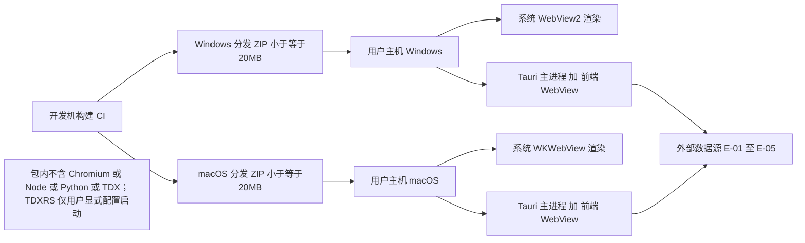
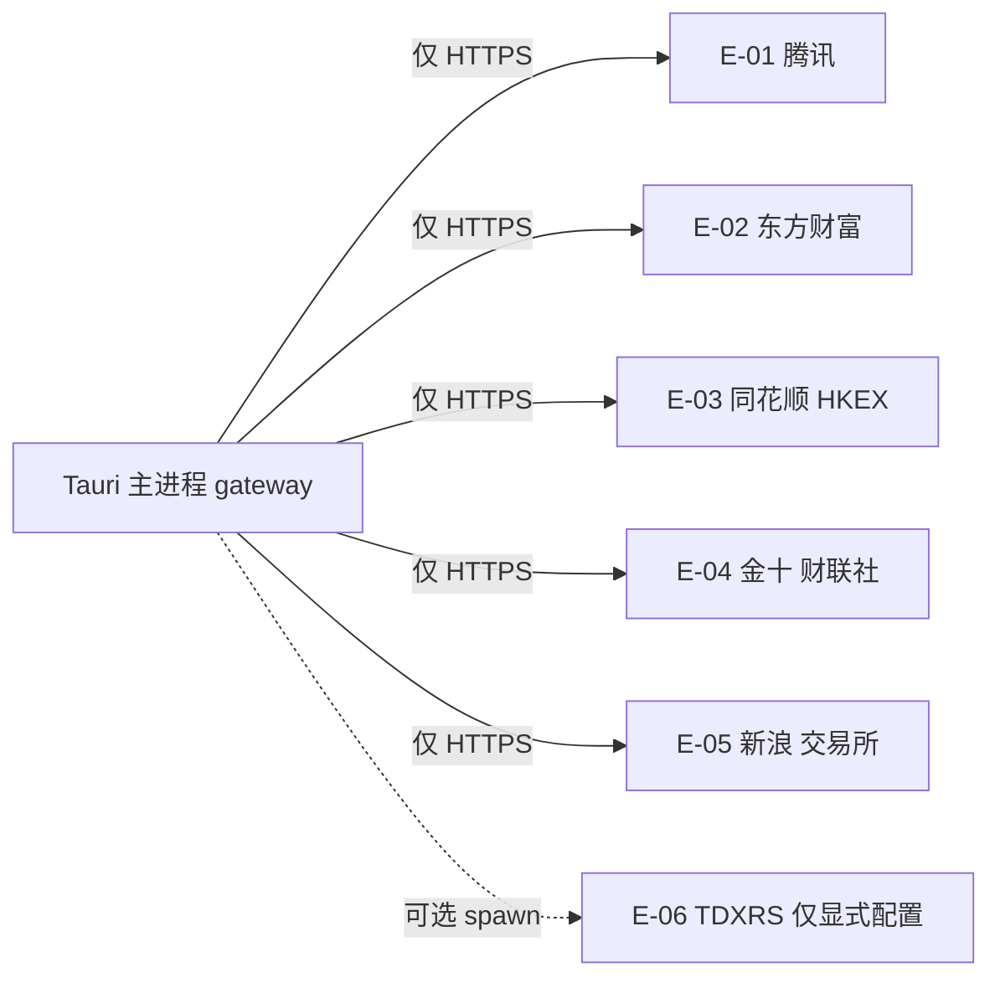
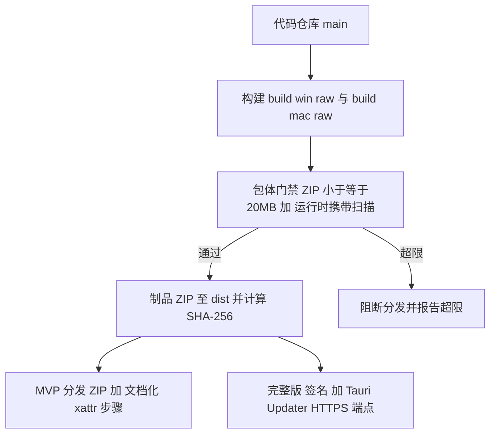
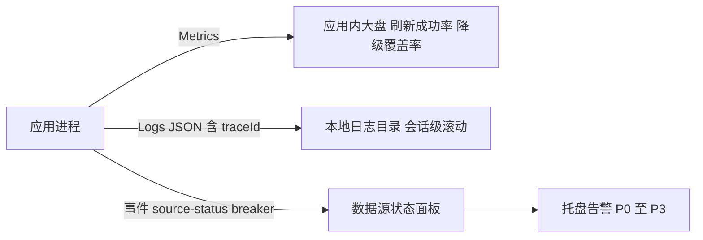

# AICoding 架构设计 · 部署设计

> 本文档为《AICoding 架构设计》核心产物之一，定位为**部署设计模版**的本地桌面适配版。
> 上游输入：《高层架构设计》（已通过 G3，Tauri 2+Rust 已裁决）、《系统设计》（§3.1.2 容器图 / §5 非功能 / §6 网络架构 / §7 安全基线 / E-01~E-06 外部依赖 / §5.4 分发约束）、《UserStory》（US-13 包体门禁 / US-16 自动更新 / US-17 macOS 公证）。
> 下游输出：分发 SOP、构建门禁脚本、运行时约束清单、更新与回滚 SOP。
>
> **关键事实基线（严格继承，不得推翻）**：
> 1. 目标架构 = Tauri 2 + Rust（X1 已裁决，权威）；原生 HTML/CSS/JavaScript 前端；Rust 进程内 gateway。
> 2. 分发约束：Windows 依赖系统 WebView2（不携带离线运行时）；macOS 用系统 WKWebView、未公证（MVP 走文档化 xattr 步骤）；ZIP ≤ 20MB；包内不含 Chromium/Node/Python/TDX；外部进程 TDXRS 仅用户显式配置时启动且包不含 runtime。
> 3. 更新：MVP 走 ZIP + 文档化 xattr 步骤分发；完整版接入 Tauri Updater（强制签名验证 + 端点强制 HTTPS，验证不可禁用）。
> 4. 功能范围：MVP = F1–F12 + N1/N2；F13 导入导出 / F14 自动更新 / F15 macOS 公证延后完整版。
> 5. 待裁决 U-01~U-04 移交下游（安全/部署/法务），文中仅标注待裁决，不自行拍板；其中 U-03（macOS 公证与 Updater 商务/成本）为部署侧核心待裁决项。

---

## 0. 元信息：修订记录与裁剪适配说明

### 0.1 修订记录

```yaml
标题: 恭喜发财桌面版 - 部署设计 v1.0（本地桌面适配）
版本: v1.0
状态: Approved   # Draft | Reviewing | Approved | Deprecated（G5 已审定）
创建日期: 2026-08-13
最后更新: 2026-08-13
作者: 毕落地（platform-architect / 平台架构师）
评审人:
  - 主理人（team-lead，G5 已审定）
  - security-architect（下游读者，[交接·安全→部署] 回填方）
  - system-architect（上游读者）
```

| 版本 | 日期 | 作者 | 变更内容 | 评审状态 |
| --- | --- | --- | --- | --- |
| v1.0 | 2026-08-13 | 毕落地（platform-architect） | 基于已通过 G3 的《高层架构设计》《系统设计》冻结边界，产出本地桌面分发与运行时部署设计；G5 审定 | Approved |

### 0.2 裁剪与适配说明（本地桌面语义改写）

> 本项目是**本地桌面应用，非 SaaS / 非私有化 / 无云端基础设施**。因此「部署」= 桌面分发与运行时约束，不是服务器集群 / K8s。对模板做如下裁剪与本地化改写，并顺延编号，以 §标注：

| 模板原章节 | 原云原生语义 | 本地桌面改写 | 是否保留 |
| --- | --- | --- | --- |
| §1.1 适用范围与部署形态 | 私有化 / 公有云 / 混合云 | 本地桌面分发形态（Windows/macOS 单机分发） | 保留并改写 |
| §2.2 云资源清单（计算/存储/网络/中间件/安全/可观测） | 云主机 / 云盘 / VPC / 云中间件 | 改为「本地运行时资源清单」：计算=用户主机 CPU/内存；存储=本地磁盘 config+缓存；网络=出网白名单；中间件=进程内缓存（无远端中间件，N/A）；安全=签名/权限/密钥（待裁决项）；可观测=应用内埋点 | 保留并改写，标注 N/A |
| §3.1 物理拓扑（Region/AZ/集群） | 跨 Region / AZ 集群 | 改为「桌面分发拓扑」：开发机构建 → 分发 ZIP → 用户主机 → 系统 WebView → 外部数据源 | 保留并改写 |
| §3.2 流量与网络链路（VPC/安全组/WAF） | 公网入口 / mTLS | 改为「出网出口白名单」：仅 HTTPS 到 E-01~E-05 + 可选 E-06；无入站服务 | 保留并改写，标注 N/A |
| §3.3 高可用（多副本/弹性伸缩/容灾） | K8s 多副本 / HPA | 改为「单进程故障容错 + 故障域划分 + 本地原子恢复」：无负载均衡、无弹性伸缩、无多 AZ | 保留并改写 |
| §4 部署流程（CI/CD/制品/配置/发布） | 镜像仓库 / K8s 发布 | 改为「构建与打包（build:win:raw / build:mac:raw）+ 分发渠道（MVP ZIP / 完整版 Updater）+ 配置 L1~L4」 | 保留并改写 |
| §5 监控告警接入（Prometheus/CLS/APM） | 云监控栈 | 改为「应用内 Metrics/Logs/Traces + 本地日志目录 + 托盘告警」 | 保留并改写 |
| §6 应急与回滚（镜像回滚/DB 回滚） | K8s 一键回滚 | 改为「MVP 手动重装 / 完整版 Updater 回退 + config 原子回退」 | 保留并改写 |
| §7 安全合规（VPC/安全组/WAF/KMS） | 云安全组件 | 改为「签名密钥/权限最小化/出口白名单/密钥加密（待裁决）」并指向 [交接·部署→安全] | 保留并改写 |
| §8 容量与成本（云容量/月度账单） | 云资源账单 | 改为「包体门禁水位 + 分发成本（免云端，仅构建与公证年费）」 | 保留并改写 |

**不可裁剪章节**（§1/§2/§3/§4/§5/§6/§7/§8）均保留，仅按本地桌面形态落地。所有云原生概念（VPC / 安全组 / WAF / 云中间件 / mTLS / K8s）按上述改写或显式标注 N/A，不套用云部署范式。

---

## 1. 引言

### 1.1 适用范围与部署形态

- **系统范围**：恭喜发财桌面版（fund-tracker-desktop），本地桌面行情监控工具。
- **部署形态**：本地桌面应用（非 SaaS / 非私有化）；单机单用户，无云端服务端；分发包为 ZIP（Windows portable / macOS .app+ZIP），用户解压即运行。
- **目标平台**：
  - Windows 10/11 x64：依赖系统 WebView2（不携带离线运行时）；
  - macOS arm64（Apple Silicon）：使用系统 WKWebView，当前未公证（MVP 走文档化 xattr 步骤）。
- **分发渠道**：MVP = 官网/网盘分发 ZIP + 文档化 xattr 步骤；完整版 = Tauri Updater（签名 + HTTPS 端点）。

### 1.2 名词与缩写

| 缩写 / 名词 | 含义 |
| --- | --- |
| Tauri 2 | 本地桌面外壳框架，Rust 核心 + 系统 WebView 渲染 |
| WebView2 | Windows 系统 WebView 组件（基于 Edge/Chromium 内核，由 OS 提供） |
| WKWebView | macOS 系统 WebView 组件 |
| PCS | Tauri 权限/能力/作用域（Permission/Capability/Scope）声明式模型 |
| gateway | Rust 进程内数据网关（合并在途 + TTL 缓存 + 熔断 + 降级） |
| ZIP 门禁 | 分发 ZIP 体积硬约束 ≤ 20MB，不含 Chromium/Node/Python/TDX |
| xattr 步骤 | macOS 未公证包首次打开报损坏时，执行 `sudo xattr -rd com.apple.quarantine` 解除隔离 |
| Tauri Updater | Tauri 官方自动更新插件，构建期私钥签名 + 运行期公钥验证 + 端点强制 HTTPS |
| E-01~E-06 | 外部数据源与外部进程依赖编号（见 §3.2） |
| U-03 | 待裁决项：macOS 公证与 Updater 商务/成本（Apple Developer ID 年费、更新服务器） |

---

## 2. 环境与资源清单

### 2.1 环境矩阵

> 本地桌面应用无集群隔离概念。环境矩阵按「开发 / 联调 / 预发验收 / 生产分发」四态描述，prod 态即独立分发包 ZIP ≤ 20MB。
> 本系统环境统一划分为 dev、int、uat、prod 四态，其中 dev / int / uat 为本机与 CI 验证态，prod 为面向用户的独立分发包。

| 环境 | 用途 | 隔离方式 | 数据 | 网络访问 |
| --- | --- | --- | --- | --- |
| dev | 开发自测 | 开发者本机 | 模拟数据 / 本地 config | 本机 + 出网白名单 E-01~E-05 |
| int | 联调 | 本机 / CI 构建机 | 模拟数据 | 本机 + 出网白名单 |
| uat | 预发 / 验收 | 独立验收机器 | 仿生产 config | 本机 + 出网白名单 |
| prod | 生产分发 | 独立分发包（ZIP ≤ 20MB） | 用户真实数据（本机） | 用户主机出网白名单 E-01~E-05 |

**配置策略（与 §4.4 联动）**：

| 配置层级 | 存放位置 | 适用内容 | 变更生效 |
| --- | --- | --- | --- |
| L1 代码内 | 代码仓库 | 默认值、枚举、常量、出口白名单 | 重新构建 |
| L2 配置（config.json v2） | 用户数据目录 | 分组/持仓/主题/路由/提醒 | 保存即时生效 |
| L3 构建参数 | tauri.conf.json / 构建脚本 | 窗口尺寸、能力声明、包名 | 重新构建 |
| L4 运行期 | 本地缓存 / 日志目录 | TTL 缓存、运行日志、数据源状态 | 进程内即时 |

### 2.2 资源清单（本地运行时，替代云资源清单）

> 下列清单按本地桌面语义落地。中间件与平台服务（远端 RDBMS/Redis/MQ/K8s）在本系统为 N/A，以进程内缓存替代。

#### 2.2.1 计算资源（用户主机侧）

| 资源编号 | 类型 | 形态 | 规格量级 | 用途 |
| --- | --- | --- | --- | --- |
| R-C-001 | 用户主机 CPU/内存 | 操作系统进程 | 数十~百 MB 常驻 | Tauri 主进程 + 前端 WebView 运行 |

#### 2.2.2 存储资源

| 资源编号 | 类型 | 形态 | 容量 | 用途 | 备份策略 |
| --- | --- | --- | --- | --- | --- |
| R-S-001 | 配置文件 | 本地单文件 config.json v2 | KB 级 | 用户分组/持仓/设置 | 原子写入（临时写+rename），失败保留旧文件 |
| R-S-002 | 本地磁盘缓存 | 应用缓存目录 | MB 级 | 行情/新闻可重拉缓存 | 按 TTL 过期，无需备份 |
| R-S-003 | 日志 | 本地日志目录 JSON | 会话级滚动 | 来源状态/熔断/错误 | 不长期归档（保留期待安全定稿，见 §5.2） |

#### 2.2.3 网络资源

| 资源编号 | 类型 | 形态 | 环境 | 用途 |
| --- | --- | --- | --- | --- |
| R-N-001 | 出网白名单 | HTTPS 出站（仅 E-01~E-05 + 可选 E-06） | 全部 | 访问已登记数据源，无入站服务 |

> **说明**：网络资源不含 VPC / 安全组 / WAF（N/A）。出口收敛见 §3.2。

#### 2.2.4 中间件与平台服务（N/A）

| 资源编号 | 类型 | 产品 | 用途 | 状态 |
| --- | --- | --- | --- | --- |
| R-M-001 | 远端中间件 | 远端 RDBMS/Redis/MQ | 无 | N/A（本地桌面，进程内缓存替代） |

#### 2.2.5 安全资源

| 资源编号 | 类型 | 用途 | 状态 |
| --- | --- | --- | --- |
| R-Sec-001 | 签名密钥（代码签名 / Mac 公证 / Updater） | 完整版签名与更新验证 | 待裁决（U-03） |
| R-Sec-002 | 本地密钥（config 敏感字段加密） | 持仓成本/备注加密落盘 | 待裁决（U-02） |
| R-Sec-003 | PCS 能力声明 | 仅开放事件能力，不开放 fs/shell/process | 已启用（X1） |

#### 2.2.6 可观测资源

| 资源编号 | 类型 | 承载维度 | 用途 |
| --- | --- | --- | --- |
| R-O-001 | 应用内 Metrics | 业务/应用/资源指标 | 刷新成功率、降级覆盖率、RED、ZIP 水位 |
| R-O-002 | 本地结构化日志 | 来源状态/熔断/错误 | 应用日志目录 JSON，含 traceId |
| R-O-003 | 托盘/状态面板告警 | 数据源健康/熔断 | P0~P3 告警（见 §5） |

### 2.3 复用资源清单

| 复用资源 ID | 原业务方 | 余量评估 | 隔离方式 |
| --- | --- | --- | --- |
| 操作系统 WebView（WebView2 / WKWebView） | 操作系统厂商 | 随系统提供，不计入包体 | 进程内系统组件 |
| Tauri 2 框架与 PCS 模型 | Tauri 社区（Apache-2.0 & MIT） | 已采纳，无授权费 | 应用沙箱 |

> 无云端复用资源；本地复用仅操作系统组件与开源框架。

---

## 3. 部署拓扑与高可用设计

### 3.1 桌面分发拓扑

#### 3.1.1 物理拓扑（桌面分发）



#### 3.1.2 拓扑要素清单

- 跨主机部署：否（单机分发）。
- 跨 AZ / 跨 Region：否（无云端拓扑）。
- 流量入口路径：用户启动 → WebView 渲染 → commands 调 gateway → HTTPS 出网。
- 内部调用路径：Tauri IPC（commands/events），进程内。
- 外部访问路径：gateway → E-01~E-05 HTTPS/REST（§3.2）。

### 3.2 流量与网络链路（出网出口白名单）

> 本应用无入站服务、无 VPC / 安全组 / WAF（N/A）。仅对外访问已登记数据源，全部出网 HTTPS。

#### 3.2.1 出入口链路

| 组件 | 协议 - 端口 | TLS 终结 | 作用 |
| --- | --- | --- | --- |
| gateway → E-01~E-05 | HTTPS / 443 | 外部源 HTTPS（gateway 直连） | 行情/资讯聚合 |
| gateway → E-06（可选） | 进程 spawn（用户显式配置） | 不适用 | TDXRS 加速，包不含 runtime |

#### 3.2.2 出口白名单（条目级域名）

| 外部系统 | 域名（条目级） | 协议 |
| --- | --- | --- |
| E-01 腾讯 | qt.gtimg.cn / web.ifzq.gtimg.cn | HTTPS |
| E-02 东方财富 | push2.eastmoney.com / datacenter.eastmoney.com | HTTPS |
| E-03 同花顺 / HKEX | 同花顺行情域名 / www.hkex.com.hk | HTTPS |
| E-04 金十 / 财联社 | 各自公开快讯域名 | HTTPS |
| E-05 新浪 / 沪深交易所 / 深交所 | money.finance.sina.com.cn / 交易所官网 | HTTPS |
| E-06 TDXRS（可选） | 用户显式配置的本地二进制路径 | 进程间（非网络，可选） |



#### 3.2.3 跨网络互联

| 互联类型 | 通道 | 加密 | 用途 |
| --- | --- | --- | --- |
| 出网（公网） | 系统网络栈直连 | HTTPS 强制 | 访问 E-01~E-05 |
| 入站 | 不适用 | 不适用 | 本应用无入站服务 |

### 3.3 高可用与故障容错

#### 3.3.1 故障域划分

| 故障域 | 影响范围 | 容错机制 | 预期 RTO |
| --- | --- | --- | --- |
| 单进程崩溃 | 当前会话 | 重启应用自动恢复缓存与 config | ≤ 1 分钟 |
| WebView 缺失（Windows） | UI 无法渲染 | 显示原生提示与官方 WebView2 下载链接 | 用户安装 WebView2 |
| macOS 隔离拦截（未公证） | 应用无法打开 | 文档化 xattr 步骤解除隔离（U-03 完整版公证消除） | 用户执行 xattr 步骤 |
| 外部源全不可用 | 行情空白 | 诚实表达（available:false）+ 缓存兜底 | 源恢复后自动重连 |

> 可用性来源拆分：系统 WebView 由操作系统厂商兜底；业务逻辑容错/重试/熔断/降级由本系统自身保障；外部源故障由熔断+降级+诚实表达兜底（无 SLA，U-01 待裁决）。

#### 3.3.2 负载均衡

| 维度 | 取值 |
| --- | --- |
| 类型 | 不适用（单机单进程，无负载均衡） |
| 应用内健康检查 | `healthz` 命令（进程存活 + 外部源连通抽样），频率 10s |
| 失败阈值 | 连续 3 次外部源全失败 → 诚实表达态，不退出进程 |

#### 3.3.3 健康检查配置

| 项 | 取值 |
| --- | --- |
| 检查路径 | 应用内 `healthz` 命令 |
| 频率 | 10s |
| 失败阈值 | 连续 3 次 |
| 成功阈值 | 任意一次外部源连通即恢复 |

#### 3.3.4 弹性伸缩配置

| 维度 | 取值 |
| --- | --- |
| 触发指标 | 不适用（单进程，无 HPA） |
| 扩容区间 | 单实例 |
| 备注 | 缓存膨胀时收紧 TTL（即时，见 §8.1） |

#### 3.3.5 容灾切换配置

| 维度 | 取值 |
| --- | --- |
| 容灾级别 | 单主机（无多 AZ / 多 Region） |
| 故障切换 RTO | ≤ 1 分钟（应用重启自动恢复） |
| 跨主机数据同步 | 不适用（无云端同步，O4 不做） |

---

## 4. 部署流程

### 4.1 代码仓库与分支

| 项 | 规范 / 值 | 说明 |
| --- | --- | --- |
| 代码仓库地址 | 本地 git 仓库 fund-tracker-desktop | 主理人已裁决边界 |
| 分支管理 | main（稳定）/ dev（开发） | 发布从 main 打 tag |
| 合并规范 | PR 评审 + 构建门禁（ZIP ≤ 20MB） | 普通构建不修改版本号 |
| 标签规范 | 语义化版本 vX.Y.Z | 完整版 Updater 用 tag 比对 |

### 4.2 流水线（CI / CD）

> 本地桌面无 K8s 发布。流水线以「构建 → 包体门禁 → 制品 → 分发」为主，完整版叠加签名与 Updater 发布。



| 阶段 | 触发条件 | 关键动作 | 失败处理 |
| --- | --- | --- | --- |
| 构建 | 手动 / tag 触发 | `npm run build:win:raw` 产出 Windows x64 EXE+portable ZIP；`npm run build:mac:raw` 产出 macOS arm64 .app+ZIP；产物输出 dist/ | 阻断后续阶段 |
| 代码扫描 | 构建后 | 静态检查 / 复杂度（不达标阻断） | 不达标阻断 |
| 安全扫描 | 构建后 | 依赖漏洞 SCA / 包体携带扫描（是否含 Chromium/Node/Python/TDX） | 高危阻断 |
| 包体门禁 | 构建后 | 校验两个分发 ZIP 体积均 ≤ 20MB | 超限阻断分发 |
| 制品 | 门禁通过 | 计算 SHA-256 校验和，随分发说明提供 | 失败重试 |
| 分发（MVP） | 手动 | 官网/网盘发布 ZIP + 文档化 xattr 步骤 | 用户手动重装回退 |
| 分发（完整版） | 签名后 | 推送至 Updater HTTPS 端点（签名验证不可禁用） | 端点非 2XX 试下一个 |

### 4.3 构建产物与制品管理

| 配置项 | 配置值 / 规则 | 说明 |
| --- | --- | --- |
| 产物类型 | Windows portable ZIP / macOS .app+ZIP | 解压即运行，无安装器 |
| 产物命名 | `恭喜发财-windows-x64-vX.Y.Z.zip` / `恭喜发财-macos-arm64-vX.Y.Z.zip` | 含版本 tag |
| 包体门禁 | Windows/macOS 分发 ZIP 均 ≤ 20MB | 超限构建失败 |
| 运行时携带清单 | 空（不含 Chromium/Node/Python/TDX） | 安全扫描校验 |
| 制品保留期 | 当前版本 + 上一稳定版（本地归档） | 供回退 |
| 制品溯源 | 构建附 git commit / 构建时间 / SHA-256 | 便于反查 |
| 签名与校验 | 完整版：Developer ID 签名 + Updater 私钥签名；MVP：SHA-256 核对 | MVP 未公证（U-03） |

### 4.4 配置管理（L1~L4）

> 与 §2.1 配置层级一致。禁止在 L1 代码内写入环境差异、密钥、出口白名单以外的域名。

| 层级 | 内容 | 变更生效 | 对部署的约束 |
| --- | --- | --- | --- |
| L1 代码内 | 默认值、枚举、出口白名单、常量 | 重新构建 | 禁止写入密钥 / 环境差异 |
| L2 配置 config.json v2 | 用户分组/持仓/主题/路由/提醒 | 保存即时 | 必须实现迁移回调（§系统设计 §4.5） |
| L3 构建参数 | tauri.conf.json / 构建脚本（窗口尺寸、能力声明、包名） | 重新构建 | 启动失败 fail-fast |
| L4 运行期 | 本地缓存 / 日志 / 数据源状态 | 进程内即时 | 缓存 TTL 收紧即时生效 |

### 4.5 发布策略

#### 4.5.1 发布方式

> 全系统采用「分发包替换」发布。MVP 与完整版分发方式不同：

| 阶段 | 发布方式 | 说明 |
| --- | --- | --- |
| MVP | ZIP + 文档化 xattr 步骤（手动分发） | 用户下载解压即运行；macOS 执行 xattr 解除隔离 |
| 完整版 | Tauri Updater（签名 + HTTPS 自动更新） | 客户端验证签名后更新，验证不可禁用 |

#### 4.5.2 发布标准流程

- MVP 首次发布：构建 → 门禁 → 计算 SHA-256 → 发布 ZIP + 分发说明（含 xattr 步骤与 SHA-256 核对）。
- 完整版发布：构建 → 签名（Developer ID + Updater 私钥）→ 推送 HTTPS 端点 → 客户端 Updater 拉取验证。
- 资源变更：仅配置与前端资源，无远端资源变更（O4 不做云端同步）。

#### 4.5.3 灰度路径与观测窗口

| 批次 | 范围 | 观测窗口 | 放量条件 |
| --- | --- | --- | --- |
| MVP 内测 | 开发者 / 验收机器 | 1~3 天 | 包体门禁通过 + 启动无崩溃 |
| MVP 公测 | 全部用户（同 ZIP） | 7 天 | 无 WebView 缺失阻断反馈 |
| 完整版 Updater | 按版本增量推送 | 灰度 24h | 更新成功率 ≥ 99% 且无签名失败 |

#### 4.5.4 发布门禁

| 门禁项 | 拦截条件 | 检查时机 |
| --- | --- | --- |
| 包体门禁 | Windows/macOS ZIP 任一 > 20MB | 构建期 |
| 运行时携带扫描 | 包内含 Chromium/Node/Python/TDX 任一 | 构建期 |
| 出口白名单 | 新增非登记域名调用 | 代码评审 / 安全扫描 |
| 完整性 | MVP 未提供 SHA-256 核对 | 分发前 |
| 签名验证 | 完整版签名不匹配 / 端点非 HTTPS | 发布前（U-03 完整版） |

---

## 5. 监控告警接入

### 5.1 监控架构与数据流



### 5.2 关键 Dashboard 与日志规范

| 大盘 | 用户 | 指标 |
| --- | --- | --- |
| 业务大盘 | 产品 / 合规 | 刷新成功率、降级覆盖率、来源健康 |
| 服务健康大盘 | 研发 | RED（Rate / Errors / Duration） |
| 多源降级大盘 | 研发 / 合规 | 各 E-xx 熔断状态、半开探测 |
| 容量大盘 | 研发 | §8.1 ZIP 体积 / 内存水位 |

**结构化日志规范**：所有日志含 `traceId` + `tenantId`（单租户固定 `local`）；来源状态/熔断记录含 source/breaker 字段；ERROR 级含完整堆栈 + 业务上下文。

**日志保留期（待安全侧回填，见 [交接·部署→安全] 第 5 项）**：

| 日志类型 | 级别 | 当前策略 | 是否含个人信息 |
| --- | --- | --- | --- |
| 应用日志 | INFO+ | 会话级 + 本地滚动 | 否（禁止打印持仓成本/备注明文，U-02 定稿） |
| 来源/熔断日志 | INFO+ | 会话级 | 否 |
| 审计日志 | INFO+ | 应用目录，保留期待安全定稿 | 否（本机单用户） |

### 5.3 告警规则清单

| 编号 | 级别 | 触发条件 | Owner |
| --- | --- | --- | --- |
| AL-01 | P0 | 配置原子写入连续失败 | 毕落地 |
| AL-02 | P0 | WebView 无法初始化（Windows 缺 WebView2） | 毕落地 |
| AL-03 | P1 | 全部 E-xx 熔断且无缓存 | 毕落地 |
| AL-04 | P2 | 单源连续降级超阈值 | 毕落地 |
| AL-05 | P3 | 迷你图并发排队持续 | 毕落地 |

### 5.4 告警通道

| 级别 | 响应时间 | 通知方式 | 上升机制 |
| --- | --- | --- | --- |
| P0 | ≤ 5 min | 应用内错误 + 托盘提示 | 用户手动重启 / 重装 |
| P1 | ≤ 15 min | 托盘提示 + 状态面板 | 用户检查网络 |
| P2 | ≤ 1 h | 状态面板 | 无 |
| P3 | 工作时间 | 无感 | 无 |

---

## 6. 应急与回滚

### 6.1 回滚机制

#### 6.1.1 回滚触发条件

- 分发 ZIP 启动崩溃率超阈值。
- P0 告警（WebView 缺失 / 配置损坏）集中出现。
- 完整版 Updater 更新后功能回归。

#### 6.1.2 回滚决策人

- MVP：产品所有者（手动重装上一归档版本）。
- 完整版：发布负责人（Updater 回退到上一签名版本）。

#### 6.1.3 回滚执行 SOP

| 对象 | 回滚方式 | 预计耗时 | 有损风险 / 数据丢失 |
| --- | --- | --- | --- |
| 应用版本（MVP） | 重新下载上一归档 ZIP 解压覆盖 | ≤ 5 min | 无（config 独立保留） |
| 应用版本（完整版） | Updater 回退至上一签名版本 | ≤ 5 min | 无 |
| 配置 | config.json 原子写入失败保留旧文件 | 小于 1 min | 无 |
| 缓存 | TTL 过期自动失效，可重拉 | 即时 | 无 |

### 6.2 故障应急 Runbook

#### 6.2.1 Runbook 索引

| Runbook 编号 | 关联告警 | 故障场景 | Owner |
| --- | --- | --- | --- |
| RB-01 | AL-02 | Windows 缺 WebView2 | 毕落地 |
| RB-02 | AL-03 | 全部数据源熔断 | 毕落地 |
| RB-03 | AL-01 | config 原子写入失败 | 毕落地 |

#### 6.2.2 RB-01：Windows 缺 WebView2

- **症状**：应用启动报 WebView2 运行时缺失。
- **诊断**：检查系统是否安装 WebView2（现代 Win10/11 通常已提供）。
- **缓解**：展示原生提示与官方 WebView2 下载链接，引导用户安装后重启。
- **升级**：持续缺失则引导用户重装系统组件。

#### 6.2.3 RB-02：全部数据源熔断

- **症状**：所有 E-xx 熔断且无缓存，行情空白。
- **诊断**：查看数据源状态面板 source-status / breaker-tripped。
- **缓解**：诚实表达（available:false）+ 缓存兜底；源恢复后自动重连，不退出进程。
- **升级**：超 30 min 无恢复则公告提示。

#### 6.2.4 RB-03：config 原子写入失败

- **症状**：保存配置报错，AL-01 触发。
- **诊断**：查看日志写入路径权限与磁盘空间。
- **缓解**：保留旧文件不破坏用户数据，提示用户检查目录权限。
- **升级**：无法写入则引导导出配置（F13 完整版）后重装。

---

## 7. 安全合规

### 7.1 上线前安全自检（本地适配）

| 编号 | 检查项 | 检查内容 / 标准 | 责任人 | 检查时机 | 是否通过 |
| --- | --- | --- | --- | --- | --- |
| 7.1.1 | 《安全架构设计》清单自检 | 待安全设计回填（[交接·安全→部署]） | security-architect | G5 前 | 待回填 |
| 7.1.2 | 包体门禁 | ZIP ≤ 20MB 且不含 Chromium/Node/Python/TDX | 毕落地 | 构建期 | 是 |
| 7.1.3 | 出口面评估 | 仅 HTTPS 到 E-01~E-05 + 可选 E-06，无入站 | 毕落地 | 构建期 | 是 |
| 7.1.4 | 权限开放性检查 | PCS 仅开放事件能力，不开放 fs/shell/process | 毕落地 | 评审期 | 是 |
| 7.1.5 | 签名/公证（完整版） | Developer ID 签名 + Updater 签名 + HTTPS 端点 | 待裁决（U-03） | 完整版发布前 | 待裁决 |
| 7.1.6 | 本地密钥管理 | config 敏感字段加密（U-02） | 待裁决（U-02） | 安全定稿 | 待裁决 |
| 7.1.7 | 代码漏洞扫描 | SCA 依赖漏洞 0 高危 | 毕落地 | 构建后 | 是 |
| 7.1.8 | MVP 完整性保障 | 分发附 SHA-256 核对 | 毕落地 | 分发前 | 是 |
| 7.1.9 | 系统上线前扫描 | 包体携带扫描 + 权限清单核对 | 毕落地 | 分发前 | 是 |

### 7.2 凭证与密钥清单

| 凭证编号 | 类型 | 存储方式 | 所有人 | 用途 | 状态 |
| --- | --- | --- | --- | --- | --- |
| K-01 | 代码签名 / Mac 公证密钥 | 待裁决（U-03） | 产品所有者 | 完整版签名与公证 | 待裁决 |
| K-02 | Tauri Updater 签名密钥对 | 待裁决（U-03） | 产品所有者 | 更新包验签 | 待裁决 |
| K-03 | config 敏感字段加密密钥 | 待裁决（U-02） | 本机用户设备 | 持仓成本/备注加密落盘 | 待裁决 |

> 红线：禁止密钥明文入库 / 入代码 / 入配置文件明文；跨环境不共用（详见 [交接·部署→安全] 第 1、2 项）。

### 7.3 访问审计接入

| 审计源 | 去向 | 保留期 | 是否启用 |
| --- | --- | --- | --- |
| 本地操作 / 来源健康 / 熔断事件 | 应用日志目录 JSON | 待安全定稿（第 5 项） | 是（轻量） |
| 配置变更 | 应用日志目录 | 同上 | 是 |

---

## 8. 容量与成本

### 8.1 容量规划

#### 8.1.1 业务量预估

| 业务指标 | 当前值 | MVP 阶段值 | 生产阶段值 | 备注 |
| --- | --- | --- | --- | --- |
| 单用户自选/持仓规模 | 数十~数百 | ≤ 500 | ≤ 1000 | 个人投资者 |
| 峰值刷新并发 | — | ≤ 3 普通 + 东财单并发 | ≤ 3 | 协调器约束 |
| 数据写入量/天 | — | KB 级配置 | KB 级 | 本地单文件 |
| 数据存量 | — | KB~MB 级 | MB 级 | config + 缓存 |

#### 8.1.2 资源容量推算

| 资源 | 推算公式 | 当前配置 | 生产阶段配置 |
| --- | --- | --- | --- |
| 分发 ZIP 体积 | 二进制 + 前端静态资源 | ≤ 20MB（门禁） | ≤ 20MB（门禁） |
| 内存 | 进程常驻 + 缓存 | 数十 MB | 数十~百 MB |
| 本地磁盘 | config + 缓存 | KB~MB | MB 级 |

#### 8.1.3 扩容触发与路径

| 资源 | 扩容触发指标 | 扩容方式 | 扩容耗时 |
| --- | --- | --- | --- |
| 分发 ZIP | 超 20MB 门禁 | 裁剪依赖 / 不打包运行时 | 构建期 |
| 内存 | 缓存膨胀 | 收紧 TTL | 即时 |

#### 8.1.4 容量水位线

> 容量水位采用四级分层模型，针对「分发 ZIP 体积」一项设定（本系统唯一硬门禁资源）。

| 水位 | 含义 | 阈值 | 动作 |
| --- | --- | --- | --- |
| 健康水位 | 正常分发区间 | ZIP 小于 16MB | 无动作 |
| 预警水位 | 接近门禁，需关注 | 16MB ~ 20MB | 告警，审查依赖 |
| 危险水位 | 即将破门禁 | 接近 20MB | 裁剪或说明突破理由 |
| 红线水位 | 必须保护 | ≥ 20MB | 构建失败（门禁），禁止携带 Chromium/Node/Python/TDX |

### 8.2 成本计算

> 本地桌面应用无云端账单。成本仅含构建与分发的边际成本，以及完整版公证/更新的待裁决成本（U-03）。

| 成本项 | 月度成本 | 年度成本 | 说明 |
| --- | --- | --- | --- |
| 构建 CI（本机 / 自托管） | 近似 0 | 近似 0 | 本地构建，无云构建账单 |
| 分发托管（官网/网盘） | 低 | 低 | 静态文件托管，带宽随用户量 |
| 带宽（出网数据源由用户侧承担） | 0（本应用侧） | 0 | 数据源访问由用户网络承担 |
| Apple Developer ID 年费（完整版公证） | 待裁决（U-03） | 约 99 美元/年（行业公开价，待主理人确认） | 仅完整版 macOS 公证需要 |
| 更新服务器（完整版 Updater） | 待裁决（U-03） | 待裁决 | CrabNebula 或自托管 JSON 端点 |
| 合计 | 低（MVP）/ 待裁决（完整版） | 低（MVP）/ 待裁决（完整版） | U-03 移交下游裁决 |

> 不新增对外 SLA / 合规承诺；成本未扩大功能范围；U-03 仅标注待裁决。

---

## 9. 配置落盘路径与运行时约束

> 本节汇总部署侧对研发产生约束的落盘与运行时结论（与《系统设计》§4.2/§5.4 对齐）。

### 9.1 配置与数据落盘路径

| 平台 | 配置路径 | 缓存路径 | 日志路径 |
| --- | --- | --- | --- |
| macOS | ~/Library/Application Support/恭喜发财/config.json | ~/Library/Caches/恭喜发财/ | ~/Library/Logs/恭喜发财/ |
| Windows | %APPDATA%\恭喜发财\config.json | %LOCALAPPDATA%\恭喜发财\Cache\ | %LOCALAPPDATA%\恭喜发财\Logs\ |

### 9.2 运行时约束

| 约束项 | 取值 | 对研发的约束 |
| --- | --- | --- |
| Windows WebView2 依赖 | 系统组件，不携带离线运行时 | 缺失时显示原生提示与官方下载链接（R-01） |
| macOS 未公证 | 隔离拦截 | 文档化 xattr 步骤：`sudo xattr -rd com.apple.quarantine /Applications/恭喜发财.app`（完整版公证消除，U-03） |
| 包体门禁 | ZIP ≤ 20MB | 构建期校验，超限阻断 |
| 运行时携带 | 空（不含 Chromium/Node/Python/TDX） | 安全扫描校验 |
| TDXRS | 仅用户显式配置 TDXRS_BIN / TDXRS_PYTHON 启动，包不含 runtime | 不默认启动外部进程 |
| 权限模型 | PCS 仅开放事件能力 | 不开放 fs/shell/process，不引入额外能力 |

---

## 10. [交接·部署→安全]

> 本节为部署侧对安全设计的**前置约定与待安全侧回填条目**。部署侧已按本地桌面语义落地分发与运行时约束；下列 6 项本地化交叉一致性核对项，需 security-architect 在《安全设计》文档新增 **[交接·安全→部署]** 节回填（约定位置见各款项末「需安全侧回填」）。当前安全设计文档与本文并行产出，故本节对尚未回填处标注假设。

### 第 1 项：签名密钥分级与保管

- **部署侧立场**：MVP 不携带任何签名密钥（未公证，仅 SHA-256 核对完整性）；完整版必须引入两类密钥——(a) 代码签名 / macOS 公证密钥（Apple Developer ID），(b) Tauri Updater 签名密钥对（私钥签名、公钥随包分发验签）。密钥均不得入库 / 入代码 / 入包明文。
- **需安全侧确认**：密钥分级标准（签名密钥 vs Updater 密钥是否同级）、保管方式（HSM / OS Keychain / 加密文件）、轮换周期、泄露应急（尤其 Updater 私钥泄露后的吊销与重新分发路径）。
- **回填位置**：安全设计 [交接·安全→部署] 第 1 项；关联 U-03。
- **假设**：若完整版采用自托管 Updater 端点，密钥托管责任归本团队；若采用 CrabNebula，部分密钥由服务商托管（待 U-03 商务裁决）。

### 第 2 项：本地密钥 / 加密（config 敏感字段）

- **部署侧立场**：配置落盘路径已固定在用户数据目录（§9.1）；部署确保密钥不进包、不进 L1 代码。敏感字段（持仓成本/备注，U-02）是否加密由安全设计定稿，加密落地点在 config.rs 存储层。
- **需安全侧确认**：密钥分级（OS Keychain vs AES-GCM+设备绑定）、密钥派生与存储位置、明文回退策略、跨设备迁移时密钥如何处理（与 F13 导入导出联动）。
- **回填位置**：安全设计 [交接·安全→部署] 第 2 项；关联 U-02。
- **假设**：若选 OS Keychain，部署需保证在 macOS/Windows 分别调用对应凭据管理器；若选 AES-GCM+设备绑定，部署需保证密钥不落盘明文。

### 第 3 项：对外出口白名单

- **部署侧立场**：打包不含任何网络能力扩展；gateway 仅能访问 E-01~E-05 已登记域名 HTTPS 出站（§3.2），无入站监听；TDXRS 仅在用户显式配置时 spawn 本地进程，不新增网络出口。PCS 不开放 shell/process 即禁止任意外联能力被前端触发。
- **需安全侧确认**：白名单是否需更严格（如证书钉扎 / 域名哈希校验）、是否存在本地监听端口风险、E-06 可选进程是否需独立网络约束、U-01 数据源版权是否影响白名单条目。
- **回填位置**：安全设计 [交接·安全→部署] 第 3 项；关联 U-01。
- **假设**：当前出口白名单以域名条目级登记为准，不做证书钉扎（待安全侧裁决是否加强）。

### 第 4 项：权限模型（PCS 能力开放）

- **部署侧立场**：Tauri capabilities 配置仅开放 events 与已声明 commands（fetch_*/load_config/save_config/cache_*/schedule_refresh 等），不开放 fs / shell / process（见《系统设计》§3.1.4 / §7.1）。部署确保 build:win:raw / build:mac:raw 不引入额外 capability。
- **需安全侧确认**：capability 基线清单是否需进一步收窄（如浮窗/托盘是否需额外权限）、是否禁止任何动态命令注册、前端 CSP 策略基线。
- **回填位置**：安全设计 [交接·安全→部署] 第 4 项。
- **假设**：当前能力集与《系统设计》§3.6 commands/events 全集一致，不扩展。

### 第 5 项：日志保留期

- **部署侧立场**：应用内结构化日志（JSON，含 traceId）落本地日志目录，会话级 + 本地滚动；记录来源状态 / 熔断 / 错误；禁止打印持仓成本/备注明文。当前保留期为会话级，无长期归档。
- **需安全侧确认**：保留期上限（如 7 天 / 30 天）、是否需审计级防篡改、是否含个人信息（部署侧立场：不含个人信息，仅本机操作与源状态）、日志导出是否需用户授权。
- **回填位置**：安全设计 [交接·安全→部署] 第 5 项。
- **假设**：保留期默认会话级 + 滚动覆盖，最长不超过 30 天，待安全侧定稿。

### 第 6 项：更新通道安全

- **部署侧立场**：完整版 Tauri Updater 强制签名验证 + 端点强制 HTTPS，验证不可禁用（research_report §2.2.1/§2.3）；MVP 阶段无自动更新，以 ZIP + 文档化 xattr 步骤分发，完整性靠 SHA-256 核对（material_digest D1 §5.3）。
- **需安全侧确认**：更新端点防护（HTTPS 证书校验强度、是否防中间人）、Updater 私钥泄露应急（与第 1 项联动）、MVP 阶段 SHA-256 核对的用户可达性与完整性保障下限是否足够（未公证包的完整性边界）。
- **回填位置**：安全设计 [交接·安全→部署] 第 6 项；关联 U-03。
- **假设**：MVP 阶段完整性下限为「发布页提供 SHA-256 + 用户手动核对」，完整版由 Updater 强制验签兜底；该下限是否被安全侧接受需回填确认。

---

## 附录 A：中间确认自检记录（协议 §2.4）

> 本节记录本阶段关键决策点的中间确认自检结果。结论：全程未命中协议 §2.1 / §2.2，未发起 `[中间确认]`。

### A.1 §0/§3/§4 部署形态与分发方式自检

- **§2.1 判定**：未命中。部署形态（本地桌面）、构建命令（build:win:raw / build:mac:raw）、ZIP ≤ 20MB 门禁、MVP ZIP+xattr / 完整版 Updater 均由上游已冻结事实（X1、D1 §5、material_digest D1 §5/§5.3、UserStory US-13/US-16/US-17）直接规定，不存在 ≥ 2 种未冻结的合理方案需裁决。
- **§2.3 反向验证 3 问**：
  - Q1（3 个月后被推翻的返工成本）：若推翻需重构构建脚本与分发 SOP（§4），返工范围约本文档 15%，切换成本约 0.5 人月，但因分发形态已冻结为本地桌面，实际不会被推翻。→ 已冻结，可控。
  - Q2（用户/客户/监管是否感知）：分发方式对用户可见（xattr 步骤 vs 自动更新），但已由上游功能边界（F14/F15 完整版延后）冻结，非本阶段新决策。→ 感知点已在上游冻结。
  - Q3（与用户原始诉求显式能力是否一致）：用户诉求为「基于 Tauri 2 的本地桌面行情工具，ZIP ≤ 20MB，Windows WebView2 / macOS 未公证」（material_digest D1 §5 直接引用），与本文一致。→ 一致。

### A.2 §10 [交接·部署→安全] 待裁决项处理自检

- **§2.1 判定**：未命中。U-01~U-04 已由主理人明确裁定「移交下游，文中仅标注待裁决，不自行拍板」（高层 §6.6）。存在多种方案（如密钥分级选 Keychain vs AES-GCM），但边界已冻结为「待裁决」，不属未冻结决策点。
- **§2.3 反向验证 3 问**：
  - Q1：若下游裁决加密/签名，仅影响 config.rs / 签名脚本，返工范围约本文档 5%。→ 可控。
  - Q2：签名/加密属对外承诺/合规属性，但已由 U-02/U-03 移交下游，本阶段不越权。→ 本阶段感知不到（待下游）。
  - Q3：用户诉求未显式指定密钥管理方式或公证商务。→ 一致（标注移交）。

### A.3 总体结论

全部关键决策点均已冻结或移交下游（U-01~U-04），无 ≥ 2 种未冻结合理方案，未触发协议 §2.1 / §2.2，故全程未发起 `[中间确认]`。U-03（macOS 公证与 Updater 商务/成本）作为部署侧核心待裁决项，已在 §7.1.5 / §7.2 / §8.2 / §10 第 1、6 项标注待裁决，移交主理人与安全/法务在 G5 后裁决。
