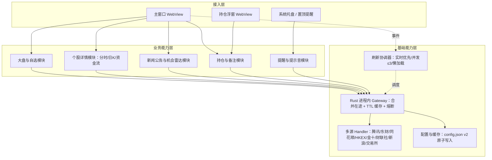
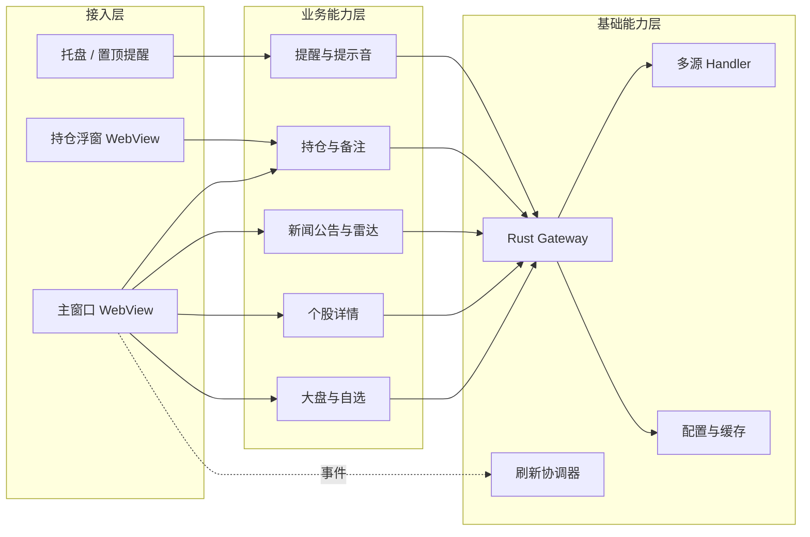

# AICoding 架构设计 · 高层架构设计

> 本文档为《AICoding 架构设计》核心产物之一，对应**高层架构设计模版**。
> 上游输入：业务原始诉求 + 行业调研结论（research_report.md）+ 资料摘要（material_digest.md）+ 主理人已裁决架构前提（X1=Tauri 2+Rust）；
> 下游输出：驱动《系统设计》《部署设计》《安全设计》《UserStory》四份文档的撰写。
> 本文档是 system-architect 与 product-story-designer 的唯一上游边界基线。

---

## 0. 元信息：修订记录

```yaml
标题: 恭喜发财桌面版 - 高层架构设计 v1.0
版本: v1.0
状态: Approved   # Draft | Reviewing | Approved | Deprecated（G3 已审定）
创建日期: 2026-08-13
最后更新: 2026-08-13
作者: 许边界（business-architect / 业务架构师）
评审人:
  - 主理人（team-lead，G3 已审定）
  - system-architect（下游读者）
  - product-story-designer（下游读者）

关联文档:
  上游输入:
    - 业务原始诉求: 基于项目背景与资料生成完整架构方案（为 fund-tracker-desktop「恭喜发财桌面版」生成五份 AICoding 架构文档）
    - 行业调研报告: D:/Project/fund-tracker-desktop/.workbuddy/output/research_report.md
    - 资料摘要: D:/Project/fund-tracker-desktop/.workbuddy/output/material_digest.md
    - 主理人已裁决架构前提: X1 架构=Tauri 2+Rust；原生前端；Rust 进程内 gateway；config.json v2；功能范围；数据可靠性口径；设计体系；分发约束
  下游产出:
    - 系统设计: 待 system-architect 生成（AICoding架构设计-2-系统设计.md）
    - 部署设计: 待 platform-architect 生成（AICoding架构设计-3-部署设计.md）
    - 安全设计: 待 security-architect 生成（AICoding架构设计-4-安全设计.md）
    - UserStory: 待 product-story-designer 生成（AICoding架构设计-5-UserStory.md）
```

| 版本 | 日期 | 作者 | 变更内容 | 评审状态 |
| --- | --- | --- | --- | --- |
| v1.0 | 2026-08-13 | 许边界（business-architect） | 基于 Tauri 2+Rust 已裁决前提冻结六章高层架构边界；G3 审定为实现基线 | Approved |

> **版本管理纪律**：破坏性变更（章节结构调整 / 关键决策反转）升 MAJOR；新增章节、扩充内容升 MINOR。

---

## 1. 需求概要

### 1.1 需求概要说明

「恭喜发财桌面版」是基于 **Tauri 2 + Rust** 的本地桌面行情工具，面向个人投资者，提供大盘、自选、持仓与多源行情监控；当前已有 src-tauri Rust 工程、原生 HTML/CSS/JavaScript 前端与 config.json v2 配置机制，处于从 Electron 旧描述向 Tauri 2 目标架构收敛的落地阶段。本期由主理人已裁决的 **X1 架构（Tauri 2 + Rust）** 触发，需把分散在 D1–D4 的资料与调研结论冻结为统一的高层架构边界，驱动下游系统/部署/安全/UserStory 设计。本系统定位为在用户本机运行的「轻量、离线优先、多源降级」个人投资行情监控桌面应用，承担本地数据聚合与可视化层（见 §4.2）。

### 1.2 关键决策摘要

| 编号 | 决策类别 | 决策内容 | 关联章节 |
| --- | --- | --- | --- |
| D1 | 范围决策 | 本期覆盖大盘指数/自选分组/持仓成本备注/分时日K资金流新闻公告/风险与机会雷达/持仓浮窗与提醒/托盘与多源降级；导入导出延后至 MVP 后，自动更新与 macOS 公证归入完整版 | §6.1 |
| D2 | 技术选型决策 | 目标架构 = Tauri 2 + Rust（已裁决 X1）；原生前端；数据链路统一经 Rust 进程内 gateway；不采纳 Electron | §3.2 / §4.2 |
| D3 | MVP / 完整版边界 | MVP 覆盖核心查看/监控/提醒闭环；导入导出、自动更新通道、macOS 公证发行延后至完整版 | §4.3 |
| D4 | 复用 vs 新建 | 复用 Tauri 2 框架、config.json v2、src-tauri gateway 与刷新协调器；新建机会雷达深度分析与多源 handler 降级元数据一致性 | §5.2 |
| D5 | 部署形态 | 本地桌面应用（非 SaaS / 非私有化）；Windows 依赖系统 WebView2，macOS 未公证；分发 ZIP ≤20MB，包内不含 Chromium/Node/Python/TDX | §5.2 / 部署设计 |

**硬指标**：≥ 3 条，≤ 5 条；每条决策必须能映射到正文具体章节（已满足，5 条）。

### 1.3 价值主张

| 价值维度 | 量化目标 | 度量指标 | 当前值 | 目标值 | 截止时间 |
| --- | --- | --- | --- | --- | --- |
| 效率 | 主窗口实时行情刷新时延可控，减少无效请求 | 普通请求并发上限（稳态） | 无统一约束 | ≤3 并发；东方财富单并发 + 启动间隔 1–1.3s | MVP 上线 |
| 体验 | 跨休市/故障仍可读数据，降级透明 | 数据源不可用时的诚实表达覆盖率 | 未定义 | 100%（null / available:false，不伪装净流入/确定结论） | MVP 上线 |
| 成本 | 分发包体受硬门禁约束，不携带冗余运行时 | 分发 ZIP 体积 | 未量化基线 | ≤20MB（Windows / macOS 均满足） | MVP 上线 |
| 体验 | 高密度信息密度与一致主题，降低扫描成本 | 主题/状态一致性（浅/深/跟随） | 三窗口色板分叉（D3 §3） | 100% 统一白纸黑墨荧光黄体系 | MVP 上线 |

**硬指标**：业务价值 ≥ 2 条（效率/体验）+ 技术/成本价值 ≥ 1 条（成本）；每条必须可量化，无"提升 / 优化 / 加强 / 更好"等模糊词（已满足）。

---

## 2. 需求分析 & 痛点解构

### 2.1 核心角色关注点

| 角色 | 业务身份 | 主要操作 | Top1 关心点 | 来源 |
| --- | --- | --- | --- | --- |
| 甲方决策者（产品所有者角色） | 个人开发者 / 项目负责人 | 设定功能边界、分发与合规决策 | 在 20MB 包体、WebView2 依赖与多源版权约束下，按时交付可用且可靠的本地行情工具 | D1 §2/§5；主理人 X1 裁决 |
| 最终用户·散户投资者（核心使用角色） | 个人投资者 | 浏览大盘/自选/持仓、查看分时K线资金流新闻、接收提醒 | 行情数据新鲜、来源可信、断流/降级时不被误导（诚实表达） | D1 §2；D4 §2.4/§2.5 |
| 最终用户·重度盯盘者（使用角色） | 活跃交易者 | 使用持仓浮窗、置顶提醒、提示音、托盘常驻 | 实时性、低打扰、可常驻不打断工作流 | D1 §2；D3 §6 |
| 受影响方·合规/运维（保障角色） | 分发与合规负责人 | 监控数据源版权、包体、WebView 风险面 | 数据源 redistribution / 快讯版权合规、包体不破门禁、权限最小化 | D4；research U-01/U-04 |

**硬指标**：≥ 3 类（甲方决策者 / 最终用户 / 受影响方各至少一行）；每行必须有"Top1 关心点"（已满足，4 行覆盖三类）。

### 2.2 核心痛点

| 编号 | 痛点描述 | 现象 / 数据 | 影响角色 | 影响程度 | 优先级 |
| --- | --- | --- | --- | --- | --- |
| P1 | 多源行情在限流/风控/网络抖动下易整体不可用或被误导 | 上游 403/429/5xx 触发熔断（5 分钟）；空值若被伪装成净流入/确定结论将直接误导投资决策（D4 §2.2/§2.4） | 最终用户 | 高（投资误判/信任风险） | P1 |
| P1 | 历史架构描述分散冲突（Tauri 2 vs Electron），边界未冻结 | 资料 X1/X2/X3 三处冲突并列，gateway 位置与 IPC 机制未统一（material_digest §3） | 甲方决策者/受影响方 | 中 | P1 |
| P2 | 高密度行情界面在浅/深/跟随三主题下表达分叉，状态不统一 | 主窗口/浮窗/告警分别维护色板，旧冷蓝视觉待淘汰（D3 §3） | 最终用户 | 中 | P2 |
| P2 | 分发包体受 20MB 硬门禁且不能携带 Chromium/Node/Python/TDX | ZIP ≤20MB；Windows 依赖系统 WebView2，macOS 未公证（D1 §5） | 甲方决策者/受影响方 | 中 | P2 |

**优先级标准**：
- **P1**：直接影响业务核心流程或合规底线，不解决无法上线。
- **P2**：影响用户体验或运营效率，可在 MVP 后迭代。
- **P3**：体验型 / 长尾问题，列入完整版或后续版本。

**硬指标**：每条痛点必须有"现象 / 数据"佐证；P1 ≥ 1 条且在 §2.3 有对应目标（已满足，2 条 P1 均有 V 目标）。

### 2.3 期待目标

| 编号 | 目标描述 | 对齐痛点 | 度量指标 | 当前值 | 目标值 | 截止时间 |
| --- | --- | --- | --- | --- | --- | --- |
| V1 | 多源行情在限流/故障下仍可用且诚实表达，不误导 | P1 | 不可用源诚实表达覆盖率 / 熔断恢复时效 | 未定义 | 100% 诚实表达；403/连续失败 5 分钟熔断 + 半开探测 | MVP 上线 |
| V2 | 架构边界在 G3 冻结为单一事实来源（Tauri 2+Rust），消除 X1/X2/X3 冲突 | P1（架构冲突） | 未裁决冲突项收敛数 | 3 处冲突并列 | 0 处未裁决冲突 | 本期（G3） |
| V3 | 三主题/状态表达统一，loading/empty/error 规范落地 | P2 | 主题一致性覆盖率 | 分叉（D3 §3） | 100% 统一（浅/深/跟随） | MVP 上线 |
| V4 | 分发包体满足硬门禁且运行时不携带冗余运行时 | P2 | 分发 ZIP 体积 / 运行时携带 | 未量化 | ≤20MB；不含 Chromium/Node/Python/TDX | MVP 上线 |

**硬指标**：每条目标必须有数字 + 对齐至少 1 条痛点；P1 痛点必须有对应 V 级目标（已满足）。

### 2.4 基线复用

| 复用类别 | 现有能力 | 复用方式 | 来源系统 | 备注 |
| --- | --- | --- | --- | --- |
| 核心底座 | Tauri 2 + Rust 运行时（src-tauri） | 直接采用（已裁决 X1） | 项目既有工程 | v2 经独立安全审计；PCS 权限模型 |
| 网关/数据 | Rust 进程内 gateway（合并在途 + TTL 缓存 + 熔断） | 沿用并补强 | src-tauri | 东方财富单并发 + 1–1.3s；403/连续失败 5 分钟熔断 |
| 前端协调 | 刷新协调器（实时优先/并发≤3/隐藏暂停/迷你图懒加载≤2） | 沿用 | 前端 | 仅开放事件能力 |
| 配置 | config.json v2 原子写入 + 旧字段兼容 | 沿用 | 产品目录 | macOS ~/Library/Application Support/恭喜发财；Windows %APPDATA%\恭喜发财 |
| 路由/降级 | D4 多源路由表（主备源 + 降级元数据） | 沿用 | docs/overview.md | handler 保留来源/降级/不可用元数据 |
| UI 设计 | 白纸/黑墨/荧光黄设计体系（D3） | 沿用 | docs/design-brief.md | DESIGN_VARIANCE 5 / MOTION_INTENSITY 3 / VISUAL_DENSITY 8 |

**硬指标**：必须先盘点再决定新建；凡列入"功能缺口"的能力，必须先在本节确认基线无法覆盖（已满足）。

### 2.5 功能缺口

| 阶段 | 功能缺口 | 必要性 | 优先级 | 对齐目标 |
| --- | --- | --- | --- | --- |
| 数据接入 | Rust gateway 多源 handler + 降级元数据一致性 | 必须 | MVP | V1 |
| 查看分析 | 大盘/自选/分时日K资金流新闻公告/机会雷达可视化 | 必须 | MVP | V1/V3 |
| 持仓与提醒 | 持仓成本备注、独立浮窗、置顶提醒、提示音、托盘 | 必须 | MVP | V1 |
| 数据接入 | 导入/导出（文件权限敏感） | 重要 | MVP 后 | V4（包体/权限） |
| 分发与合规 | 自动更新通道、macOS 公证发行 | 重要 | 完整版 | — |
| 合规 | 数据源 redistribution / 快讯版权治理（U-01/U-04） | 必须 | 待裁决 | — |

**硬指标**：每条缺口必须对齐 §2.3 至少一条目标；MVP 缺口必须在 §6.3 功能清单中对应有 MVP 范围标记（已满足）。

---

## 3. 行业调研

> 本节整合 `research_report.md`（已通过 G2）的结论。明确区分**事实 / 推断 / 建议 / 风险**：事实来自可核验公开来源或上游资料；推断为合理推演；建议为供裁决的参考（非冻结）；风险为不确定性。

### 3.1 行业标杆系统分析

| 标杆系统 | 厂商 / 来源 | 场景覆盖 | 技术亮点 | 商业模式 | 适用度 |
| --- | --- | --- | --- | --- | --- |
| Tauri 2 | Tauri 团队/开源社区（Apache-2.0 & MIT） | 轻量跨平台桌面/移动；系统 WebView 渲染 | Rust 核心 + 系统 WebView、PCS 权限/能力/作用域、内置 IPC/Updater、v2 安全审计 | 开源（无授权费） | 高（已采纳） |
| Electron | OpenJS Foundation / GitHub·Microsoft | 通用桌面；VS Code/Slack/Discord 等头部 SaaS 桌面端 | 内嵌 Chromium + Node.js、contextIsolation、进程沙箱、contextBridge 白名单 | 开源框架（驱动众多头部 SaaS 桌面端） | 低（否决，包体冲突） |
| Wails 3 | Wails 团队/开源社区（MIT） | Go + 系统 WebView 轻量桌面应用 | 系统 WebView 渲染、Go 单一二进制、清单式权限 | 开源（无授权费） | 中（部分借鉴范式） |
| TradingView 桌面端 | TradingView Inc.（头部 SaaS） | 跨资产实时行情图表与交易社交平台 | 实时/历史行情、多屏工作区、跨设备同步、订阅分级 | SaaS 订阅制（freemium→付费） | 中（产品范式参考） |

**硬指标**：≥ 3 家；至少包含 1 家头部 SaaS（TradingView）+ 1 家开源/自研代表（Tauri 2 / Wails 3）（已满足）。

### 3.2 方案对标及优先级打分

**对比矩阵**（每行权重之和 = 1）：

| 评估维度 | 权重 | Tauri 2 得分 | Electron 得分 | Wails 3 得分 |
| --- | --- | --- | --- | --- |
| 场景契合度 | 0.30 | 5 | 1 | 4 |
| 技术成熟度 | 0.20 | 4 | 5 | 3 |
| 集成难度（反向）| 0.15 | 5 | 3 | 3 |
| 成本（反向） | 0.15 | 5 | 1 | 5 |
| 合规可控性 | 0.20 | 5 | 3 | 4 |
| **加权总分** | **1.00** | **4.80** | **2.50** | **3.80** |

> 得分标尺：1=严重不符合，3=基本满足但有局限，5=完美契合。反向维度（集成难度、成本）分数越高代表越易集成/越省成本。加权总分：Tauri 2 = 0.30×5+0.20×4+0.15×5+0.15×5+0.20×5 = 4.80；Electron = 0.30×1+0.20×5+0.15×3+0.15×1+0.20×3 = 2.50；Wails 3 = 0.30×4+0.20×3+0.15×3+0.15×5+0.20×4 = 3.80。

**结论摘要**（建议，已被主理人 X1 裁决采纳为基线）：
- **优先借鉴（事实+已采纳）**：**Tauri 2** —— 场景契合度/成本/合规满分，系统 WebView + 不携带 Chromium/Node 直接满足分发约束；与已裁决架构一致。来源：research_report §3.2。
- **部分借鉴（推断）**：**Wails 3** —— 借鉴「系统 WebView + 极小包体 + 清单式权限」范式；但其 Go 栈与本项目 Rust 栈不符，不直接采用。来源：research_report §3.2。
- **不借鉴（否决）**：**Electron** —— 内嵌 Chromium/Node 与「ZIP≤20MB、不含 Chromium/Node」硬门禁直接冲突；其安全加固清单（contextIsolation/sandbox/CSP/最小权限 IPC）可作 WebView 风险面参考，但不改变否决结论。来源：research_report §3.2。

### 3.3 完整报告参考

- 完整报告链接：`D:/Project/fund-tracker-desktop/.workbuddy/output/research_report.md`
- 调研工具：`tech-research-advisor`
- 调研日期：2026-08-13
- 调研归档：`.workbuddy/output/research_report.md`

---

## 4. 方案决策

### 4.1 价值定位澄清

**定位三段式**：

```
对外价值（客户侧）: 在用户本机提供高密度、实时、多源降级的个人投资行情监控，断流/降级时诚实表达，不误导决策。
对内价值（运营侧）: 轻量包体（≤20MB、无冗余运行时）、权限最小化（仅开放事件能力）、离线优先与统一配置，降低分发与运维成本。
差异化价值        : 相对 Electron 类桌面方案，以 Tauri 2+Rust 系统 WebView 实现极小包体与 PCS 最小权限，并以「多源 handler 保留来源/降级/不可用元数据 + null/available:false 诚实表达」建立数据可信闭环。
```

**与产品矩阵的关系**：本系统在「本地个人投资工具矩阵」中承担数据聚合与可视化核心职责，与上游多源行情（腾讯/东方财富/同花顺/HKEX/金十/财联社/新浪/沪深交易所/深交所）、下游配置与提醒（config.json / 浮窗 / 托盘）形成完整业务闭环（见 §5.3）。

### 4.2 系统定位澄清

| 维度 | 内容 |
| --- | --- |
| 系统名称 | 恭喜发财桌面版（fund-tracker-desktop） |
| 系统类型 | 新建（在既有 src-tauri 工程上落地 Tauri 2+Rust 目标架构） |
| 部署形态 | 本地桌面应用（非 SaaS / 非私有化）；Windows 依赖系统 WebView2，macOS 未公证 |
| 多租户 | 否（单机单用户本地应用，无租户概念） |
| 服务对象 | 个人投资者（散户/重度盯盘者）、产品所有者、分发与合规负责人 |
| 上游依赖 | 腾讯/东方财富/同花顺/HKEX/金十/财联社/新浪/沪深交易所/深交所等行情与资讯源（经 Rust gateway 统一接入） |
| 下游消费者 | 本地配置（config.json v2）、持仓浮窗、透明置顶提醒、提示音、Windows 托盘；后续自动更新通道（完整版） |
| 边界（不做） | 不做服务端聚合/云端账户体系；不做交易下单；不做跨设备云端同步；不内嵌 Chromium/Node/Python/TDX 运行时 |

### 4.3 MVP 与完整版决策

| 阶段 | 时间窗 | 范围（功能编号） | 架构差异点 | 退出标准 | 不做（延后） |
| --- | --- | --- | --- | --- | --- |
| MVP | W1 ~ W6（首版 6 周） | F1–F12（大盘/自选/持仓/分时日K资金流新闻公告/机会雷达/浮窗/提醒/提示音/托盘/多源降级/配置） | 单主窗口 + 浮窗；本地 config.json v2；Rust gateway 全量降级；无自动更新 | 核心查看/监控/提醒主链路跑通；三主题统一；数据源不可用诚实表达；ZIP≤20MB | F13 导入导出、F14 自动更新、F15 macOS 公证发行 |
| 完整版 | W7 ~ W12 | + F13 导入导出；+ F14 自动更新通道；+ F15 macOS 公证发行 | 可选 Tauri Updater（签名+HTTPS）；macOS 公证；导入导出文件权限治理 | 日活稳定 30 天；数据源降级覆盖率达标；包体仍≤20MB | — |

**范围纪律：所有 P0 级功能均纳入 MVP 范围（P0 = MVP）；P1 及以上可在完整版补齐；MVP 中不做 Mock（数据源为真实只读聚合，降级即真实行为）。**

**演进纪律**（重要）：
- ✅ MVP 的架构骨架必须是完整版的**子集**，不允许 MVP 上线后推倒重来。
- ✅ 延后能力（导入导出/自动更新/公证）为增量扩展，不要求 MVP 引入不可继承架构；自动更新在完整版接入 Tauri Updater（签名验证不可禁用 + 端点强制 HTTPS），MVP 阶段通过 ZIP + 文档化 xattr 步骤分发。
- ❌ 禁止：MVP 为赶工引入「完整版无法继承」的临时架构（如内嵌 Chromium 以绕开 WebView2 依赖）。

---

## 5. 业务架构设计

### 5.1 业务架构图

三层业务架构图自顶向下分为：接入层（用户/触点与窗口）→ 业务能力层（行情/自选/持仓/提醒/雷达等核心模块）→ 基础能力层（Rust gateway 底座/多源 handler/配置与缓存数据）。



**绘制规范**：三层（接入层 → 业务能力层 → 基础能力层）；模块均使用标准名（与 §4.2 / §6.2 一致）；实线 = 同步调用、虚线 = 异步事件、粗线 = 主链路。

### 5.2 系统依赖架构

| 依赖类型 | 系统 / 模块 | 提供方 | 依赖能力 | 接入方式 | 同步/异步 | 关键约束 |
| --- | --- | --- | --- | --- | --- | --- |
| 上游 | 腾讯行情源 | 腾讯 | 实时行情/指数/日K分时 | HTTPS/REST（经 Rust gateway） | 同步（gateway 内） | 主源无独立备用；指数迷你图真实 242 点分时，不生成模拟曲线 |
| 上游 | 东方财富 | 东方财富 | 资金流/龙虎榜/限售解禁/快讯 | HTTPS/REST | 同步 | 单并发；启动间隔 1–1.3s；403/连续失败 5 分钟熔断，半开仅放行一次探测 |
| 上游 | 同花顺 / HKEX | 同花顺/HKEX | 北向数据 | HTTPS/REST | 同步 | 主源同花顺分钟序列，备用 HKEX 日统计（仅成交额，不描述净流入） |
| 上游 | 金十 / 财联社 | 金十/财联社 | 财经快讯 | HTTPS/REST | 同步 | 三者互相降级；页面显示实际使用来源 |
| 上游 | 新浪 / 沪深交易所 / 深交所 | 新浪/交易所 | 资金流备用/公告/北向官方 | HTTPS/REST | 同步 | 新浪仅展示可确认主力净额；官方源空值返回空，不参与资金评分 |
| 复用底座 | Tauri 2 | Tauri 社区 | 系统 WebView / PCS / IPC / Updater | Tauri commands/events | 混合 | 仅开放事件能力；不开放任意文件系统/shell/进程 |
| 复用底座 | config.json v2 | 本项目 | 原子写入 + 旧字段兼容 | 本地文件 API | 同步 | 关键用户数据；敏感字段加密待 U-02 裁决 |
| 数据订阅 | 本地缓存 / WebView 缓存 | 本项目 | 行情/新闻可重拉缓存 | 本地存储 | 异步 | 缓存可重拉；不长期缓存快讯正文（U-04） |
| 外部进程（可选） | TDXRS | 用户显式配置 | 日K/分时加速 | 外部进程 spawn | 异步 | 仅 TDXRS_BIN/TDXRS_PYTHON 配置时启动；包不含 runtime |

**硬指标**：
- 每条依赖必须明确"接入方式 + 同步/异步 + 关键约束"（已满足）。
- 所有 P1 痛点对应的核心能力，必须能在本表找到依赖来源：P1 多源可靠性 → 上游各源 + Rust gateway（熔断/单并发/降级元数据）全覆盖（已满足）。

### 5.3 业务闭环

**业务主链路**（端到端）：

```
触发（用户打开应用 / 添加自选 / 配置持仓阈值）
  → 环节1：Rust gateway 聚合多源（合并在途 + TTL 缓存 + 降级元数据）
  → 环节2：刷新协调器统一调度（实时优先 / 同周期单合并 / 并发≤3 / 隐藏暂停 / 迷你图懒加载≤2）
  → 环节3：业务能力层渲染（大盘 / 自选 / 个股 / 新闻 / 雷达）
  → 环节4：持仓浮窗 / 透明置顶提醒 / 提示音 / 托盘交付
  → 反馈回路（用户调整自选 / 持仓 / 阈值 → 重新进入聚合与调度）
```

**关键反馈回路**：

| 回路 | 触发点 | 反馈对象 | 反馈机制 | 价值 |
| --- | --- | --- | --- | --- |
| 业务效果回路 | 用户调整自选/持仓/提醒阈值 | 配置与协调器 | 本地 config.json v2 持久化 + 重新调度 | 个性化监控闭环 |
| 运营监控回路 | 数据源降级/熔断/空值 | 用户（界面状态）/ 合规 | 界面诚实表达（null/available:false）+ 来源标识 | 快速感知与信任 |
| 模型迭代回路 | 机会雷达覆盖不足（少于 3 个核心组件可用） | 雷达分析引擎 | 返回覆盖率与缺失来源，不生成综合分 | 避免误导结论 |

**运营主线**：每日由用户（个人投资者）查看大盘/自选/持仓与提醒；每周由产品所有者审阅数据源降级覆盖率与包体门禁；每月由合规负责人复核 redistribution/快讯版权（U-01/U-04）与权限最小化。

---

## 6. 产品需求及原型

### 6.1 需求边界

**In-Scope（本期必做，共 14 条）** 以下能力纳入本期范围：
| 编号 | 功能 | 类型 | 说明 |
| --- | --- | --- | --- |
| F1 | 大盘指数监控 | 功能 | 指数列表 / 迷你图（真实 242 点分时） |
| F2 | 自选股分组 | 功能 | 分组管理、增删改、排序 |
| F3 | 持仓成本与备注 | 功能 | 本地持仓记录与备注 |
| F4 | 分时 / 日K | 功能 | 经 Rust gateway 多源聚合 |
| F5 | 资金流 | 功能 | 主源东方财富 + 新浪备用 |
| F6 | 新闻 / 公告 | 功能 | 多源降级、显示实际来源 |
| F7 | 风险与机会雷达 | 功能 | 前 8 名深度分析；少于 3 个核心组件可用时不生成综合分 |
| F8 | 独立持仓浮窗 | 功能 | 受限事件收精简行情 |
| F9 | 透明置顶提醒 | 功能 | 常驻置顶提醒 |
| F10 | 提示音 | 功能 | 提醒音效 |
| F11 | Windows 托盘 | 功能 | 系统托盘常驻 |
| F12 | 多数据源降级 | 功能 | 腾讯主源 + 东财/同花顺等备用，熔断 + 元数据 |
| N1 | 配置原子写入 | 非功能 | config.json v2 原子写入 + 旧字段兼容 |
| N2 | 包体 ≤20MB | 非功能 | 不含 Chromium/Node/Python/TDX |

**Out-of-Scope（本期不做，必须列原因）** 以下能力本期明确不做：
| 编号 | 不做的事 | 原因 | 后续计划 | 范围标记 |
| --- | --- | --- | --- | --- |
| O1 | 自动更新通道（CrabNebula / 自托管） | 涉及签名密钥管理与更新服务器商务/成本（U-03） | 完整版接入 Tauri Updater | Out-of-Scope |
| O2 | macOS 公证发行 | 需 Apple Developer ID 年费与公证流程（U-03） | 先 ZIP + 文档化 xattr 步骤 | Out-of-Scope |
| O3 | 导入 / 导出 | 涉及文件权限与外部格式，过早扩大权限面 | MVP 后补足（F13） | Out-of-Scope |
| O4 | 服务端聚合 / 云端账户 / 跨设备同步 | 超出本地桌面应用边界（§4.2） | 由其他系统承担 / 不做 | Out-of-Scope |
| O5 | 交易下单 | 非本工具职责，合规风险高 | 不做 | Out-of-Scope |

**硬指标**：In-Scope ≤ 15 条（当前 14 条）；Out-of-Scope ≥ 3 条（当前 5 条）。

### 6.2 产品模块全景图

**模块卡片**：

| 模块名称 | 一级归属 | 责任团队 | 上游 | 下游 | MVP 是否包含 |
| --- | --- | --- | --- | --- | --- |
| 主窗口 WebView（触点端） | 接入层 | 前端 | 业务能力层 | 用户 | 是 |
| 持仓浮窗 WebView | 接入层 | 前端 | 持仓模块 / 协调器 | 用户 | 是 |
| 系统托盘 / 置顶提醒 | 接入层 | 前端 + Rust | 提醒模块 | 用户 | 是 |
| 大盘与自选模块 | 业务能力层 | 前端 | Rust gateway | 主窗口 | 是 |
| 个股详情模块 | 业务能力层 | 前端 | Rust gateway | 主窗口 / 浮窗 | 是 |
| 新闻公告与机会雷达模块 | 业务能力层 | 前端 | Rust gateway | 主窗口 | 是 |
| 持仓与备注模块 | 业务能力层 | 前端 | Rust gateway / config | 浮窗 / 主窗口 | 是 |
| 提醒与提示音模块 | 业务能力层 | 前端 + Rust | 协调器 / config | 托盘 / 置顶 | 是 |
| Rust 进程内 Gateway | 基础能力层 | Rust（src-tauri） | 多源 Handler | 业务模块 | 是 |
| 多源 Handler | 基础能力层 | Rust（src-tauri） | 外部行情源 | Gateway | 是 |
| 配置与缓存（config.json v2） | 基础能力层 | Rust + 前端 | 本地文件 | 各模块 | 是 |
| 刷新协调器 | 基础能力层 | 前端 | Gateway / 事件 | 各展示模块 | 是 |



### 6.3 功能清单

**范围纪律：所有 P0 级功能均纳入 MVP 范围（P0 = MVP）；P1 及以上可在完整版补齐。**

| 编号 | 一级模块 | 二级功能 | 功能描述 | 优先级 | MVP 范围 | 完整版范围 | 对齐目标 |
| --- | --- | --- | --- | --- | --- | --- | --- |
| F1 | 行情监控 | 大盘指数 | 指数列表 + 迷你图（真实 242 点分时） | P0 | ✅ | ✅ | V1/V3 |
| F2 | 自选管理 | 自选分组 | 分组增删改、排序 | P0 | ✅ | ✅ | V3 |
| F3 | 持仓管理 | 持仓成本与备注 | 本地持仓 + 备注 | P0 | ✅ | ✅ | V1 |
| F4 | 个股详情 | 分时 / 日K | 多源聚合展示 | P0 | ✅ | ✅ | V1 |
| F5 | 个股详情 | 资金流 | 东财主源 + 新浪备用 | P0 | ✅ | ✅ | V1 |
| F6 | 资讯 | 新闻 / 公告 | 多源降级 + 来源标识 | P0 | ✅ | ✅ | V1 |
| F7 | 雷达 | 风险与机会雷达 | 前 8 名深度分析；少于 3 个核心组件可用时不生成综合分 | P0 | ✅ | ✅ | V1 |
| F8 | 持仓浮窗 | 独立浮窗 | 受限事件收精简行情 | P0 | ✅ | ✅ | V1 |
| F9 | 提醒 | 透明置顶提醒 | 常驻置顶 | P0 | ✅ | ✅ | V1 |
| F10 | 提醒 | 提示音 | 提醒音效 | P1 | ✅ | ✅ | V1 |
| F11 | 系统 | Windows 托盘 | 托盘常驻 | P0 | ✅ | ✅ | V1 |
| F12 | 数据链路 | 多源降级 | gateway 熔断 + 降级元数据 | P0 | ✅ | ✅ | V1 |
| F13 | 数据迁移 | 导入 / 导出 | 文件读写（权限敏感） | P1 | ❌ | ✅ | V4 |
| F14 | 分发 | 自动更新通道 | Tauri Updater 签名 + HTTPS | P2 | ❌ | ✅ | — |
| F15 | 分发 | macOS 公证发行 | 公证 + 签名 | P2 | ❌ | ✅ | — |

**硬指标**：
- 每个 P0 功能必须在 MVP 范围内为 ✅（F1–F12 中 P0 均 ✅，已满足）。
- 每个功能必须能反向映射到 §2.5 功能缺口 + §2.3 期待目标（已满足）。

### 6.4 产品原型 - 主窗口（散户投资者核心触点）

**核心页面清单**：

| 页面 | 用途 | 关键交互 | MVP |
| --- | --- | --- | --- |
| 大盘/自选页 | 指数与自选分组总览 | 分组切换、迷你图悬停 | ✅ |
| 个股详情页 | 分时/日K/资金流/新闻/公告/雷达 | Tab 切换、统一刷新 | ✅ |
| 持仓页 | 持仓成本与备注 | 增删改、备注编辑 | ✅ |
| 设置页 | 主题/数据源/提醒配置 | 切换浅/深/跟随、阈值设置 | ✅ |

**关键交互约束**：
- 刷新响应：实时行情 P99 ≤ 协调器节拍（实时优先，同周期单合并请求；普通并发上限 3）。
- 操作步数：核心路径 ≤ 3 步。
- 状态表达：loading 保留最终布局刷新不清空旧内容，empty 解释当前结果，error 提供可恢复操作（D3 §5）。

**原型链接**：暂无（原生前端，后续 Axure/Figma 补充）

### 6.5 产品原型 - 持仓浮窗与提醒端（重度盯盘者触点）

**核心页面清单**：

| 页面 | 用途 | 关键交互 | MVP |
| --- | --- | --- | --- |
| 持仓浮窗 | 常驻精简行情 | 拖拽、置顶、受限事件收行情 | ✅ |
| 提醒弹窗 | 透明置顶提醒 + 提示音 | 出现/关闭、免打扰 | ✅ |
| 托盘菜单 | 最小化为托盘 | 右键菜单、显示/退出 | ✅ |
| 数据源状态面板 | 降级/熔断/来源标识 | 查看实际来源、覆盖率 | ❌（完整版） |

**关键交互约束**：
- 浮窗启动回退本地缓存，运行中仅经受限事件收精简行情（D1 §6.3）。
- 提醒低打扰：提示音 + 透明置顶，不打断主工作流。

**原型链接**：暂无

### 6.6 待裁决项（U-01~U-04，移交下游）

> 本节所列事项由主理人明确裁定「移交下游，文中标注为待裁决/待确认即可，不自行拍板」。业务架构阶段仅做边界登记，不冻结结论。

| 编号 | 待裁决项 | 不确定性说明 | 归属下游阶段 |
| --- | --- | --- | --- |
| U-01 | 各公开第三方数据源的实时可用性、字段/时序稳定性与是否允许 redistribution | 受网络/休市/上游风控影响，无公开 SLA；版权边界未明确 | 安全设计 / 部署设计 / 法务 |
| U-02 | 本地 config.json 敏感字段（持仓成本、备注）是否加密落盘及密钥管理（OS Keychain vs AES-GCM+设备绑定） | 当前资料仅规定原子写入与旧字段兼容，未规定加密 | 安全设计 |
| U-03 | macOS 公证与自动更新通道（CrabNebula / 自托管 JSON）的商务与成本归属 | 涉及 Apple Developer 年费、更新服务器/云服务成本 | 部署设计 / 安全设计 |
| U-04 | 上游快讯内容（金十/财联社等）的版权与合规边界 | 资料未明确快讯正文使用与缓存时限 | 安全设计 / 法务 |

---

## 附录 A：生成流程方法论

> 本附录为高层架构设计的**生成方法论**，描述每一步的目标、工具与产物形态，作为正文章节的产出依据。
>
> ⚠️ **附录中"能力效果展示"小节出现的领域举例（如"AI 智慧外呼 / 投诉场景"）仅用于演示方法论的输入与产物形态，不代表本模版的目标领域**。读者只需关注每一步的「目标 / 工具 / 产物形态」即可。

### A.0 生成流程总览

> 高层架构设计采用 **Step0 → Step5** 六步法，逐步从「业务背景」推导至「系统高层架构 + 产品需求原型」。

| 步骤 | 名称 | 核心产出 | 落入正文章节 |
| --- | --- | --- | --- |
| Step0 | 业务基础知识库构建 | 关联文档结构化知识库 | （为全文提供输入） |
| Step1 | 行业调研分析 | 行业标杆 / 方案对比 / MVP 决策 | §3 行业调研 |
| Step2 | 需求分析 / 痛点解构 | 需求画像卡 | §2 需求分析 & 痛点解构 |
| Step3 | 能力盘点，系统定位 | 价值定位 + 系统定位 | §4 方案决策 / §5.2 系统依赖架构 |
| Step4 | 生成系统高层架构设计 | 本文档主文档 | §1 ~ §5 |
| Step5 | 产品需求及原型 | 需求边界 + 全景图 + 原型 | §6 产品需求及原型 |


### A.1 Step0：业务基础知识库构建

#### A.1.1 目标

构建业务系统关联信息知识库，为后续步骤提供「现有架构、外部依赖文档」等业务背景。

#### A.1.2 工具（Skill）

- `docx`：解析 Word 类业务/产品文档
- `pdf`：解析 PDF 类规范、API 手册等
- `pptx`：解析方案 / 汇报型 PPT
- `xlsx`：解析数据表、清单类文件

#### A.1.3 能力效果展示

> 「AI 营销知识示例」：通过上述 Skill 将营销业务的存量文档（产品文档、对接手册、数据字典等）解析、结构化，沉淀为可在后续步骤直接召回的业务知识库。

### A.2 Step1：行业调研分析

#### A.2.1 目标

基于当前需求，调研行业标杆系统及对应解决方案，**对标行业标杆的优秀方案**，结合当前系统背景及基础组件能力，**综合打分决策 MVP 功能和落地路径**。

#### A.2.2 工具（Skill）

- `tech-research-advisor`

#### A.2.3 完整报告参考

- 完整报告链接：`https://doc.weixin.qq.com/doc/w3_AN0AogZ1ACcCNkbQno92nSXa516PH?scode=AJEAIQdfAAoQ9ySyjnAN0AogZ1ACc`

#### A.2.4 能力效果展示

##### A.2.4.1 用户输入问题

> 使用 `tech-research-advisor` 技能，调研行业内解决"AI 智慧外呼"相关工具在解决投诉场景的常规方案和核心能力，辅助坐席进行客户投诉问题信息的有效收集。

##### A.2.4.2 行业标杆

> 调研产出的行业标杆系统清单及标签。

##### A.2.4.3 行业优秀方案及对比

> 行业标杆方案的横向对比矩阵。

##### A.2.4.4 方案打分及 MVP 功能评估

> 综合打分后形成 MVP 功能评估结果。

##### A.2.4.5 能力清单 & 方案总结

> 形成可复用能力清单与最终方案总结。

### A.3 Step2：需求分析 / 痛点解构

#### A.3.1 目标

构建**需求画像卡**，深入解构需求要点及目标。

#### A.3.2 能力效果展示

> 以"智慧外呼-投诉场景"为例，按"核心角色关注点 / 核心痛点 / 期待目标 / 基线复用 / 功能缺口"五段式产出需求画像卡（结构对应正文 §2）。

### A.4 Step3：能力盘点，系统定位

#### A.4.1 目标

- 从能力知识库中召回现有系统架构，与当前问题相关的已有能力，并完成**分层与去重**
- **系统价值及能力嵌入**：明确需求 / 系统在当前架构中的价值定位
- **系统架构定位、上下游推导**：让目标系统在图中"被看见"，并自动生成上下游关系说明

#### A.4.2 产物形态

- 价值定位澄清（对应正文 §4.1）
- 系统定位澄清（对应正文 §4.2）
- 系统依赖架构图（对应正文 §5.2）

### A.5 Step4：生成系统高层架构设计

#### A.5.1 目标

整合行业分析、需求结构、现有项目背景知识库，输出**系统高层设计**（即本文档正文 §1 ~ §5）。

#### A.5.2 产物形态

- 需求概要（§1）
- 需求分析 & 痛点解构（§2）
- 行业调研（§3）
- 方案决策（§4）
- 业务架构设计（§5）

### A.6 Step5：产品需求及原型

#### A.6.1 目标

在系统高层设计的基础上，输出可被产品/研发直接消费的需求边界、功能清单与产品原型（即本文档正文 §6）。

#### A.6.2 产物形态

- 需求边界（§6.1）
- 产品模块全景图（§6.2）
- 功能清单（§6.3）
- 产品原型 - 主窗口（§6.4）
- 产品原型 - 持仓浮窗与提醒端（§6.5）

---

## 附录 B：配套工具清单

### B.1 知识库 Skill

> 用途：解析存量知识库内容。

- `docx`
- `pdf`
- `pptx`
- `xlsx`

### B.2 行业调研

> 用途：基于核心痛点与客户诉求，调研行业标杆项目及解决方案。

- `tech-research-advisor`
